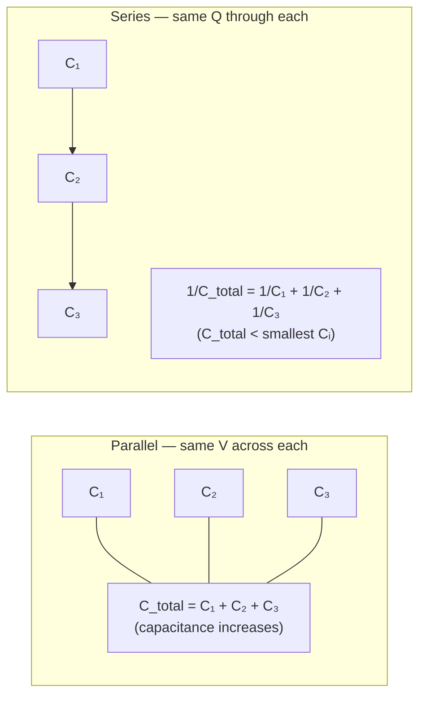

# Capacitors in Series and Parallel

## Core Idea

Capacitors combine by rules that are the opposite of resistors: capacitances add directly in parallel, and add reciprocally in series.

## Meaning

When several capacitors are connected, they behave as a single equivalent [[Capacitor]] of capacitance C_total.

**Parallel.** Each capacitor has the same [[Potential-Difference]] V across it. Total charge is the sum of the individual charges, so:

- C_total = C₁ + C₂ + C₃ + …

Parallel connection effectively increases plate area, so capacitance increases.

**Series.** Each capacitor carries the same [[Charge]] Q (charge displaced by the source is identical through the chain). The voltages add to the supply voltage, giving:

- 1 / C_total = 1/C₁ + 1/C₂ + 1/C₃ + …

Series connection effectively increases plate separation, so the total capacitance is smaller than the smallest individual capacitor.

This is the reverse of the resistor rules: resistors add in series, reciprocally in parallel. The reason is that capacitance relates charge to voltage (Q = CV), whereas resistance relates voltage to current.

## Everyday Intuition

Parallel capacitors are like several buckets side by side filled to the same depth — total storage is the sum. Series capacitors are like stacking thin gaps end to end — the effective gap grows, so the combined ability to store charge falls.

## GCSE Foundation

- [[Charge]]
- [[Potential-Difference]]
- [[Energy]]

## Why It Matters

Combination rules let designers reach a required capacitance or voltage rating from standard components, and are routinely tested in OCR multi-capacitor network questions and in [[Capacitor-Timing-Circuits]].

## Related Quantities

- [[Capacitance]]
- [[Charge]]
- [[Potential-Difference]]

## Related Laws or Results

- [[Capacitor-Discharge-Equation]]

## Related Models

- [[Capacitor]]
- [[Energy-Stored-in-a-Capacitor]]

## Representations

- [[Capacitor-Discharge-Graph]]

## Experiments or Observations

- [[Analysing-Capacitor-Charge-and-Discharge]]

## Applications

- [[Capacitor-Timing-Circuits]]

## Frontier Links

- [[Semiconductor-Physics-Map]]

## Common Mistakes

- Applying resistor rules to capacitors (series and parallel formulae are swapped).
- Assuming series capacitors share voltage equally (the smallest C takes the largest share of V).
- Forgetting that series capacitors all carry the same charge, not the same voltage.

## Visuals

### Combination rules: parallel vs series

*Figure: In parallel, capacitances add directly (larger effective plate area). In series, reciprocals add (larger effective gap) — giving a total capacitance smaller than any individual capacitor.*
*Source: Authored for this vault (CC0). No external copyright.*

## Source Trace

- Source: OpenStax College Physics; HyperPhysics; Physics LibreTexts — no copied text
- Section/Page: OCR alignment: [[OCR-Physics-A-H556-Specification]] (M6.1)
