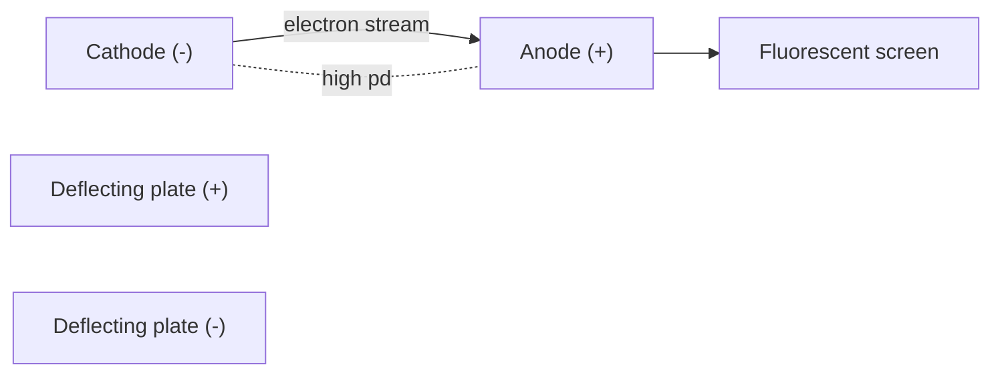

# Cathode Rays

## Core Idea

Cathode rays are streams of fast-moving electrons emitted from the negative electrode (cathode) of an evacuated tube when a large potential difference is applied between the electrodes.

## Meaning

In a discharge tube at low gas pressure (around 10⁻²–10⁻³ atm) with a high potential difference (several kV) across two electrodes, a faint glow appears and "rays" travel from cathode to anode. As the pressure is reduced further, the glow disappears but the glass opposite the cathode fluoresces. The rays:

- travel in straight lines (cast sharp shadows of obstacles),
- carry negative charge (deflected by [[Electric-Field]] and [[Magnetic-Field]]),
- transfer momentum (turn a small paddle wheel placed in their path),
- have a fixed charge-to-mass ratio independent of the cathode material.

This last property — established by J. J. Thomson in 1897 — showed the rays are a universal subatomic particle: the **electron**.

## Everyday Intuition

A cathode-ray tube is the ancestor of old TV screens and oscilloscope displays: a "gun" shoots a focused beam of electrons that paints a glowing spot on a phosphor screen.

## GCSE Foundation

- [[Static-Electricity]]
- [[Atomic-Structure]]

## Why It Matters

Cathode rays gave the first direct evidence that atoms are not indivisible: they contain charged particles much lighter than any atom. Measuring the rays' deflection in crossed [[Electric-Field]] and [[Magnetic-Field]] yielded the electron's [[Specific-Charge]] e/m ≈ 1.76 × 10¹¹ C kg⁻¹, opening the door to modern atomic physics.

## Related Quantities

- [[Specific-Charge]]
- [[Charge]]
- [[Electric-Field]]
- [[Magnetic-Field]]

## Related Laws or Results

- [[Force-on-a-Moving-Charge]]

## Related Models

- [[The-Nuclear-Atom]]

## Representations

- Schematic of a discharge tube with cathode, anode, and deflecting plates.

## Experiments or Observations

- [[Thermionic-Emission]] (modern source of cathode-ray electrons)
- [[Millikan-Oil-Drop-Experiment]] (gave the charge e, which combined with e/m yields the electron mass)

## Applications

- [[Electron-Microscopes]]
- Oscilloscopes and historical CRT displays.

## Frontier Links

- [[Quantum-Mechanics-Map]]

## Common Mistakes

- Calling cathode rays "light" — they are matter, not electromagnetic radiation.
- Forgetting the tube must be evacuated; air molecules would scatter the electrons.
- Confusing the charge-to-mass ratio with the charge itself.

## Visuals

### Cathode-ray discharge tube

*Figure: Electrons leave the cathode, accelerate to the anode, and strike a screen. Plates between anode and screen deflect the beam.*
*Source: Authored for this vault (CC0). No external copyright.*

### From Wikimedia

<!-- wiki-images: yes -->

#### Crookes tube with Maltese-cross shadow
![[_attachments/04_Concepts/Cathode-Rays--wiki-crookes-tube-maltese-cross.jpg]]
*Figure: A working Crookes tube — the metal cross casts a sharp shadow on the glowing glass, showing cathode rays travel in straight lines from the cathode.*
*Source: Wikimedia Commons — [Crookes tube-in use-lateral view-standing cross prPNr°11.jpg](https://commons.wikimedia.org/wiki/File:Crookes_tube-in_use-lateral_view-standing_cross_prPNr%C2%B011.jpg) — CC BY-SA 3.0 at — D-Kuru. Retrieved 2026-06-27.*

## Source Trace

- Source: [[AQA-Physics-7407-7408-Specification]] §3.12.1
- Public reference: HyperPhysics; OpenStax College Physics
