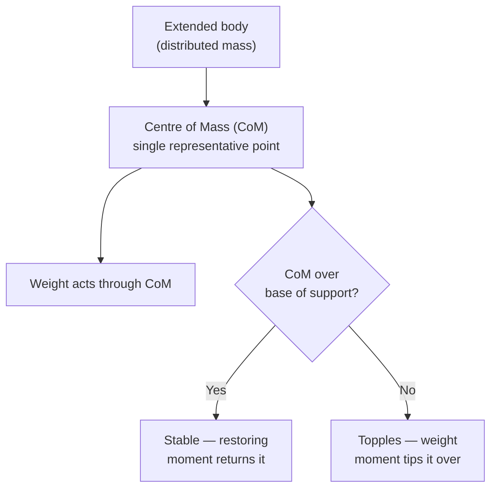

# Centre of Mass

## Core Idea

The centre of mass of a body is the single point at which the whole mass can be considered to act, so the body's translational motion behaves as if all its mass were concentrated there.

## Meaning

For any extended object the mass is distributed through space, but its motion under external forces can be analysed by treating it as a [[Point-Mass-Model]] located at the centre of mass. The weight of the object acts effectively through this point (called the centre of gravity, which coincides with the centre of mass in a uniform gravitational field).

For a symmetric uniform object the centre of mass lies at the geometric centre. For irregular shapes it can be found experimentally: suspend the object freely from a point, draw the vertical plumb line, repeat from another point, and the centre of mass lies where the lines intersect.

The position of the centre of mass relative to the base of support determines stability. An object topples when its centre of mass passes outside the base, because the weight then produces a moment that rotates it over rather than restoring it.

## Everyday Intuition

A tightrope walker carries a long pole to keep their combined centre of mass low and over the rope. A racing car is built low and wide so its centre of mass stays well inside its wheelbase.

## GCSE Foundation

- [[Mass]]
- [[Weight]]
- [[Moment]]

## Why It Matters

The centre of mass lets complex objects be treated as point masses, makes Newton's laws tractable for real bodies, and is central to stability, toppling and balancing problems.

## Related Quantities

- [[Mass]]
- [[Weight]]
- [[Moment]]

## Related Laws or Results

- [[Newton-Second-Law]]
- [[Principle-of-Moments]]

## Related Models

- [[Point-Mass-Model]]
- [[Rigid-Body-Model]]

## Representations

- [[Free-Body-Diagram]]

## Experiments or Observations

- Plumb-line method to locate the centre of mass of an irregular lamina.

## Applications

- Vehicle and ship stability design.
- Sports biomechanics (jumping, gymnastics).

## Frontier Links

- Centre of mass frames are central to collision analysis in particle physics ([[Particle-Physics-Map]]).

## Common Mistakes

- Assuming the centre of mass must lie inside the material of the object (a ring's lies in empty space).
- Confusing stability with how heavy an object is rather than where its centre of mass is.
- Treating centre of mass and centre of gravity as always different (they coincide in uniform gravity).

## Visuals

### Centre of mass and stability

*Figure: The weight of an object acts effectively through its centre of mass. Stability depends on whether the CoM lies over the base of support; if it moves outside, a toppling moment results.*
*Source: Authored for this vault (CC0). No external copyright.*

## Source Trace

- Source: OpenStax College Physics; The Physics Classroom; IOPSpark; Physics LibreTexts — paraphrased, no copied text.
- OCR alignment: [[OCR-Physics-A-H556-Specification]]
