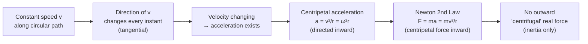

# Circular Motion

## Core Idea

An object moving in a circle at constant speed is still accelerating, because its velocity direction is continuously changing; this requires a net force directed towards the centre.

## Meaning

In uniform circular motion the speed |v| is constant but the [[Velocity]] vector changes direction every instant, always tangent to the circle. A changing velocity means an [[Acceleration]] — here the [[Centripetal-Acceleration]] $a = v^2/r = \omega^2 r$, directed radially inward. By [[Newton-Second-Law]] there must be a resultant inward [[Centripetal-Force]] $F = mv^2/r = m\omega^2 r$. There is no outward "centrifugal" real force; the inward force is provided by tension, gravity, friction, normal contact, or a combination.

## Everyday Intuition

Swinging a ball on a string: you must pull inward to keep it circling, and if the string snaps the ball flies off along the tangent, not outward. A car turning a corner relies on inward friction from the tyres.

## GCSE Foundation

- [[Speed]]
- [[Force]]
- [[Acceleration]]

## Why It Matters

Circular motion underlies orbits, fairground rides, centrifuges, banked tracks, electrons in magnetic fields and rotating machinery. It is the prerequisite for understanding gravitational and magnetic field orbits at A-Level.

## Related Quantities

- [[Angular-Velocity]]
- [[Centripetal-Acceleration]]
- [[Period]]
- [[Frequency]]

## Related Laws or Results

- [[Newton-Second-Law]]

## Related Models

- [[Simple-Harmonic-Oscillator]]

## Representations

- [[Velocity-Time-Graph]]

## Experiments or Observations

- [[Investigating-Simple-Harmonic-Motion]]

## Applications

- [[Banked-Tracks-and-Centrifuges]]

## Frontier Links

- [[Particle-Physics-Map]]

## Common Mistakes

- [[Confusing-Angular-and-Linear-Quantities]]

## Visuals

### Circular motion: velocity, acceleration and force

*Figure: Even at constant speed, circular motion requires a centripetal (inward) acceleration and net force. The acceleration and force are perpendicular to the velocity at all times.*
*Source: Authored for this vault (CC0). No external copyright.*

## Source Trace

- Source: OpenStax College Physics; HyperPhysics; The Physics Classroom — no copied text
- Section/Page: OCR alignment: [[OCR-Physics-A-H556-Specification]] (M5.2 Circular motion)
