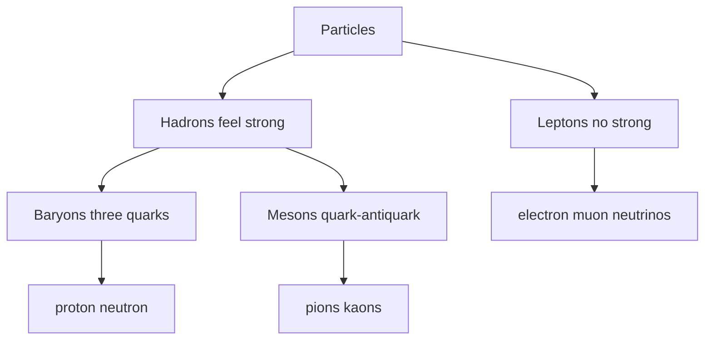

# Classification of Particles

## Core Idea

All known particles can be sorted by which fundamental interactions they feel. The first cut separates particles that feel the **strong** interaction (hadrons) from those that do not (leptons). Hadrons then split by internal quark content into baryons and mesons.

## Meaning

```
                Particles
              /          \
         Hadrons        Leptons
        (feel strong)   (no strong)
        /      \
   Baryons    Mesons
  (3 quarks) (quark-antiquark)
```

**Hadrons** are composite particles built from quarks. They feel the strong nuclear force.

- **Baryons**: three quarks. Examples: proton ($uud$), neutron ($udd$). Antibaryons such as the antiproton are made of three antiquarks. Baryon number $B = +1$ (baryons), $-1$ (antibaryons).
- **Mesons**: one quark + one antiquark. Examples: pions ($\pi^{+}, \pi^{0}, \pi^{-}$) and kaons ($K^{+}, K^{0}, K^{-}$). Mesons have $B = 0$.

**Leptons** are point-like elementary particles that do **not** feel the strong force. Examples examinable by AQA: the electron $e^{-}$, the muon $\mu^{-}$, the electron neutrino $\nu_{e}$, the muon neutrino $\nu_{\mu}$, and their antiparticles.

Key stability and decay facts to remember:

- The **proton is the only stable baryon** as far as we know. Free neutrons decay by $\beta^{-}$ with a half-life of about 10 minutes.
- The **muon** is unstable and decays to an electron (plus neutrinos).
- **Kaons** decay (via the weak interaction) into pions, and pions decay further.
- The neutrinos are very light and electrically neutral; they interact only via the weak interaction.

## Everyday Intuition

Think of particles like organisms in a taxonomy: who do they interact with? Hadrons "stick" via the strong force; leptons stay aloof. Within hadrons, baryons travel in threes and mesons in pairs.

## GCSE Foundation

- [[Atomic-Structure]]
- [[The-Nuclear-Atom]]

## Why It Matters

Classification gives you the bookkeeping rules for checking whether a reaction is allowed: which conservation laws apply, and which exchange particle is plausible. It is also the structure of [[The-Standard-Model]] in miniature.

## Related Quantities

- [[Charge]]
- [[Baryon-Number]]
- [[Lepton-Number]]
- [[Strangeness]]

## Related Laws or Results

- [[Conservation-of-Energy]]
- [[Conservation-of-Momentum]]

## Related Models

- [[Quarks]]
- [[Leptons]]
- [[Fundamental-Particles]]
- [[The-Standard-Model]]

## Representations

- [[Feynman-Diagram]]

## Experiments or Observations

- Cosmic-ray and accelerator tracks reveal pions, kaons, and muons.
- Observation of strange particles produced in pairs (1950s) is direct evidence for strangeness conservation in the strong interaction.

## Applications

- Pion exchange in the nucleus.
- Muon tomography; cosmic-ray studies.
- Kaon decay studies (CP violation — beyond AQA).

## Frontier Links

- [[Particle-Physics-Map]]
- [[The-Standard-Model]] — three generations of quarks and leptons.

## Common Mistakes

- Saying the electron is a baryon. It is a lepton.
- Calling protons and neutrons "elementary". They are hadrons (specifically baryons), built from quarks.
- Saying mesons feel only the strong force. Charged mesons also feel the electromagnetic and weak forces.
- Forgetting that kaons are strange (contain an $s$ quark or $\bar{s}$).

## Visuals


*Figure: Hadron vs lepton split, with the baryon-meson sub-split.*
*Source: Authored for this vault (CC0). No external copyright.*

### From Wikimedia

<!-- wiki-images: yes -->

#### Bubble chamber tracks
![[_attachments/04_Concepts/Classification-of-Particles--wiki-bubble-chamber-lambda.jpg]]
*Figure: a 1959 bubble-chamber photograph showing the production and decay of neutral lambda and anti-lambda hyperons; the curved and V-shaped tracks reveal charged particles produced when hadrons interact.*
*Source: Wikimedia Commons — [Bubble chamber event. Decay of neutral lambda, anti-lambda hyperons. Bubble Chamber-772A](https://commons.wikimedia.org/wiki/File:Bubble_chamber_event._Decay_of_neutral_lambda,_anti-lambda_hyperons._Photograph_circa_July_1959._Bubble_Chamber-772A_-_DPLA_-_5141859e360581251906c073668c70de.jpg) — Public domain — DOE / Lawrence Berkeley National Laboratory. Retrieved 2026-06-27.*

## Source Trace

- Source: [[AQA-Physics-7407-7408-Specification]] §3.2.1.5 and §3.2.1.6
- Section/Page: Classification of particles; quarks and antiquarks.
- Explanatory reference: HyperPhysics "Particle Classification"; OpenStax College Physics §33.3 (no text copied).
