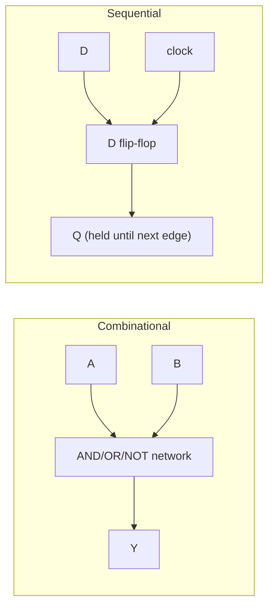

# Combinational and Sequential Logic

## Core Idea

Digital circuits split into two families: **combinational** circuits, whose output depends only on the present inputs, and **sequential** circuits, whose output depends on the inputs **and** on stored history.

## Meaning

**Combinational logic** is built from logic gates (AND, OR, NOT, NAND, NOR, XOR) wired so signals flow forward with no loops. Given any pattern of input bits, the output settles to a fixed value after a short propagation delay. Behaviour is captured exactly by a **truth table** or by a **Boolean expression**.

Examples: an adder, a multiplexer, a parity checker.

**Sequential logic** adds a memory element so the present output can depend on previous inputs. The basic memory element is a **latch** or **flip-flop** built by feeding gate outputs back into gate inputs in a controlled way. An SR latch made of two cross-coupled NOR gates has two stable states, "set" and "reset", and remembers which it is in until told otherwise. A clocked **D flip-flop** captures its input value on the rising edge of a clock and holds it until the next rising edge.

Sequential circuits include counters, shift registers, and the registers and caches inside every CPU.

Symbols:

- $A, B, \dots$: input bits (0 or 1)
- $Q$: stored output bit of a latch or flip-flop
- $\overline{Q}$: complement of $Q$
- $f_{clk}$: clock frequency (Hz)

**Astables.** An **astable multivibrator** has no stable state — its output continuously toggles between high and low, producing a square wave. A common implementation uses a **555 timer** chip with two resistors $R_{1}, R_{2}$ and a capacitor $C$. The output frequency depends on $R_{1}$, $R_{2}$, and $C$ (qualitatively: smaller $R$ or $C$ gives faster oscillation). Astables provide the clock signals that drive sequential circuits.

## Everyday Intuition

A vending-machine button is combinational: press it and a drink drops, regardless of history. A traffic light is sequential: which colour comes next depends on which colour is currently showing.

## GCSE Foundation

- [[Potential-Difference]]
- [[Analogue-and-Digital-Signals]]

## Why It Matters

Every computer is a giant sequential machine clocked at a fixed frequency, with combinational blocks between flip-flops carrying out arithmetic and decision logic. Understanding the two families makes digital electronics intelligible rather than magical.

## Related Quantities

- [[Capacitance]]
- [[Resistance]]
- [[Potential-Difference]]

## Related Laws or Results

- Boolean algebra identities (De Morgan, distributive law).

## Related Models

- [[Ideal-Operational-Amplifier]] — comparators and Schmitt triggers bridge analogue and digital.

## Representations

- [[Logic-Gate-Diagram]]
- Truth tables.
- Timing diagrams (waveforms vs time).

## Experiments or Observations

- Build a 555 astable and measure the output frequency vs $C$.
- Wire an SR latch from two NOR gates and verify the truth table.

## Applications

- [[Logic-Gates]]
- [[Signal-Processing]]
- [[Communication-Systems]]

## Frontier Links

- [[Semiconductor-Physics-Map]]

## Common Mistakes

- Calling a flip-flop "combinational" — its output depends on its previous state, not just present inputs.
- Forgetting that an SR latch with both inputs asserted is in a forbidden state.
- Believing that a 555 astable needs a separate clock — it generates its own.
- Reading a truth table without listing every input combination ($2^{n}$ rows for $n$ inputs).

## Visuals

### Combinational vs sequential block

*Figure: combinational logic reacts instantly to inputs; sequential logic latches an input on each clock edge.*
*Source: Authored for this vault (CC0). No external copyright.*

### From Wikimedia

<!-- wiki-images: yes -->

#### D-type flip-flop from logic gates
![[_attachments/04_Concepts/Combinational-and-Sequential-Logic--wiki-d-flip-flop.svg]]
*Figure: a clocked D flip-flop built from cross-coupled gates — the basic memory element of sequential logic.*
*Source: Wikimedia Commons — [D-Type Flip-flop Diagram.svg](https://commons.wikimedia.org/wiki/File:D-Type_Flip-flop_Diagram.svg) — Public domain — jjbeard. Retrieved 2026-06-27.*

## Source Trace

- Source: [[AQA-Physics-7407-7408-Specification]] §3.13
- Public source: HyperPhysics; All About Circuits
- Section/Page: Electronics — combinational and sequential logic
