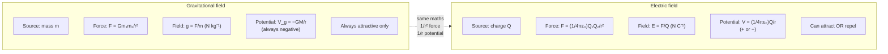

# Comparing Gravitational and Electric Fields

## Core Idea

Gravitational and electric fields share the same mathematical structure — inverse-square forces, 1/r potentials, field-line patterns — but differ in what creates them and whether they can attract only or both attract and repel.

## Meaning

Both fields are described by analogous quantities. Field strength is force per unit "test property"; potential is potential energy per unit test property.

| Feature | Gravitational | Electric |
|---|---|---|
| Source | mass $m$ | charge $Q$ |
| Force law | $F = Gm_1m_2 / r^2$ | $F = (1/4\pi\varepsilon_0)\, Q_1Q_2 / r^2$ ([[Coulombs-Law]]) |
| Field strength | $g = F/m$ | $E = F/Q$ ([[Electric-Field-Strength]]) |
| Potential | $V_g = -GM/r$ | $V = (1/4\pi\varepsilon_0)\, Q/r$ ([[Electric-Potential]]) |
| Potential energy | $E_p = -GMm/r$ | $E_p = (1/4\pi\varepsilon_0)\, Qq/r$ ([[Electric-Potential-Energy]]) |
| Constant | $G$ (very small) | $1/4\pi\varepsilon_0$ (very large) |
| Sign | always attractive | attractive **or** repulsive |

Key structural similarities: both forces obey an inverse-square law (1/r²), both potentials vary as 1/r, both fields can be drawn with field lines, and both have uniform-field special cases (uniform g near a surface; [[Uniform-Electric-Field]] between plates).

Key differences: gravity acts only between masses and is always attractive, so gravitational potential energy is always negative (relative to infinity). The electric force can attract or repel because charge has two signs, so the relative strength of electricity is enormously larger than gravity for elementary particles.

## Everyday Intuition

A mass "falling" towards Earth and a positive charge "falling" towards a negative plate obey the same kind of rule — both roll downhill on an energy slope. The difference is that you can never make gravity push, but you can make electricity push or pull.

## GCSE Foundation

- [[Energy-Quantity|Energy]]
- [[Charge]]

## Why It Matters

Recognising the analogy lets the same problem-solving techniques (field strength, potential, energy graphs) transfer between [[Gravitational-Field]] and [[Electric-Field]] topics, and is explicitly examined by OCR as a synoptic link.

## Related Quantities

- [[Electric-Field-Strength]]
- [[Electric-Potential]]
- [[Electric-Potential-Energy]]

## Related Laws or Results

- [[Coulombs-Law]]
- [[Newtons-Law-of-Gravitation]]

## Related Models

- [[Electric-Field]]
- [[Uniform-Electric-Field]]

## Representations

- [[Electric-Field-Line-Diagram]]

## Experiments or Observations

- [[Analysing-Capacitor-Charge-and-Discharge]]

## Applications

- [[Capacitor-Timing-Circuits]]

## Frontier Links

- [[Semiconductor-Physics-Map]]

## Common Mistakes

- Forgetting that gravitational potential energy is always negative while electric can be either sign.
- Assuming the analogy is exact (there is no negative mass, so gravity cannot repel).
- Using 1/r for force or 1/r² for potential (force $\propto 1/r^2$, potential $\propto 1/r$ in both fields).

## Visuals

### Gravitational vs electric field analogy

*Figure: Both fields share the same inverse-square force law and 1/r potential. Key difference: gravity is always attractive (no negative mass); electric force can attract or repel (two charge signs exist).*
*Source: Authored for this vault (CC0). No external copyright.*

### From Wikipedia

<!-- wiki-images: yes -->

#### Crab Nebula

![[_attachments/04_Concepts/Comparing-Gravitational-and-Electric-Fields--wiki-crab-nebula.jpg]]
*Figure: from Wikipedia article "Gravitational potential".*
*Source: Wikimedia Commons — [Crab Nebula.jpg](https://commons.wikimedia.org/wiki/File:Crab_Nebula.jpg). Retrieved 2026-05-20.*

#### Earth-moon

![[_attachments/04_Concepts/Comparing-Gravitational-and-Electric-Fields--wiki-earth-moon.jpg]]
*Figure: from Wikipedia article "Gravitational potential".*
*Source: Wikimedia Commons — [Earth-moon.jpg](https://commons.wikimedia.org/wiki/File:Earth-moon.jpg). Retrieved 2026-05-20.*

#### Mass distribution line segment

![[_attachments/04_Concepts/Comparing-Gravitational-and-Electric-Fields--wiki-mass-distribution-line-segment.svg]]
*Figure: from Wikipedia article "Gravitational potential".*
*Source: Wikimedia Commons — [Mass distribution line segment.svg](https://commons.wikimedia.org/wiki/File:Mass_distribution_line_segment.svg). Retrieved 2026-05-20.*

## Source Trace

- Source: OpenStax College Physics; HyperPhysics; Physics LibreTexts — no copied text
- Section/Page: OCR alignment: [[OCR-Physics-A-H556-Specification]] (M6.2)
