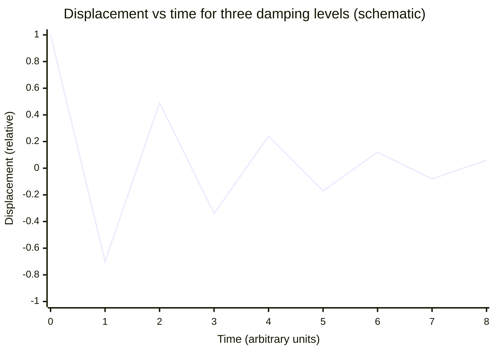

# Damping

## Core Idea

Damping is the dissipation of an oscillator's energy by resistive forces, causing the amplitude to decrease over time.

## Meaning

Real oscillators lose energy to friction, air resistance, or internal material losses, so the [[Amplitude]] decays while the total energy falls (see [[Energy-in-Simple-Harmonic-Motion]]). Damping regimes:

- **Light damping**: amplitude decreases gradually, often exponentially; oscillation continues for many cycles with [[Period]] only slightly increased.
- **Critical damping**: system returns to equilibrium in the shortest time without oscillating (e.g. car suspension, analogue meters).
- **Heavy (over)damping**: returns slowly to equilibrium with no oscillation.

Damping broadens and lowers the [[Resonance]] peak in driven systems; heavier damping gives a lower, broader peak.

## Everyday Intuition

A swing left alone slowly stops; a door closer eases a door shut without slamming or bouncing (near-critical damping); shock absorbers stop a car bouncing after a bump.

## GCSE Foundation

- [[Force]]
- [[Conservation-of-Energy]]

## Why It Matters

Damping determines how quickly oscillations die away and controls resonance sharpness — essential for vibration isolation, instruments, suspension, and seismic design.

## Related Quantities

- [[Amplitude]]
- [[Period]]
- [[Frequency]]

## Related Laws or Results

- [[Conservation-of-Energy]]
- [[Simple-Harmonic-Motion-Equation]]

## Related Models

- [[Simple-Harmonic-Oscillator]]

## Representations

- [[Velocity-Time-Graph]]

## Experiments or Observations

- [[Investigating-Simple-Harmonic-Motion]]

## Applications

- [[Banked-Tracks-and-Centrifuges]]

## Frontier Links

- [[Quantum-Mechanics-Map]]

## Common Mistakes

- [[Confusing-Angular-and-Linear-Quantities]]

## Visuals

### Damping regimes: amplitude decay comparison

*Figure: Light damping — amplitude decreases gradually each cycle (exponential envelope). Critical damping would return to zero by t ≈ 1 without oscillating; heavy damping even more slowly. The schematic shows light damping; successive peaks shrink by a constant ratio.*
*Source: Authored for this vault (CC0). No external copyright.*

## Source Trace

- Source: OpenStax College Physics; HyperPhysics; The Physics Classroom — no copied text
- Section/Page: OCR alignment: [[OCR-Physics-A-H556-Specification]] (M5.3 Oscillations)
