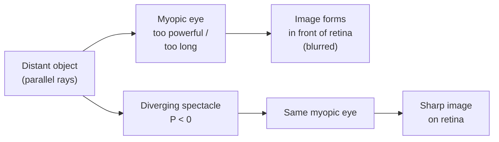

# Defects of Vision

## Core Idea

Three common refractive defects of the human eye — myopia, hypermetropia, and astigmatism — each move the focused image away from the retina in a characteristic way, and each is corrected by a thin lens of carefully chosen power.

## Meaning

A healthy emmetropic eye forms a sharp retinal image of distant objects with the ciliary muscle relaxed, and of near objects (down to the near point) with accommodation. Defects break this in one of three ways.

**Myopia (short sight).** The eyeball is too long, or the cornea–lens system too powerful, so distant rays converge to a focus *in front of* the retina. The far point is closer than infinity (e.g. 50 cm). A diverging correcting lens with focal length equal to the (negative of the) far-point distance pushes the virtual image of a distant object onto the existing far point, where the eye then focuses naturally.

For a far point of distance $x$ from the eye, the required lens power is

$$P = -\frac{1}{x}$$

with $x$ in metres. A 0.50 m far point needs a $-2.0\,\text{D}$ lens.

**Hypermetropia (long sight).** The eyeball is too short, or the system too weak, so near rays would focus *behind* the retina. The near point is further away than the normal ~25 cm. A converging correction creates a virtual image of a near object at the patient's actual near point. To bring an object at the normal near point $D_0 = 0.25\,\text{m}$ into a focused image at the patient's near point $D_p$, apply the [[Lens-Equation]] with $u = D_0$, $v = -D_p$ (virtual, same side) and solve for $P = 1/f$. A patient with $D_p = 1.0\,\text{m}$ then needs $P \approx +3.0\,\text{D}$.

**Astigmatism.** The cornea (or lens) is not spherical — it has different curvatures along different meridians, so horizontal and vertical lines focus on different planes. The eye cannot focus all directions at once. The correction is a **cylindrical** lens, which has power along one axis only. Prescriptions therefore carry three numbers: a *sphere* (spherical correction in D), a *cylinder* (extra cylindrical power in D) and an *axis* (orientation of the cylinder in degrees from 0 to 180). For example, $-2.00 / -0.75 \times 90$ means a $-2.00\,\text{D}$ spherical base plus a $-0.75\,\text{D}$ cylinder oriented at 90°.

## Everyday Intuition

Squinting helps a short-sighted person see further because narrowing the aperture deepens the depth of field — a poor man's correction. Holding a book at arm's length helps a long-sighted person because it moves the object outside their near point. Astigmatism shows up as fan-pattern test charts where some lines look sharp and the perpendicular ones blur.

## GCSE Foundation

- [[Ray-Model-of-Light]]
- [[Wave-Refraction]]

## Why It Matters

Refractive errors are the most widespread treatable medical condition on Earth. The mathematics is just the [[Lens-Equation]] applied with the patient's far or near point as the target image distance — a clean A-Level application of optics to a real diagnosis.

## Related Quantities

- [[Lens-Power]]
- [[Refractive-Index]]

## Related Laws or Results

- [[Lens-Equation]]

## Related Models

- Reduced-eye model with adjustable far/near points

## Representations

- [[Ray-Diagram]]

## Experiments or Observations

- Measuring the near point with a metre ruler
- Reading a Snellen chart at 6 m

## Applications

- Spectacles, contact lenses, intra-ocular lens implants
- LASIK and PRK corneal reshaping (changes effective $f$ surgically)

## Frontier Links

- Wavefront-guided custom corrections
- Adaptive contact lenses

## Common Mistakes

- Mixing up which sign goes with which defect: myopia → diverging ($P<0$); hypermetropia → converging ($P>0$).
- Forgetting the virtual-image sign in the [[Lens-Equation]] when treating long sight.
- Treating astigmatism as a spherical problem — it needs cylindrical correction.

## Visuals

### Myopia and its correction

*Figure: a diverging lens shifts the apparent object to the patient's far point so the unaided eye can focus it.*
*Source: Authored for this vault (CC0). No external copyright.*

## Source Trace

- Source: [[AQA-Physics-7407-7408-Specification]] §3.10.1
- Public source: HyperPhysics (Vision Correction); OpenStax College Physics — Vision Correction
- Section/Page: Optional unit 3.10.1 — physics of vision
