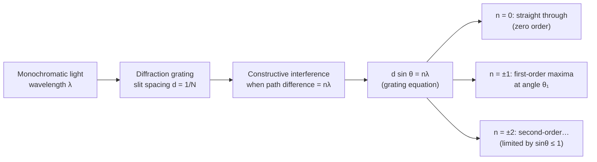

# Diffraction Grating

## Core Idea

A diffraction grating is a component with very many equally spaced parallel slits. Light passing through produces sharp, widely separated bright maxima, allowing precise measurement of [[Wavelength]].

## Meaning

Each slit acts as a coherent source. Light from adjacent slits interferes; bright fringes (orders) occur where the [[Path-Difference]] between adjacent slits equals a whole number of wavelengths. Because the grating has thousands of slits, the maxima are far sharper and brighter than in a double slit, governed by the [[Diffraction-Grating-Equation]] $d\sin\theta = n\lambda$, where $d$ is the slit spacing and $n$ the order. Different wavelengths emerge at different angles, so white light is dispersed into spectra.

## Everyday Intuition

The rainbow sheen on a CD or DVD is a grating effect — the closely spaced data tracks split reflected white light into colours.

## GCSE Foundation

- [[Wavelength]]

## Why It Matters

Gratings give far more accurate wavelength measurements than a double slit and are the heart of spectrometers used to identify elements by their line spectra, including in stellar spectroscopy and chemical analysis.

## Related Quantities

- [[Wavelength]]

## Related Laws or Results

- [[Diffraction-Grating-Equation]]

## Related Models

- Multiple coherent source model.

## Representations

- Diagram of parallel slits with rays at angle $\theta$ and the path difference $d\sin\theta$ marked.

## Experiments or Observations

- [[Investigating-Diffraction-with-a-Grating]]

## Applications

- [[Medical-Imaging]]

## Frontier Links

- Spectroscopy of distant galaxies (redshift) connects to cosmology maps; orientation only.

## Common Mistakes

- Confusing the slit spacing $d$ with the number of lines per metre $N$ (they are reciprocals: $d = 1/N$).
- Forgetting that the maximum observable order is limited by $\sin\theta \le 1$.

## Visuals

### Grating equation and order geometry

*Figure: Each order n occurs where the path difference between adjacent slits equals n wavelengths. Different wavelengths diffract to different angles, producing spectra. Maximum order limited by sin θ ≤ 1.*
*Source: Authored for this vault (CC0). No external copyright.*

## Source Trace

- Source: OpenStax College Physics; HyperPhysics; IOPSpark
- OCR alignment: [[OCR-Physics-A-H556-Specification]]
