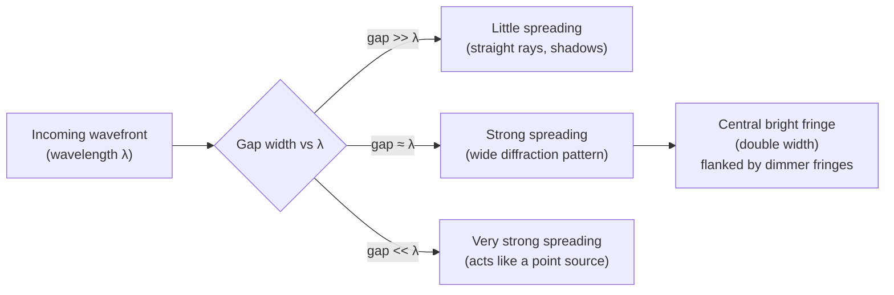

# Diffraction

## Core Idea

Diffraction is the spreading of a wave as it passes through a gap or around an obstacle, and is most pronounced when the gap or obstacle size is comparable to the wavelength.

## Meaning

When a wave meets an edge or aperture, it does not continue purely in straight lines — it bends into the geometrical shadow region and spreads out. The amount of spreading depends on the ratio of wavelength to gap width: when the gap is much larger than the wavelength there is little noticeable diffraction; when the gap is similar to the wavelength the wave spreads strongly into a wide pattern.

For a single slit, monochromatic light produces a central bright fringe (twice as wide as the others) flanked by dimmer fringes separated by dark minima. A diffraction grating, which has many thousands of slits per metre, produces sharp bright maxima at angles given by d sin θ = nλ, where d is the slit spacing, θ the angle of the maximum, n the order, and λ the wavelength. Gratings give very precise wavelength measurements because the maxima are narrow and well separated.

Diffraction is direct evidence of the wave nature of light and, when observed for electrons, of the [[Wave-Particle-Duality]] of matter.

## Everyday Intuition

Sound bends around a doorway so you can hear someone in the next room without seeing them (sound's long wavelength diffracts easily). The colours seen on a CD are diffraction from its closely spaced tracks.

## GCSE Foundation

- [[Waves-GCSE|Waves]]
- [[Wavelength]]
- [[Superposition]]

## Why It Matters

Diffraction limits the resolution of telescopes and microscopes, enables spectroscopy via gratings, and is key evidence that light and matter are wave-like.

## Related Quantities

- [[Wavelength]]
- [[Frequency]]

## Related Laws or Results

- [[Diffraction-Grating-Equation]]
- [[Wave-Speed-Equation]]

## Related Models

- [[Wavefront-Model]]
- [[Photon-Model]]

## Representations

- [[Wavefront-Diagram]]
- Intensity-against-angle graph.

## Experiments or Observations

- Measuring the wavelength of laser light using a diffraction grating and the grating equation.

## Applications

- Spectroscopy and astronomy.
- X-ray diffraction for crystal structure.

## Frontier Links

- Electron diffraction supports [[Wave-Particle-Duality]] and the [[Quantum-Mechanics-Map]].

## Common Mistakes

- Thinking diffraction changes the wavelength.
- Expecting strong diffraction when the gap is far larger than the wavelength.
- Confusing single-slit and grating patterns (fringe sharpness and spacing differ).

## Visuals

### Diffraction: effect of gap width relative to wavelength

*Figure: The degree of spreading depends on λ/gap. Maximum diffraction when gap ≈ λ. Single-slit: central fringe is twice as wide as secondary fringes.*
*Source: Authored for this vault (CC0). No external copyright.*

## Source Trace

- Source: OpenStax College Physics; The Physics Classroom; IOPSpark; Physics LibreTexts — paraphrased, no copied text.
- OCR alignment: [[OCR-Physics-A-H556-Specification]]
