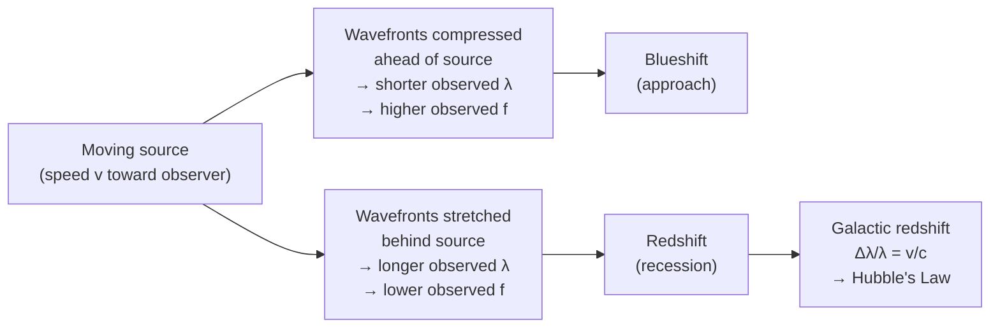

# Doppler Effect

## Core Idea

The Doppler effect is the change in observed [[Frequency]] and
[[Wavelength]] of a wave when the source and observer move relative to one
another: approaching means a higher frequency, receding means a lower one.

## Meaning

When a wave source moves towards an observer, successive wavefronts are
emitted from closer positions, so the observed [[Wavelength]] is compressed
and the [[Frequency]] rises. When the source recedes, wavefronts spread out,
wavelength stretches and frequency falls.

For light from a distant astronomical source moving with radial speed v much
smaller than the speed of light c, the fractional shift is:

Δλ / λ ≈ Δf / f ≈ v / c

Symbols: λ = emitted wavelength (m), Δλ = change in wavelength (m),
f = frequency (Hz), Δf = change in frequency (Hz), v = radial speed of source
(m s⁻¹), c = 3.00 × 10⁸ m s⁻¹. By convention Δλ is positive (longer
wavelength) when the source recedes — this is [[Redshift]] — and negative
(shorter wavelength, blueshift) when it approaches.

The shift is detected by comparing measured spectral line wavelengths with
their known laboratory values; the line *pattern* is preserved but displaced.

## Everyday Intuition

A passing ambulance siren sounds higher in pitch as it approaches and lower
as it moves away. The same physics applies to light from stars and galaxies.

## GCSE Foundation

- [[Frequency]]
- [[Wavelength]]

GCSE introduces the siren example and red-shift qualitatively. A-Level adds
the Δλ/λ = v/c relationship for light.

## Why It Matters

The Doppler effect lets astronomers measure radial speeds of stars and
galaxies, detect binary stars and exoplanets, and — through galactic
[[Redshift]] — supports [[Hubbles-Law]] and the [[Big-Bang-Theory]].

## Related Quantities

- [[Frequency]]
- [[Wavelength]]

## Related Laws or Results

- [[Hubbles-Law]]

## Related Models

- [[Big-Bang-Theory]]

## Representations

- Wavefront diagram bunched ahead of, spread behind, a moving source
- Shifted spectral-line spectra

## Experiments or Observations

- Spectral line comparison for stars and galaxies
- Radar speed measurement (everyday analogue)

## Applications

- [[Redshift]]
- Detecting binary stars and exoplanet wobble

## Frontier Links

- [[Cosmology-Map]]

## Common Mistakes

- Thinking the wave's emitted frequency changes (only the observed value does)
- Using Δλ/λ = v/c when v is comparable to c
- Confusing blueshift (approach) with redshift (recession)

## Visuals

### Doppler shift: wavefront compression and stretching

*Figure: A source moving toward an observer compresses wavefronts (blueshift); moving away stretches them (redshift). For astronomical light: Δλ/λ ≈ v/c for v << c.*
*Source: Authored for this vault (CC0). No external copyright.*

## Source Trace

- Source: OpenStax College Physics; HyperPhysics; NASA educational material — no copied text
- OCR alignment: [[OCR-Physics-A-H556-Specification]]
- Section/Page: OCR M5.5 Astrophysics and cosmology
