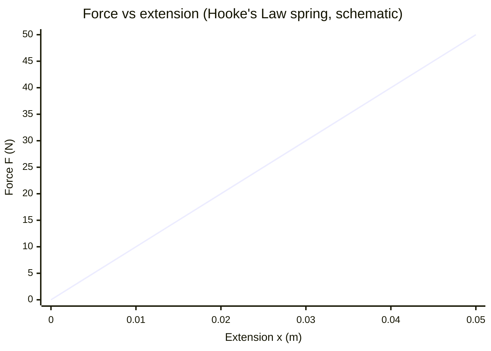

# Elastic Strain Energy

## Core Idea

Elastic strain energy is the energy stored in a material when it is deformed elastically. It equals the work done by the deforming force and is fully recoverable while the material stays within its elastic limit.

## Meaning

When a force stretches a spring or wire that obeys [[Hookes-Law]] ($F = kx$), the force grows linearly with extension. The [[Work]] done is the area under the force–extension graph, a triangle, so the stored elastic strain energy is

$$E = \tfrac{1}{2} F x = \tfrac{1}{2} k x^{2}$$

where $E$ is in joules (J), $F$ in newtons (N), $x$ in metres (m) and $k$ is the spring constant in N m⁻¹. The factor $\tfrac{1}{2}$ arises because the force builds up from zero rather than acting at full value over the whole extension.

If the material does not obey Hooke's law, the strain energy is still the area under the force–extension curve, found by counting squares or integration. For a sample of volume $V$ deforming elastically, the energy stored per unit volume equals the area under the [[Stress-Strain-Graph]], $\tfrac{1}{2}\sigma\varepsilon$ for linear behaviour.

This stored energy is released when the load is removed, provided deformation was elastic ([[Elastic-and-Plastic-Behaviour]]). If the material is taken into the plastic region, the unloading curve differs from the loading curve and the enclosed area represents energy dissipated rather than recovered.

## Everyday Intuition

A drawn bow stores elastic strain energy that transfers to the arrow's [[Kinetic-Energy]] when released; a stretched catapult or trampoline behaves the same way.

## GCSE Foundation

- [[Hookes-Law]]
- [[Work]]
- [[Energy-Quantity|Energy]]

## Why It Matters

Strain energy storage explains springs, bungee cords, vehicle suspension, vaulting poles and shock absorbers, and is central to [[Conservation-of-Energy]] problems in mechanics.

## Related Quantities

- [[Stress]]
- [[Strain]]
- [[Force]]

## Related Laws or Results

- [[Hookes-Law]]
- [[Conservation-of-Energy]]

## Related Models

- [[Constant-Acceleration-Model]]

## Representations

- [[Stress-Strain-Graph]]

## Experiments or Observations

- Measuring force–extension for a spring and comparing $\tfrac{1}{2}kx^{2}$ with energy released

## Applications

- Energy interchange with [[Kinetic-Energy]] and [[Gravitational-Potential-Energy]]

## Frontier Links

- Strain energy density underlies fracture mechanics — see [[Semiconductor-Physics-Map]]

## Common Mistakes

- Using $E = Fx$ instead of $\tfrac{1}{2}Fx$ for Hookean loading
- Assuming all strain energy is recovered after plastic deformation
- Forgetting to use the area under a non-linear curve

## Visuals

### Force–extension graph: elastic strain energy as triangle area

*Figure: For a spring obeying Hooke's Law, F is proportional to x (straight line through origin, gradient = k). The elastic strain energy $E = \tfrac{1}{2}kx^2$ equals the triangular area under the line — not the full rectangle $F \times x$.*
*Source: Authored for this vault (CC0). No external copyright.*

### From Wikipedia

<!-- wiki-images: yes -->

#### Hookes-law-springs

![[_attachments/04_Concepts/Elastic-Strain-Energy--wiki-hookes-law-springs.png]]
*Figure: from Wikipedia article "Hooke's law".*
*Source: Wikimedia Commons — [Hookes-law-springs.png](https://commons.wikimedia.org/wiki/File:Hookes-law-springs.png). Retrieved 2026-05-20.*

#### Balancier avec ressort spiral

![[_attachments/04_Concepts/Elastic-Strain-Energy--wiki-balancier-avec-ressort-spiral.png]]
*Figure: from Wikipedia article "Hooke's law".*
*Source: Wikimedia Commons — [Balancier avec ressort spiral.png](https://commons.wikimedia.org/wiki/File:Balancier_avec_ressort_spiral.png). Retrieved 2026-05-20.*

#### Hooke's Law wikipedia

![[_attachments/04_Concepts/Elastic-Strain-Energy--wiki-hookes-law-wikipedia.png]]
*Figure: from Wikipedia article "Hooke's law".*
*Source: Wikimedia Commons — [Hooke's Law wikipedia.png](https://commons.wikimedia.org/wiki/File:Hooke's_Law_wikipedia.png). Retrieved 2026-05-20.*

## Source Trace

- Source: OpenStax College Physics; The Physics Classroom; HyperPhysics — no copied text
- Section/Page: OCR alignment: [[OCR-Physics-A-H556-Specification]] (Module 3, materials)
