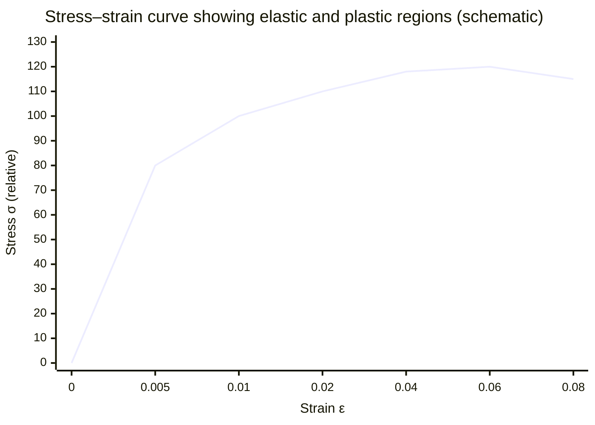

# Elastic and Plastic Behaviour

## Core Idea

A material behaves *elastically* if it returns to its original shape when the deforming force is removed, and *plastically* if it keeps a permanent change of shape.

## Meaning

When a load is applied, a sample undergoes deformation governed initially by [[Hookes-Law]] (extension proportional to force). While loading and unloading retrace the same path and the sample fully recovers, the behaviour is elastic. The elastic limit is the largest stress (or load) for which complete recovery still occurs.

Beyond the elastic limit, material behaviour becomes plastic: removing the load leaves a permanent (plastic) extension. On a force–extension or [[Stress-Strain-Graph]], the unloading line then runs parallel to the original elastic line but is offset, so the curve does not return to the origin. The horizontal intercept on unloading is the permanent deformation.

Closely related markers:
- **Yield point** — where a ductile material begins to extend with little extra load (onset of large plastic flow).
- **Elastic limit** — practically close to the limit of proportionality and yield for many materials, though not identical in definition.

Energy is conserved differently in each regime. In purely elastic deformation, work done is stored as [[Elastic-Strain-Energy]] and fully released on unloading. In plastic deformation, some work is dissipated (largely as heat through internal rearrangement), shown by the area enclosed between the loading and unloading curves — a hysteresis loop.

## Everyday Intuition

A stretched rubber band snapping back is elastic; a paperclip bent open that stays bent has been deformed plastically.

## GCSE Foundation

- [[Hookes-Law]]
- [[Force]]

## Why It Matters

Engineers must keep structural components within the elastic region so bridges, cables and springs recover their shape; controlled plastic behaviour is exploited when shaping metals.

## Related Quantities

- [[Stress]]
- [[Strain]]
- [[Young-Modulus]]

## Related Laws or Results

- [[Hookes-Law]]
- [[Conservation-of-Energy]]

## Related Models

- [[Constant-Acceleration-Model]]

## Representations

- [[Stress-Strain-Graph]]

## Experiments or Observations

- Loading and unloading a copper wire to reveal permanent extension

## Applications

- [[Elastic-Strain-Energy]]
- [[Breaking-Stress]]

## Frontier Links

- Dislocation motion in crystal lattices explains plastic flow — see [[Semiconductor-Physics-Map]]

## Common Mistakes

- Assuming a material that obeys Hooke's law cannot deform plastically (it can, beyond the limit)
- Confusing the limit of proportionality with the elastic limit (close but distinct)
- Forgetting that plastic deformation dissipates energy

## Visuals

### Stress–strain graph: elastic and plastic regions

*Figure: The initial straight region is elastic (Hooke's Law obeyed; full recovery on unloading). Beyond the elastic limit the curve becomes non-linear and plastic — permanent deformation remains after unloading. The yield point is where large plastic flow begins.*
*Source: Authored for this vault (CC0). No external copyright.*

## Source Trace

- Source: OpenStax College Physics; The Physics Classroom; HyperPhysics — no copied text
- Section/Page: OCR alignment: [[OCR-Physics-A-H556-Specification]] (Module 3, materials)
