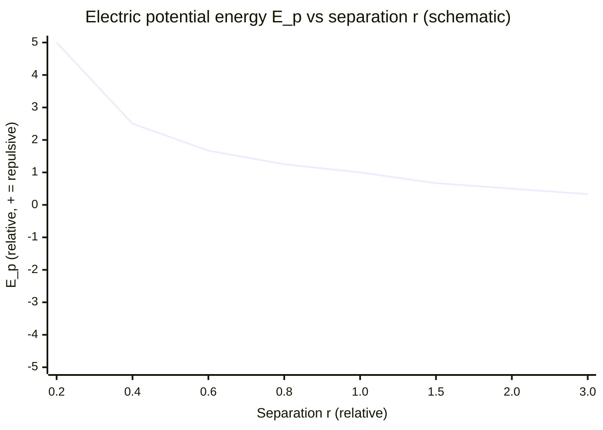

# Electric Potential Energy

## Core Idea

Electric potential energy is the energy a charge has because of its position in an [[Electric-Field]]; it equals the work done bringing the charge to that point from infinity.

## Meaning

Just as a mass has gravitational potential energy from its position in a [[Gravitational-Field]], a charge has electric potential energy from its position in an electric field. It is defined relative to a charge at infinity, where the energy is taken as zero.

For two point charges Q and q separated by distance r, the electric potential energy is:

$$E_p = \frac{1}{4\pi\varepsilon_0} \cdot \frac{Q q}{r}$$

  - $E_p$ = electric potential energy, joules (J)
  - $Q, q$ = the two charges, coulombs (C)
  - $r$ = separation, metres (m)
  - $\varepsilon_0$ = permittivity of free space

Note this is a $1/r$ dependence, while the force (and field) follows $1/r^2$. The energy is **positive** for like charges (work must be done to push them together, they would fly apart) and **negative** for unlike charges (they are bound; energy must be supplied to separate them to infinity).

Electric potential energy and [[Electric-Potential]] V are linked by $E_p = qV$: potential is the potential energy per unit positive charge. The work done moving a charge between two points is the change in $E_p$, which equals $q\Delta V$.

## Everyday Intuition

Pushing two like charges together is like compressing a spring — release them and they spring apart, releasing the stored energy. Unlike charges sit in an energy "valley" and need energy supplied to be pulled apart.

## GCSE Foundation

- [[Energy-Quantity|Energy]]
- [[Charge]]
- [[Potential-Difference]]

## Why It Matters

It underlies energy transfer in circuits ($W = QV$), the energy of charged particles in accelerators, ionisation energy, and the energy stored in a [[Capacitor]] via the work done separating charge.

## Related Quantities

- [[Electric-Potential]]
- [[Charge]]
- [[Energy-Quantity|Energy]]

## Related Laws or Results

- [[Coulombs-Law]]
- [[Newtons-Law-of-Gravitation]]

## Related Models

- [[Electric-Field]]
- [[Comparing-Gravitational-and-Electric-Fields]]

## Representations

- [[Electric-Field-Line-Diagram]]

## Experiments or Observations

- [[Analysing-Capacitor-Charge-and-Discharge]]

## Applications

- [[Capacitor-Timing-Circuits]]

## Frontier Links

- [[Semiconductor-Physics-Map]]

## Common Mistakes

- Forgetting the sign: like charges give positive E_p, unlike charges give negative E_p.
- Using 1/r² (force law) instead of 1/r for energy.
- Confusing electric potential energy E_p (depends on the charge q) with [[Electric-Potential]] V (per unit charge).

## Visuals

### Electric potential energy vs separation for like and unlike charges

*Figure: For like charges (same sign) $E_p = (1/4\pi\varepsilon_0)Qq/r$ is positive and falls as $1/r$ — energy stored as they are pushed together; they repel. For unlike charges, $E_p$ is negative (an energy well); energy must be supplied to separate them.*
*Source: Authored for this vault (CC0). No external copyright.*

## Source Trace

- Source: OpenStax College Physics; HyperPhysics; Physics LibreTexts — no copied text
- Section/Page: OCR alignment: [[OCR-Physics-A-H556-Specification]] (M6.2)
