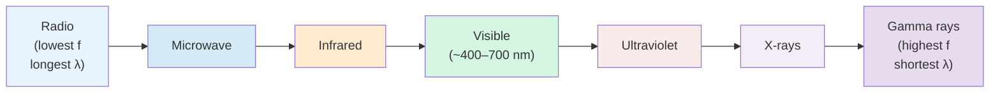

# Electromagnetic Spectrum

## Core Idea

The electromagnetic spectrum is the full range of electromagnetic waves, all travelling at the speed of light in vacuum but differing in [[Frequency]] and [[Wavelength]], ordered from radio waves to gamma rays.

## Meaning

All electromagnetic waves are transverse oscillations of electric and magnetic fields and travel at $c \approx 3.00 \times 10^{8}\ \text{m s}^{-1}$ in vacuum, with $c = f\lambda$. The conventional order by increasing frequency (and [[Photon-Energy]]) is: radio, microwave, infrared, visible, ultraviolet, X-rays, gamma rays. Higher frequency means shorter wavelength and more energetic photons via $E = hf$.

## Everyday Intuition

A radio tuner, a microwave oven, a TV remote (infrared), sunlight, and a hospital X-ray are all the same kind of wave at different frequencies.

## GCSE Foundation

- [[Wavelength]]
- [[Frequency]]

## Why It Matters

The spectrum organises how each region interacts with matter: visible light for sight, infrared for heat, X-rays and gamma rays for [[X-ray-Imaging]] and [[PET-Scanning]]. Ionising regions (UV upwards) carry enough energy per photon to remove electrons, which determines biological hazard.

## Related Quantities

- [[Wavelength]]
- [[Frequency]]
- [[Photon-Energy]]

## Related Laws or Results

- [[Photoelectric-Equation]]

## Related Models

- Wave model and photon model together describe propagation and energy transfer.

## Representations

- Logarithmic spectrum chart of frequency/wavelength against named bands.

## Experiments or Observations

- [[Investigating-Diffraction-with-a-Grating]]

## Applications

- [[X-ray-Imaging]]
- [[PET-Scanning]]

## Frontier Links

- Astronomical multi-wavelength observation connects to cosmology maps; orientation only.

## Common Mistakes

- Believing different EM waves travel at different speeds in vacuum (they do not).
- Confusing higher frequency with longer wavelength.

## Visuals

### Electromagnetic spectrum ordered by frequency

*Figure: All electromagnetic waves travel at c ≈ 3×10⁸ m s⁻¹ in vacuum. Frequency increases left to right; wavelength decreases. Photon energy E = hf increases with frequency. Above UV, radiation is ionising.*
*Source: Authored for this vault (CC0). No external copyright.*

## Source Trace

- Source: OpenStax College Physics; HyperPhysics; IOPSpark
- OCR alignment: [[OCR-Physics-A-H556-Specification]]
