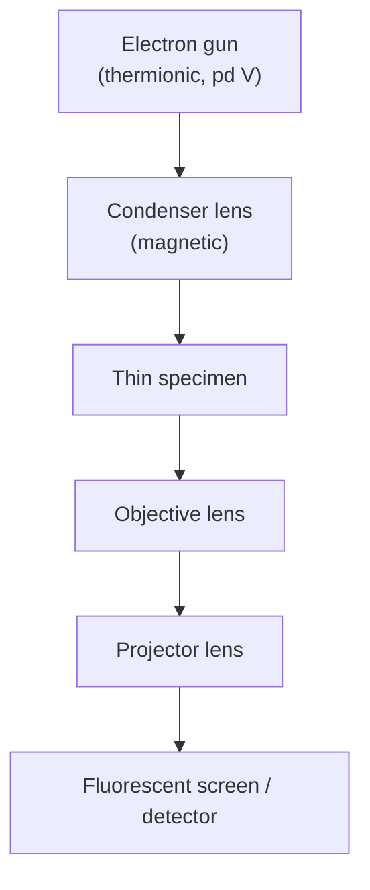

# Electron Microscopes

## Core Idea

Electrons accelerated through a large potential difference have a de Broglie wavelength thousands of times smaller than visible light. Using them in place of light gives a microscope whose resolution can reach atomic scale.

## Meaning

A microscope cannot resolve features much smaller than the wavelength it uses. Visible light has λ ≈ 500 nm, so an optical microscope is limited to features ≳ 200 nm — far larger than an atom. Electrons can do much better.

For a non-relativistic electron of mass m and charge e accelerated from rest through pd V:

$$\tfrac{1}{2}\,m v^{2} = e V \quad\Longrightarrow\quad p = m v = \sqrt{2 m e V}.$$

Combining with the [[De-Broglie-Equation]] λ = h/p:

$$\boxed{\;\lambda = \dfrac{h}{\sqrt{2 m e V}}\;}$$

Symbols and units:

- λ = de Broglie wavelength (m)
- h = Planck constant ≈ 6.63 × 10⁻³⁴ J s
- m = electron mass ≈ 9.11 × 10⁻³¹ kg
- e = elementary charge ≈ 1.60 × 10⁻¹⁹ C
- V = accelerating pd (V)

Conditions: vacuum, single electron from rest, non-relativistic (V ≲ a few tens of kV; serious microscopes use relativistic corrections).

Example: to reach λ ≈ 0.1 nm (atomic spacing), substitute λ = 1.0 × 10⁻¹⁰ m into the equation and solve for V; you get V ≈ 150 V. In practice TEMs use 100–300 kV — partly to penetrate samples and partly to focus the beam with magnetic lenses.

**Transmission electron microscope (TEM).** Electrons from an [[Thermionic-Emission]] gun are accelerated, focused by magnetic lenses, and pass *through* a very thin specimen. Denser regions scatter more electrons; the unscattered beam forms an image on a fluorescent screen or detector. Because λ is so small, atomic-scale features can be resolved. This is direct evidence of [[Wave-Particle-Duality]] — the same electrons that behave as particles in a Millikan-style experiment behave as waves here, diffracting through the specimen.

**Scanning tunnelling microscope (STM).** A very sharp metal tip is held a fraction of a nanometre above a conducting surface. Classically no current can flow across the gap, but quantum mechanically the electron wavefunction extends a little way into the vacuum, so a tiny "tunnelling" current crosses the gap. That current depends exponentially on the gap width, so scanning the tip across the surface while holding the current constant traces out the surface contour atom-by-atom.

## Everyday Intuition

You cannot tell the shape of small grit by feeling it with a thick gardening glove — the probe is bigger than the feature. Visible light is the "thick glove"; an electron beam (with its much smaller wavelength) is a fingertip.

## GCSE Foundation

- [[Wave-Refraction]]
- [[Atomic-Structure]]

## Why It Matters

Electron microscopes turned wave–particle duality from a curiosity into an everyday laboratory tool. They make atoms and molecules visible, drive materials science and biology, and are the direct technological descendant of [[Cathode-Rays]] and [[Thermionic-Emission]]. Historically they complete the arc that starts with the Newton-corpuscle versus Huygens-wave debate over light, runs through Young's double-slit (waves win for light) and the [[Photoelectric-Effect]] (particles return for light), and ends with matter itself showing wave behaviour. (See also the UV "ultraviolet catastrophe" that motivated Planck's [[Photon-Energy]] quantum hypothesis.)

## Related Quantities

- [[De-Broglie-Equation]]
- [[Specific-Charge]]
- [[Resolving-Power]]

## Related Laws or Results

- [[De-Broglie-Equation]]
- [[Photoelectric-Equation]]

## Related Models

- Wave model of the electron used in [[Wave-Particle-Duality]].

## Representations

- Schematic of TEM column: gun, condenser lens, specimen, objective lens, projector lens, screen.

## Experiments or Observations

- [[Thermionic-Emission]]
- [[Cathode-Rays]]

## Applications

- Imaging viruses, crystal lattices, semiconductor devices, individual atoms on metal surfaces.

## Frontier Links

- [[Quantum-Mechanics-Map]] — STM is the everyday demonstration of quantum tunnelling.

## Common Mistakes

- Using λ = h/(mv) without first finding v from ½mv² = eV.
- Forgetting the square root in λ = h/√(2meV).
- Confusing the **accelerating** voltage with a tunnelling voltage; the STM uses a tiny bias (mV–V), not kV.
- Claiming an electron microscope sees atoms with visible light — it images using electrons; the visible image is reconstructed afterwards.
- Treating the STM tunnelling current as classical "leakage" rather than a wave-mechanical effect.

## Visuals

### TEM column

*Figure: Electrons of wavelength λ = h/√(2meV) replace light; magnetic lenses focus the beam.*
*Source: Authored for this vault (CC0). No external copyright.*

### From Wikimedia

<!-- wiki-images: yes -->

#### Ernst Ruska's electron microscope
![[_attachments/04_Concepts/Electron-Microscopes--wiki-ruska-electron-microscope.jpg]]
*Figure: An early electron microscope built by Ernst Ruska (Deutsches Museum, Munich) — the tall evacuated column houses the electron gun and stacked magnetic lenses described in the schematic above.*
*Source: Wikimedia Commons — [Ernst Ruska Electron Microscope - Deutsches Museum - Munich-edit.jpg](https://commons.wikimedia.org/wiki/File:Ernst_Ruska_Electron_Microscope_-_Deutsches_Museum_-_Munich-edit.jpg) — CC BY-SA 3.0 — J Brew. Retrieved 2026-06-27.*

## Source Trace

- Source: [[AQA-Physics-7407-7408-Specification]] §3.12.2
- Public reference: HyperPhysics; OpenStax College Physics
