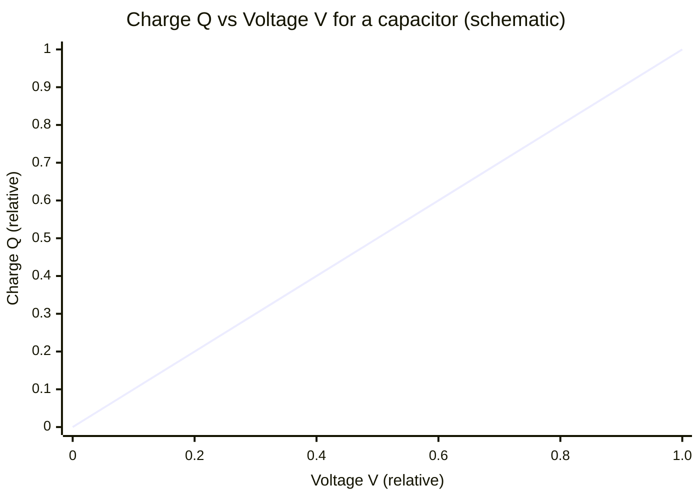

# Energy Stored in a Capacitor

## Core Idea

The energy stored in a charged capacitor equals the work done separating the charge against the rising potential difference, and is given by the area under a charge–voltage graph.

## Meaning

As a [[Capacitor]] charges, each extra element of charge $\Delta Q$ must be pushed onto a plate that is already at potential difference $V$. The work done is $V \Delta Q$. Because $V$ rises in proportion to $Q$ (since $Q = C V$), the total work is not $Q V$ but only half of it.

The energy stored is:

$$W = \tfrac{1}{2} Q V = \tfrac{1}{2} C V^2 = \frac{Q^2}{2C}$$

  - $W$ = energy stored, joules (J)
  - $Q$ = charge on each plate, coulombs (C)
  - $V$ = potential difference, volts (V)
  - $C$ = capacitance, farads (F)

All three forms are equivalent via $Q = C V$. Use the form that matches the quantities you are given.

The factor of ½ is the key feature: it appears because the average potential difference during charging is $\tfrac{1}{2}V$, not $V$. This is exactly the same mathematical structure as elastic strain energy ($\tfrac{1}{2} F x$ for a spring).

## Everyday Intuition

Filling the capacitor is like pumping water into a tank that gets harder to fill as it rises — the first charge goes in "for free" at zero voltage, the last charge goes in against the full voltage, so on average you do half the maximum work.

## GCSE Foundation

- [[Energy-Quantity|Energy]]
- [[Potential-Difference]]
- [[Charge]]

## Why It Matters

Energy storage explains why a camera flash or defibrillator uses a capacitor: energy accumulates slowly then discharges in milliseconds. The energy difference between two voltages, $\tfrac{1}{2}C(V_1^2 - V_2^2)$, gives the energy delivered during a partial discharge.

## Related Quantities

- [[Capacitance]]
- [[Charge]]
- [[Potential-Difference]]
- [[Energy-Quantity|Energy]]

## Related Laws or Results

- [[Capacitor-Discharge-Equation]]

## Related Models

- [[Capacitor]]
- [[Capacitors-in-Series-and-Parallel]]

## Representations

- [[Capacitor-Discharge-Graph]]

## Experiments or Observations

- [[Analysing-Capacitor-Charge-and-Discharge]]

## Applications

- [[Capacitor-Timing-Circuits]]

## Frontier Links

- [[Semiconductor-Physics-Map]]

## Common Mistakes

- Forgetting the factor of ½ and writing $W = QV$ (this is the work done by the supply; half is dissipated, half is stored).
- Mixing the three energy forms ($\tfrac{1}{2}CV^2$ needs V; $Q^2/2C$ needs Q — do not substitute inconsistently).
- Assuming all supplied energy is stored (during charging through a resistor, exactly half is dissipated as heat regardless of resistance).

## Visuals

### Charge–voltage graph: stored energy as triangular area

*Figure: $Q = CV$ gives a straight line through the origin (gradient = C). The energy stored $W = \tfrac{1}{2}QV$ is the triangular area under this line — not the full rectangle QV, because V starts at zero and rises as charge accumulates.*
*Source: Authored for this vault (CC0). No external copyright.*

### From Wikipedia

<!-- wiki-images: yes -->

#### Capacitors (7189597135)

![[_attachments/04_Concepts/Energy-Stored-in-a-Capacitor--wiki-capacitors-7189597135.jpg]]
*Figure: from Wikipedia article "Capacitor".*
*Source: Wikimedia Commons — [Capacitors_(7189597135).jpg](https://commons.wikimedia.org/wiki/File:Capacitors_(7189597135).jpg). Retrieved 2026-05-20.*

#### 24 Million Watt high speed flash through welding lens

![[_attachments/04_Concepts/Energy-Stored-in-a-Capacitor--wiki-24-million-watt-high-speed-flash-through.jpg]]
*Figure: from Wikipedia article "Capacitor".*
*Source: Wikimedia Commons — [24 Million Watt high speed flash through welding lens.jpg](https://commons.wikimedia.org/wiki/File:24_Million_Watt_high_speed_flash_through_welding_lens.jpg). Retrieved 2026-05-20.*

#### Axial electrolytic capacitors

![[_attachments/04_Concepts/Energy-Stored-in-a-Capacitor--wiki-axial-electrolytic-capacitors.jpg]]
*Figure: from Wikipedia article "Capacitor".*
*Source: Wikimedia Commons — [Axial electrolytic capacitors.jpg](https://commons.wikimedia.org/wiki/File:Axial_electrolytic_capacitors.jpg). Retrieved 2026-05-20.*

## Source Trace

- Source: OpenStax College Physics; HyperPhysics; Physics LibreTexts — no copied text
- Section/Page: OCR alignment: [[OCR-Physics-A-H556-Specification]] (M6.1)
