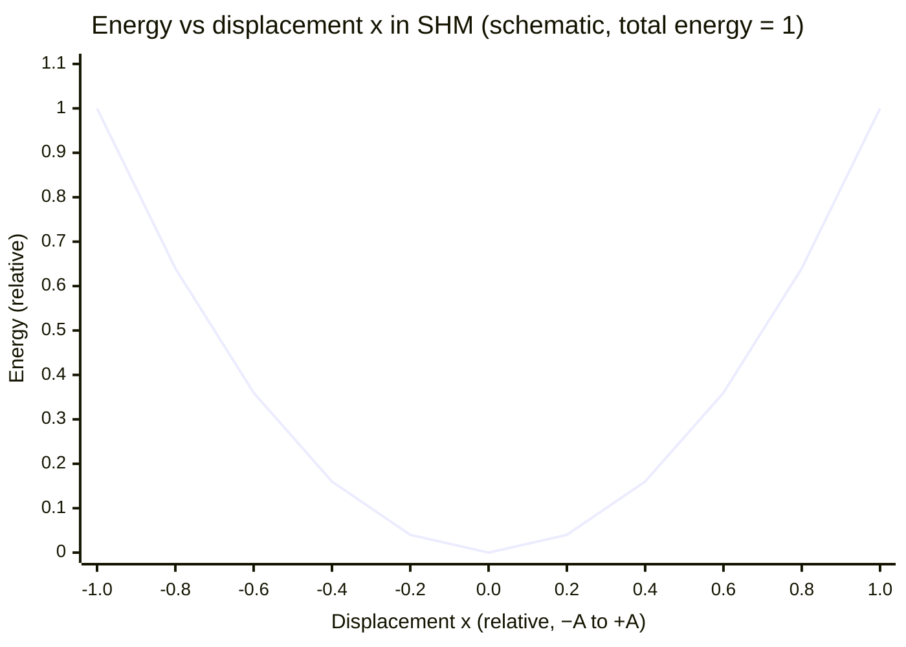

# Energy in Simple Harmonic Motion

## Core Idea

In an undamped simple harmonic oscillator, energy is continuously exchanged between kinetic and potential forms while the total mechanical energy stays constant.

## Meaning

For [[Simple-Harmonic-Motion]] with [[Amplitude]] A and angular frequency ω, the speed at displacement x is v = ±ω√(A² − x²). For a mass–spring system of mass m:

- Kinetic energy: E_k = ½ m v² = ½ m ω² (A² − x²)
- Potential energy: E_p = ½ m ω² x²
- Total energy: E = E_k + E_p = ½ m ω² A² = constant

At the centre (x = 0) energy is all kinetic; at the extremes (x = ±A) it is all potential. Total energy is proportional to A², so doubling the amplitude quadruples the energy. With [[Damping]], total energy decays as the amplitude falls. This is an application of [[Conservation-of-Energy]].

## Everyday Intuition

A pendulum trades height (potential) for speed (kinetic) and back; a bouncing spring stretches and compresses, storing and releasing strain energy each cycle.

## GCSE Foundation

- [[Conservation-of-Energy]]
- [[Hookes-Law]]

## Why It Matters

The energy view explains why amplitude affects energy but not period, underpins resonance energy build-up, and gives an independent route to find speed without solving the time equation.

## Related Quantities

- [[Amplitude]]
- [[Period]]
- [[Frequency]]

## Related Laws or Results

- [[Conservation-of-Energy]]
- [[Simple-Harmonic-Motion-Equation]]
- [[Hookes-Law]]

## Related Models

- [[Simple-Harmonic-Oscillator]]
- [[Ideal-Spring-Model]]

## Representations

- [[Velocity-Time-Graph]]

## Experiments or Observations

- [[Investigating-Simple-Harmonic-Motion]]

## Applications

- [[Banked-Tracks-and-Centrifuges]]

## Frontier Links

- [[Quantum-Mechanics-Map]]

## Common Mistakes

- [[Confusing-Angular-and-Linear-Quantities]]

## Visuals

### Kinetic and potential energy vs displacement in SHM

*Figure: Potential energy E_p = ½mω²x² is maximum at the extremes (x = ±A) and zero at the centre. Kinetic energy E_k = E_total − E_p is zero at the extremes and maximum at the centre. Total energy E ∝ A² remains constant.*
*Source: Authored for this vault (CC0). No external copyright.*

## Source Trace

- Source: OpenStax College Physics; HyperPhysics; The Physics Classroom — no copied text
- Section/Page: OCR alignment: [[OCR-Physics-A-H556-Specification]] (M5.3 Oscillations)
