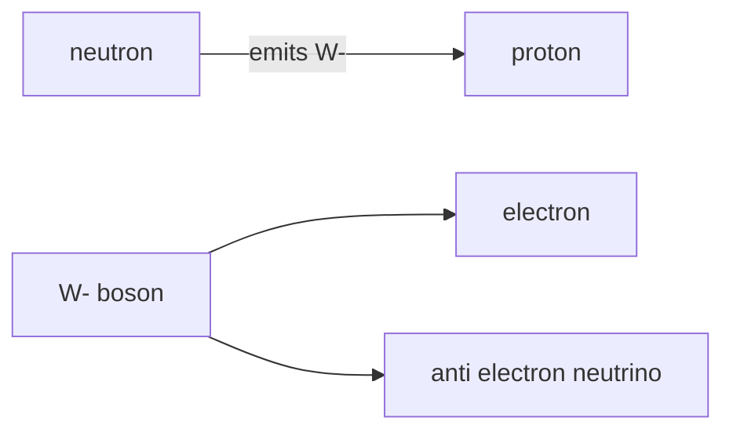

# Exchange Particles

## Core Idea

In modern physics, forces between particles are described as the exchange of "virtual" particles. Two particles interact by tossing a third particle back and forth; the recoil from this exchange is what we feel as a force.

## Meaning

For AQA A-level the only exchange particles examinable are:

- **Virtual photon** ($\gamma$) — carries the electromagnetic force between charged particles. Range: infinite (photon is massless).
- **$W^{+}$ and $W^{-}$ bosons** — carry the weak interaction. Used to explain $\beta^{-}$ decay, $\beta^{+}$ decay, electron capture, and electron–proton collisions. Range: very short ($< 10^{-18}\ \text{m}$) because the $W$ bosons are very massive.
- **Pions ($\pi$)** — the residual strong nuclear force *between nucleons* is modelled as pion exchange. Range: a few fm.

Gluons, the $Z^{0}$, and the graviton are **not** required.

The "virtual" label means these particles are not directly observed: they are temporary intermediates that exist within the energy–time uncertainty principle. Heavier exchange particles can borrow more energy for less time, which is why the weak interaction has such a short range.

## Everyday Intuition

Two ice-skaters throwing a ball between them recoil apart — exchange of a particle produces a force. The analogy is rough (it cannot give attraction), but it captures the central idea.

## GCSE Foundation

- [[Charge]]
- [[Atomic-Structure]]

## Why It Matters

Exchange particles let us draw simple Feynman diagrams for the standard AQA cases:

- **Electromagnetic repulsion**: two electrons exchange a virtual photon.
- **$\beta^{-}$ decay**: a neutron emits a $W^{-}$ which decays to an electron and an electron antineutrino, leaving a proton.
- **$\beta^{+}$ decay**: a proton emits a $W^{+}$ which decays to a positron and an electron neutrino, leaving a neutron.
- **Electron capture**: an inner-shell electron meets a proton; a $W$ boson is exchanged and a neutron plus an electron neutrino come out.
- **Electron–proton collision**: similar topology to electron capture but as a scattering event.

## Related Quantities

- [[Charge]]
- [[Mass]] — heavier exchange particle ⇒ shorter range.

## Related Laws or Results

- [[Conservation-of-Energy]]
- [[Conservation-of-Momentum]]

## Related Models

- [[The-Standard-Model]]

## Representations

- [[Feynman-Diagram]]

## Experiments or Observations

- Observed $\beta$-decay spectra and missing energy/momentum led to the prediction of the neutrino and, later, the $W$ bosons.
- Discovery of $W$ and $Z$ bosons at CERN (1983).

## Applications

- [[PET-Scanning]] relies on $\beta^{+}$ emission, mediated by a $W^{+}$.
- Solar fusion proceeds via a weak-interaction step (proton → neutron).

## Frontier Links

- [[Particle-Physics-Map]] — electroweak theory unifies $W$, $Z$, and photon; QCD uses gluons.

## Common Mistakes

- Calling exchange particles "real" particles you could detect mid-exchange. They are virtual.
- Using $W^{+}$ for $\beta^{-}$ decay (wrong sign). Charge must balance at every vertex: a $W^{-}$ is emitted because charge $-1$ leaves with it.
- Quoting gluons or $Z^{0}$ on AQA answers about the weak interaction.
- Drawing the photon line as a straight arrow instead of a wavy/dashed line.

## Visuals

*Figure: Beta-minus decay as W- exchange. Charge balances at both vertices.*
*Source: Authored for this vault (CC0). No external copyright.*

## Source Trace

- Source: [[AQA-Physics-7407-7408-Specification]] §3.2.1.4
- Section/Page: Particle interactions — exchange particles, simple Feynman diagrams.
- Explanatory reference: HyperPhysics "Exchange Particles"; OpenStax College Physics §33.4 (no text copied).
