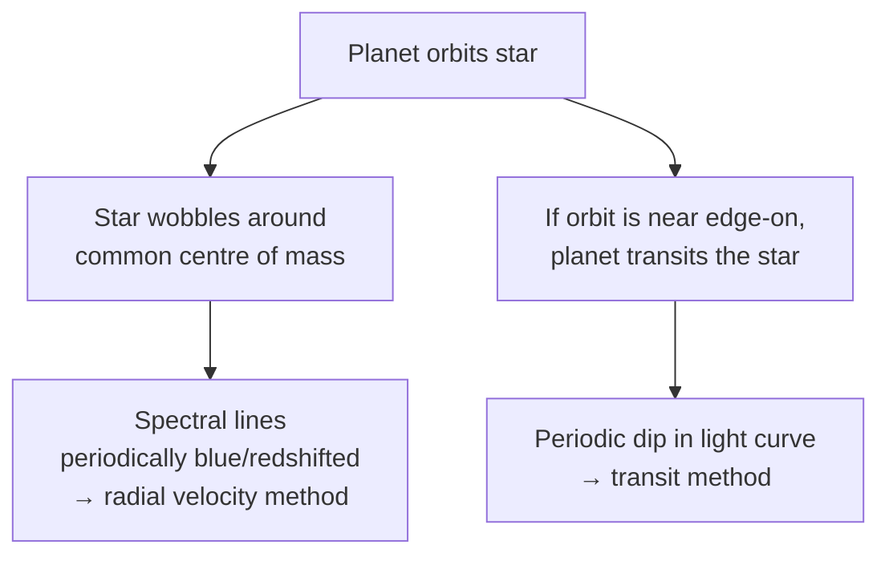

# Exoplanet Detection

## Core Idea

An **exoplanet** is a planet orbiting a star other than the Sun. Because planets are tiny, dim and physically close to a vastly brighter star, they are almost impossible to image directly. Instead, two **indirect** methods are used in AQA A-level: the **radial velocity** method and the **transit** method.

## Meaning

### Why direct imaging is hard

A Jupiter-sized planet next to a Sun-like star has a brightness contrast of order `10⁻⁹`. From light years away, the planet and star are also angularly very close — the star's glare swamps the planet's reflected light.

### Radial velocity (Doppler) method

The planet and star both orbit their common centre of mass. The star moves in a small circle, so its light is alternately blue- and red-shifted by the [[Doppler-Effect]]:

`Δλ / λ = v / c` (for `v ≪ c`)

where `v` is the line-of-sight component of the star's velocity (m s⁻¹), `λ` is the rest wavelength, and `c` is the speed of light. Repeating periodic shifts in stellar spectral lines reveal an orbiting companion. The method works best for **massive planets in close orbits**.

### Transit method

If the orbital plane is nearly edge-on to Earth, the planet **transits** (passes in front of) its star, causing a small, periodic dip in the star's measured [[Intensity]]. The dip's depth gives the planet's radius (as a fraction of the star's), and the time between dips gives the orbital period. The Kepler and TESS space missions used this method to find thousands of candidates.

A characteristic transit light curve is flat at full brightness, drops sharply as the planet's disc enters, stays roughly flat at the dimmer level during transit, and rises sharply at egress.

## Everyday Intuition

- Radial velocity: a sprinter running toward you sounds higher-pitched than one running away — same idea, with starlight instead of sound.
- Transit: a moth flying in front of a distant streetlight makes the light momentarily dimmer.

## GCSE Foundation

- [[Doppler-Effect]] for everyday waves.
- [[Intensity]] and how detectors measure brightness.

## Why It Matters

- Established that planetary systems are common throughout the galaxy.
- Lets us measure planet sizes, masses (radial velocity), and orbital periods.
- Combined methods constrain density → composition → potential habitability.

## Related Quantities

- [[Wavelength]]
- [[Intensity]]
- [[Period]]
- [[Velocity]]

## Related Laws or Results

- [[Doppler-Effect]] formula.
- [[Keplers-Third-Law]] for orbital periods.

## Related Models

- Two-body orbit around centre of mass.

## Representations

- Radial velocity curve (line-of-sight velocity vs time, sinusoidal).
- Transit light curve ([[Intensity]] vs time, flat-bottomed dip).

## Experiments or Observations

- High-resolution spectroscopy of stars over months/years.
- Photometric surveys (Kepler, TESS) measuring brightness to parts per million.

## Applications

- Identifying potentially habitable planets in the "Goldilocks zone".
- Targeting follow-up spectroscopy of planetary atmospheres.

## Frontier Links

- Astrobiology and the search for biosignatures.
- Cosmology-Map (in the broader sense of "how common is life?").

## Common Mistakes

- Confusing radial-velocity shifts of the **star** with hypothetical Doppler shifts from the planet — only the star's light is seen.
- Forgetting that transits require a near-edge-on orbit; most planets do not transit.
- Treating a single brightness dip as a confirmed transit — many false positives arise from binary stars and instrument noise; repeated periodic dips are required.

## Visuals

### Two indirect methods

*Figure: Radial velocity uses Doppler shifts of starlight; the transit method uses periodic dimming.*
*Source: Authored for this vault (CC0). No external copyright.*

### From Wikimedia

<!-- wiki-images: yes -->

#### A transit light curve
![[_attachments/04_Concepts/Exoplanet-Detection--wiki-transit-light-curve.svg]]
*Figure: A transiting exoplanet light curve — flux is flat at full brightness, drops as the planet's disc crosses the star, stays at a lower level during transit, then rises again at egress. The depth gives the planet's relative radius.*
*Source: Wikimedia Commons — [Theoretical Transiting Exoplanet Light Curve.svg](https://commons.wikimedia.org/wiki/File:Theoretical_Transiting_Exoplanet_Light_Curve.svg) — CC BY-SA 4.0 — CielProfond. Retrieved 2026-06-27.*

## Watch

- [[How-Do-We-Find-Exoplanets-STScI|How Do We Find Exoplanets?]] — Space Telescope Science Institute

## Source Trace

- Source: [[AQA-Physics-7407-7408-Specification]] §3.9.3
- Section/Page: Detection techniques of exoplanets — variation in Doppler shift, transit method.
- Public reference: NASA Exoplanet Exploration; HyperPhysics "Exoplanet Detection"; OpenStax Astronomy Ch. 21.
