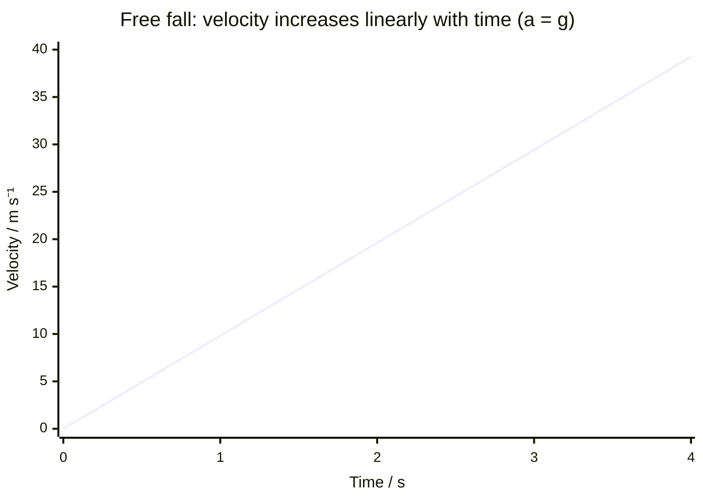

# Free Fall

## Core Idea

Free fall is motion under the influence of gravity alone, with no other significant force (in particular no air resistance) acting on the body.

## Meaning

During free fall the only force on an object is its weight, so by [[Newton-Second-Law]] its acceleration equals the gravitational field strength g (about 9.81 m s⁻² near Earth's surface). Crucially this acceleration is independent of mass: a feather and a hammer fall together in a vacuum, because while a heavier object is pulled harder, it also has proportionally more inertia, and the two effects cancel.

A freely falling object follows the [[Constant-Acceleration-Model]], so the SUVAT equations apply with $a = g$. An object thrown upward is still in free fall on the way up, at the top, and on the way down — the acceleration remains g downward throughout, even when the velocity is momentarily zero at the highest point.

True free fall requires no air resistance. In real air, drag grows with speed and eventually opposes the weight; the motion is then no longer free fall and may approach [[Terminal-Velocity]].

## Everyday Intuition

Dropping a coin: it speeds up steadily as it falls. Astronauts in orbit are in continuous free fall around the Earth, which is why they appear weightless.

## GCSE Foundation

- [[Weight]]
- [[Gravitational-Field-Strength]]
- [[Acceleration]]

## Why It Matters

Free fall is the cleanest test of the constant-acceleration model and the foundation for projectile motion, orbital mechanics, and the experimental measurement of g.

## Related Quantities

- [[Acceleration]]
- [[Velocity]]
- [[Gravitational-Field-Strength]]

## Related Laws or Results

- [[Newton-Second-Law]]

## Related Models

- [[Constant-Acceleration-Model]]

## Representations

- [[Velocity-Time-Graph]]
- [[Displacement-Time-Graph]]

## Experiments or Observations

- Measuring g using an electromagnet-released ball, trapdoor and electronic timer.
- Light gates and a falling card.

## Applications

- [[Projectile-Motion]]
- Skydiving (before drag dominates).

## Frontier Links

- Free fall is the basis of Einstein's equivalence principle in general relativity ([[Relativity-Map]]).

## Common Mistakes

- Thinking heavier objects fall faster in a vacuum.
- Claiming acceleration is zero at the top of the flight (velocity is zero, acceleration is still g).
- Forgetting that real falls include drag, so are not strictly free fall.

## Visuals

### Velocity–time graph for free fall

*Figure: Velocity increases at a constant rate equal to g ≈ 9.81 m s⁻². The straight line confirms constant acceleration regardless of the object's mass.*
*Source: Authored for this vault (CC0). No external copyright.*

## Source Trace

- Source: OpenStax College Physics; The Physics Classroom; IOPSpark; Physics LibreTexts — paraphrased, no copied text.
- OCR alignment: [[OCR-Physics-A-H556-Specification]]
