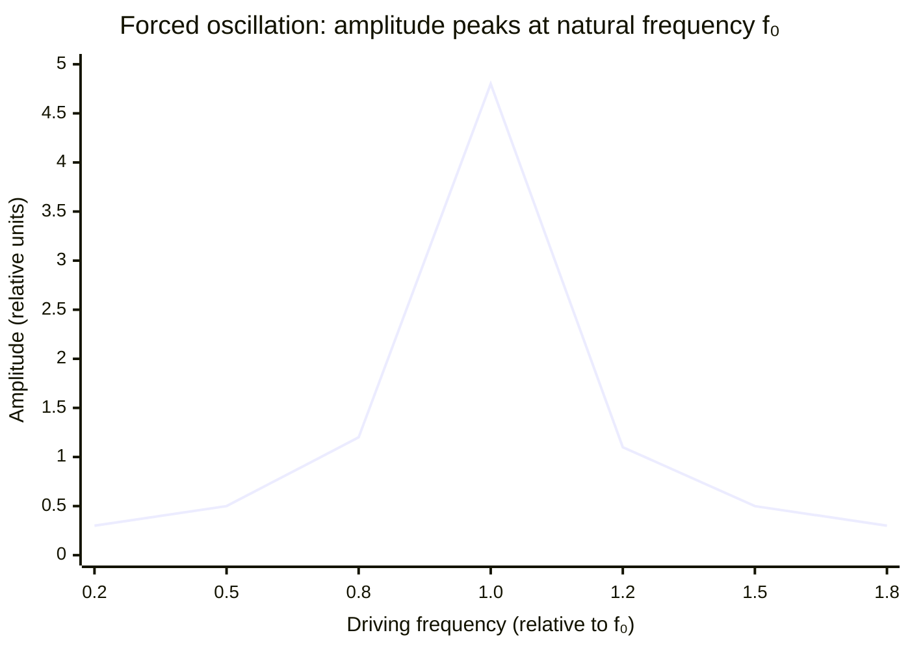

# Free and Forced Oscillations

## Core Idea

A free oscillation occurs at the system's own natural frequency with no driving force, while a forced oscillation is driven by an external periodic force and settles at the driving frequency.

## Meaning

**Free oscillation**: once displaced and released, an ideal system oscillates at its natural frequency f₀, set only by its own properties (e.g. mass and stiffness, or pendulum length and g). With no energy input and no [[Damping]] the [[Amplitude]] would stay constant; in reality it decays.

**Forced oscillation**: a periodic external driver of frequency f_d continuously supplies energy. After transients die away the system oscillates at f_d (not f₀). The steady-state [[Amplitude]] and the phase lag between driver and oscillator depend on how close f_d is to f₀:

- f_d ≪ f₀: small amplitude, nearly in phase with the driver.
- f_d ≈ f₀: large amplitude — [[Resonance]] — roughly 90° phase lag.
- f_d ≫ f₀: small amplitude, nearly antiphase (≈180°) with the driver.

## Everyday Intuition

A plucked guitar string vibrates freely at its own pitch; pushing a child on a swing is a forced oscillation — the swing responds best when you push at its natural rhythm.

## GCSE Foundation

- [[Force]]
- [[Conservation-of-Energy]]

## Why It Matters

This distinction is the foundation for understanding [[Resonance]], damping control, and the response of structures and instruments to periodic forcing.

## Related Quantities

- [[Frequency]]
- [[Amplitude]]
- [[Period]]

## Related Laws or Results

- [[Simple-Harmonic-Motion-Equation]]
- [[Conservation-of-Energy]]

## Related Models

- [[Simple-Harmonic-Oscillator]]

## Representations

- [[Velocity-Time-Graph]]

## Experiments or Observations

- [[Investigating-Simple-Harmonic-Motion]]

## Applications

- [[Banked-Tracks-and-Centrifuges]]

## Frontier Links

- [[Quantum-Mechanics-Map]]

## Common Mistakes

- [[Confusing-Angular-and-Linear-Quantities]]

## Visuals

### Amplitude–frequency response (resonance curve)

*Figure: Amplitude is largest when driving frequency equals the natural frequency f₀ — this is resonance. Away from f₀ the amplitude falls rapidly.*
*Source: Authored for this vault (CC0). No external copyright.*

### From Wikipedia

<!-- wiki-images: yes -->

#### ArealVelocity

![[_attachments/04_Concepts/Free-and-Forced-Oscillations--wiki-arealvelocity.svg]]
*Figure: from Wikipedia article "Natural frequency".*
*Source: Wikimedia Commons — [ArealVelocity.svg](https://commons.wikimedia.org/wiki/File:ArealVelocity.svg). Retrieved 2026-05-20.*

## Source Trace

- Source: OpenStax College Physics; HyperPhysics; The Physics Classroom — no copied text
- Section/Page: OCR alignment: [[OCR-Physics-A-H556-Specification]] (M5.3 Oscillations)
