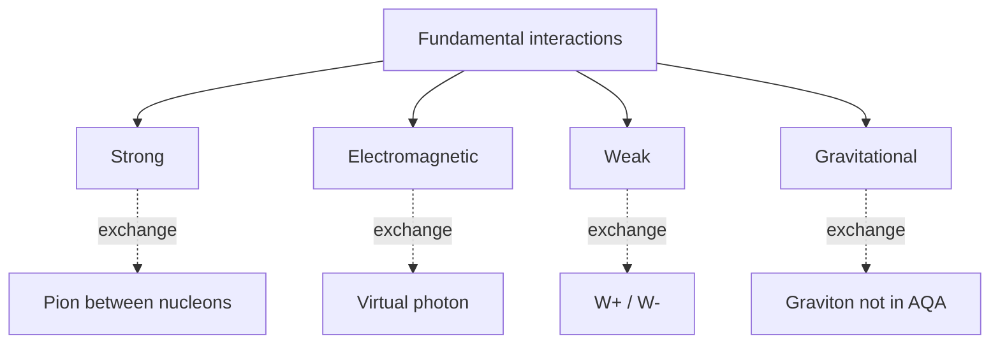

# Fundamental Interactions

## Core Idea

Every physical process in the universe is built from just four fundamental interactions: gravitational, electromagnetic, weak nuclear, and strong nuclear. Each acts on different particles, has a different strength, and operates over a different range — and each is mediated by an exchange particle.

## Meaning

| Interaction | Acts on | Relative strength | Range | Exchange particle (AQA) |
| --- | --- | --- | --- | --- |
| Strong nuclear | hadrons (quarks, nucleons, pions) | $1$ | $\sim 3\ \text{fm}$ | pion ($\pi$) between nucleons |
| Electromagnetic | charged particles | $\sim 10^{-2}$ | infinite | virtual photon ($\gamma$) |
| Weak nuclear | all leptons and quarks | $\sim 10^{-6}$ | $< 10^{-18}\ \text{m}$ | $W^{+}$, $W^{-}$ bosons |
| Gravitational | anything with mass/energy | $\sim 10^{-39}$ | infinite | (graviton — not in AQA) |

The "relative strength" entries are order-of-magnitude comparisons at nuclear scales. Gluons, the $Z^{0}$, and the graviton are not required by AQA at A-level.

## Everyday Intuition

Gravity holds you to the floor (long range but weak); electromagnetism holds you to your chair (the chair pushes back electrostatically). The two nuclear forces never make their presence felt in daily life because their ranges are shorter than an atom.

## GCSE Foundation

- [[Charge]]
- [[Mass]]
- [[Atomic-Structure]]

## Why It Matters

The four interactions decide what particles exist, which reactions are allowed, and which conservation laws to check. They are the backbone of [[The-Standard-Model]]. The idea that forces are carried by [[Exchange-Particles]] follows from quantum field theory and is tested by AQA via simple Feynman diagrams.

## Related Quantities

- [[Charge]]
- [[Mass]]

## Related Laws or Results

- [[Conservation-of-Energy]]
- [[Conservation-of-Momentum]]

## Related Models

- [[The-Standard-Model]]
- [[The-Nuclear-Atom]]

## Representations

- [[Feynman-Diagram]]

## Experiments or Observations

- Stable atoms (EM binding electrons).
- Stable nuclei (strong force).
- $\beta$ decay (weak interaction).
- Orbits and falling bodies (gravity).

## Applications

- Nuclear power, fusion in stars (strong + weak).
- Electronics and chemistry (EM).
- [[PET-Scanning]] uses weak-interaction decay products.

## Frontier Links

- [[Particle-Physics-Map]] — electroweak unification; gauge bosons of [[The-Standard-Model]]; gluons and the colour force; Higgs mechanism.

## Common Mistakes

- Saying gravity is "strong" because it holds planets together. It is by far the weakest interaction; it dominates astronomically only because mass-energy is always positive and the range is infinite.
- Mixing up the strong nuclear force (between nucleons / hadrons) and the weak nuclear force (responsible for flavour-changing decays).
- Saying the weak force is "weaker than gravity". It is much stronger than gravity but very short-ranged.
- Listing gluons or the $Z^{0}$ in AQA answers — only $W^{\pm}$ and the virtual photon are required as exchange particles, with pions for the strong force between nucleons.

## Visuals

*Figure: The four fundamental interactions and their AQA-required exchange particles.*
*Source: Authored for this vault (CC0). No external copyright.*

## Source Trace

- Source: [[AQA-Physics-7407-7408-Specification]] §3.2.1.3 and §3.2.1.4
- Section/Page: Particles, antiparticles and photons; particle interactions.
- Explanatory reference: HyperPhysics "Fundamental Forces"; OpenStax College Physics §33.4 (no text copied).
