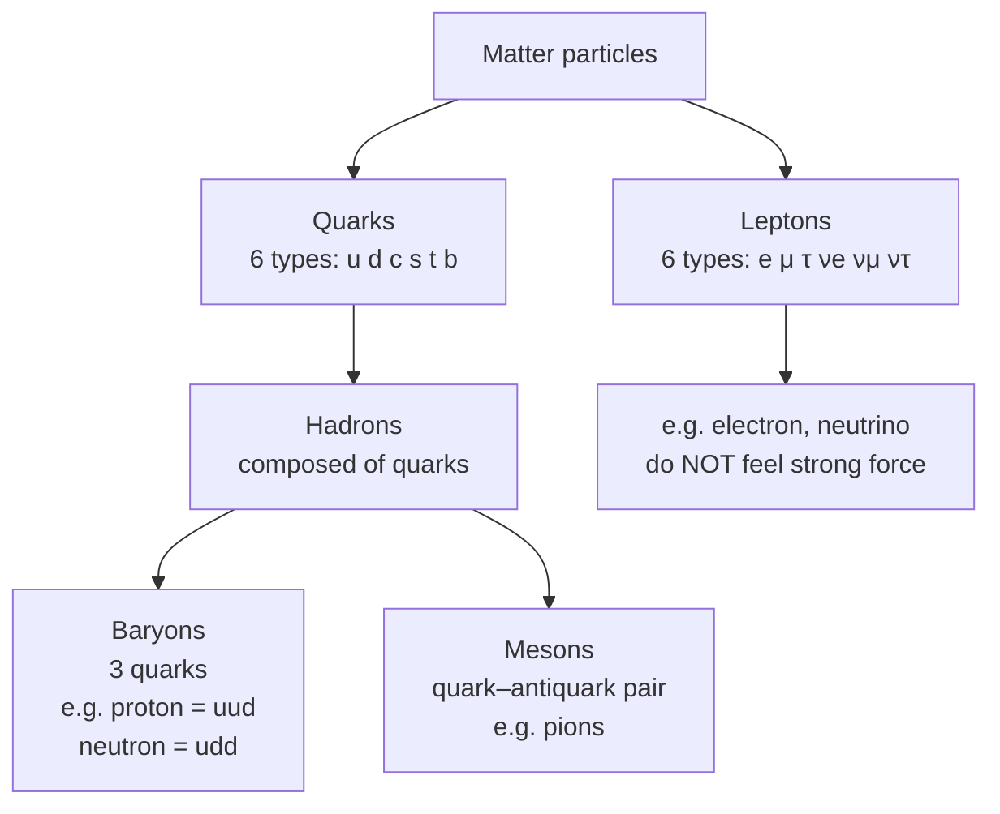

# Fundamental Particles

## Core Idea

A fundamental (elementary) particle has no internal structure and is not made of anything smaller; quarks and leptons are the fundamental matter particles.

## Meaning

Protons and neutrons are **not** fundamental — they are composed of [[Quarks]]. Electrons and neutrinos, by contrast, show no evidence of internal structure and are treated as fundamental [[Leptons]]. The currently accepted set of matter building blocks is:

- **Quarks** (six types): up, down, charm, strange, top, bottom — they feel the strong interaction and bind into composite particles.
- **Leptons** (six types): electron, muon, tau, and their three neutrinos — they do not feel the strong interaction.

Composite particles built from quarks are **hadrons**, split into:

- **Baryons** — three quarks (e.g. proton = uud, neutron = udd).
- **Mesons** — a quark–antiquark pair (e.g. pions, kaons).

Forces are carried by **exchange particles** (e.g. photon for electromagnetism), but at A-Level the focus is the quark/lepton classification and baryon/meson structure.

## Everyday Intuition

Just as all words are built from a small alphabet, all everyday matter is built from a handful of quarks and leptons — mostly up quarks, down quarks, and electrons.

## GCSE Foundation

- [[Atomic-Structure]]

## Why It Matters

This classification organises hundreds of observed particles, predicts which reactions are allowed via conservation rules, and underpins the [[The-Standard-Model]] description of matter.

## Related Quantities

- [[Mass]]
- [[Energy-Quantity|Energy]]

## Related Laws or Results

- [[Conservation-of-Momentum]]
- [[Conservation-of-Energy]]

## Related Models

- [[The-Standard-Model]]

## Representations

- Quark-content notation (e.g. proton = uud)

## Experiments or Observations

- High-energy particle collisions (deep inelastic scattering revealing quarks)

## Applications

- [[Particle-Physics-Map]]

## Frontier Links

- [[Particle-Physics-Map]]
- [[CERN-Science]]

## Common Mistakes

- Calling the proton fundamental (it is a baryon made of quarks)
- Treating quarks and leptons as the same family
- Forgetting mesons are quark–antiquark pairs, not three quarks

## Visuals

### Classification hierarchy of fundamental and composite particles

*Figure: Quarks bind into hadrons (baryons or mesons); leptons remain fundamental and do not feel the strong interaction. This tree shows how the particles relevant to OCR H556 fit together.*
*Source: Authored for this vault (CC0). No external copyright.*

## Source Trace

- Source: OpenStax College Physics; HyperPhysics; CERN educational material — no copied text
- OCR alignment: [[OCR-Physics-A-H556-Specification]]
