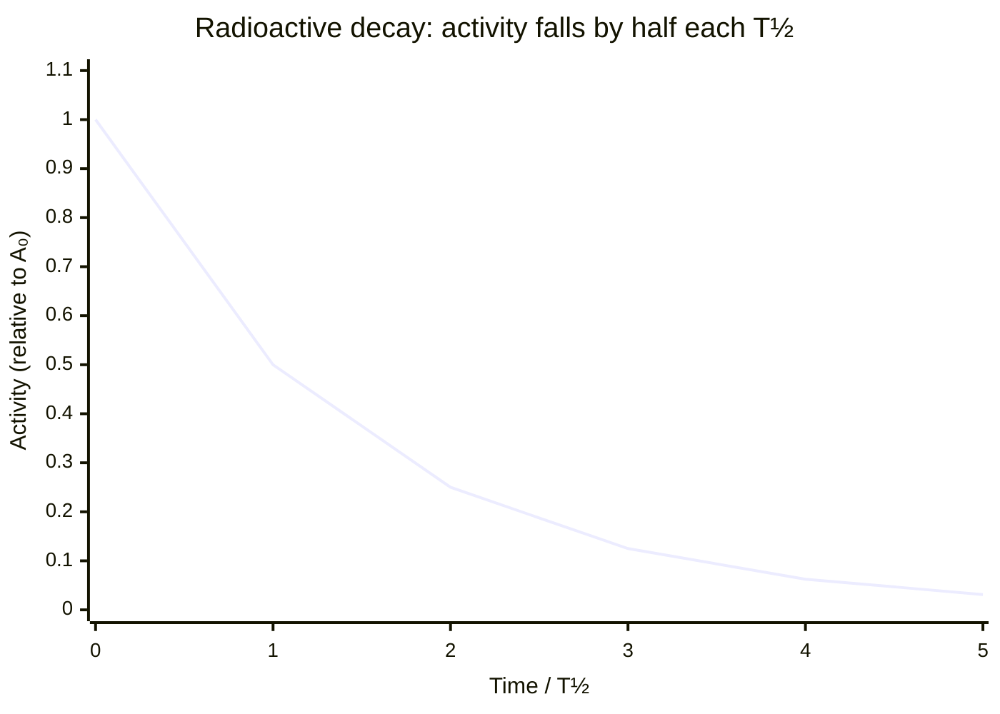

# Half-Life

## Core Idea

The half-life of a radioactive isotope is the average time taken for half of the undecayed nuclei in a sample to decay, or equivalently for the activity to fall to half its value.

## Meaning

Because [[Radioactive-Decay]] is exponential, the number of undecayed nuclei does not fall by a fixed amount each second but by a fixed fraction. The time for any sample of a given isotope to halve is constant, no matter how much you start with — this constant time is the half-life, T½.

After one half-life, half the original nuclei remain; after two half-lives a quarter remain; after three, an eighth, and so on. The activity (count rate) follows the same pattern because activity is proportional to the number of undecayed nuclei. Half-life is linked to the decay constant λ by $T_{1/2} = \ln 2 / \lambda$, where λ is the probability per second that a given nucleus decays. A short half-life means a high decay constant and a highly active but quickly fading source.

Half-lives range enormously: from fractions of a second to billions of years. This wide range is what makes different isotopes suitable for medical tracers (short half-life, low lingering dose) or for dating ancient rocks (long half-life).

## Everyday Intuition

If you keep removing half the water from a jug each minute, it never quite empties but shrinks predictably. Carbon-14's 5730-year half-life lets archaeologists date organic remains.

## GCSE Foundation

- [[Radioactivity]]
- [[Atomic-Structure]]
- [[Isotopes]]

## Why It Matters

Half-life determines the choice of isotopes for medicine, dating and power, the storage time for nuclear waste, and is a standard exam graph and calculation skill.

## Related Quantities

- [[Decay-Constant]]
- [[Activity]]

## Related Laws or Results

- [[Radioactive-Decay-Law]]

## Related Models

- [[Nuclear-Model]]

## Representations

- Exponential decay graph with successive halvings marked.
- Log-linear graph (straight line of gradient −λ).

## Experiments or Observations

- Determining the half-life of a short-lived source (e.g. protactinium-234m) from a count-rate–time graph.

## Applications

- Medical radioactive tracers.
- Radiometric and carbon dating; nuclear waste management.

## Frontier Links

- Decay statistics connect to the weak interaction in the [[Particle-Physics-Map]].

## Common Mistakes

- Thinking the sample fully decays after two half-lives.
- Believing half-life depends on the starting quantity.
- Confusing half-life with the decay constant (they are inversely related via ln 2).

## Visuals

### Exponential decay: activity halves every half-life T½

*Figure: Each step along the x-axis represents one half-life T½. Activity (and undecayed nuclei) halves with each T½. The curve never reaches zero — the sample decays asymptotically.*
*Source: Authored for this vault (CC0). No external copyright.*

### From Wikipedia

<!-- wiki-images: yes -->

#### Euler's formula

![[_attachments/04_Concepts/Half-Life--wiki-eulers-formula.svg]]
*Figure: from Wikipedia article "Half-life".*
*Source: Wikimedia Commons — [Euler's_formula.svg](https://commons.wikimedia.org/wiki/File:Euler's_formula.svg). Retrieved 2026-05-20.*

#### Euler's formula

![[_attachments/04_Concepts/Half-Life--wiki-eulers-formula.svg]]
*Figure: from Wikipedia article "Half-life".*
*Source: Wikimedia Commons — [Euler's formula.svg](https://commons.wikimedia.org/wiki/File:Euler's_formula.svg). Retrieved 2026-05-20.*

## Source Trace

- Source: OpenStax College Physics; The Physics Classroom; IOPSpark; Physics LibreTexts — paraphrased, no copied text.
- OCR alignment: [[OCR-Physics-A-H556-Specification]]
