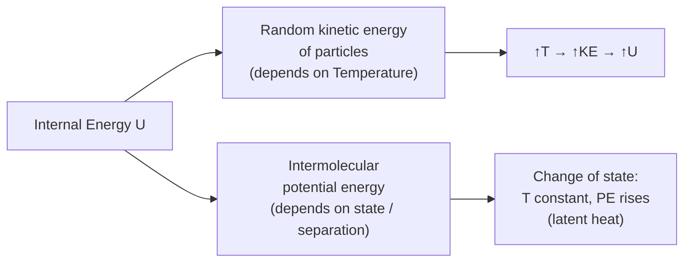

# Internal Energy

## Core Idea

The internal energy of a body is the sum of the randomly distributed kinetic and potential energies of all its particles.

## Meaning

Internal energy $U$ has two contributions:

- **Random kinetic energy** of the particles (translation, rotation, vibration), which depends on [[Temperature]].
- **Potential energy** stored in the intermolecular forces (bonds), which depends on the separation of particles and therefore on the **state of matter**.

The word "random" is essential: ordered, bulk kinetic energy (the whole object moving) and bulk gravitational potential energy are **not** part of internal energy.

Internal energy can be changed in two ways: by **heating** (energy transfer due to a temperature difference) or by **doing work** on the substance (e.g. compressing a gas). This is the basis of the conservation principle expressed by the first law of thermodynamics, an extension of [[Conservation-of-Energy]].

For an **ideal gas** there are no intermolecular forces, so the potential-energy term is zero. The internal energy of an ideal gas is therefore purely the total random kinetic energy of its molecules and depends *only* on its thermodynamic temperature:

$$ U = N \times \tfrac{3}{2}kT $$

where $N$ is the number of molecules, $k$ is the [[Boltzmann-Constant]] (J K⁻¹) and $T$ is thermodynamic temperature (K).

## Everyday Intuition

Stretching a rubber band or repeatedly bending a paperclip warms it: work done on the material increases the random particle energy, raising its internal energy and temperature.

## GCSE Foundation

- [[Energy]]
- [[Conservation-of-Energy]]

## Why It Matters

During a **change of state** (melting, boiling) the temperature stays constant while energy is supplied: the kinetic part of $U$ is unchanged but the potential part increases as bonds are broken — this is the meaning of [[Specific-Latent-Heat]].

## Related Quantities

- [[Temperature]]
- [[Specific-Heat-Capacity]]
- [[Specific-Latent-Heat]]
- [[Boltzmann-Constant]]

## Related Laws or Results

- [[Ideal-Gas-Equation]]
- [[Conservation-of-Energy]]

## Related Models

- [[Ideal-Gas-Model]]
- [[Kinetic-Theory-of-Gases]]

## Representations

- Energy-vs-time heating curves showing plateaus at changes of state

## Experiments or Observations

- [[Measuring-Specific-Heat-Capacity]]

## Applications

- Heat engines, refrigeration, calorimetry

## Frontier Links

- Statistical mechanics and entropy (beyond A-Level)

## Common Mistakes

- [[Confusing-Heat-and-Temperature]]

## Visuals

### Two contributions to internal energy

*Figure: Internal energy has two parts. During heating of a single phase both rise; during a change of state only PE changes (temperature stays constant — this is the physical meaning of specific latent heat).*
*Source: Authored for this vault (CC0). No external copyright.*

## Source Trace

- Source: OpenStax College Physics; HyperPhysics; The Physics Classroom — paraphrased, no copied text
- Section/Page: OCR alignment: [[OCR-Physics-A-H556-Specification]] (Module 5.1.2)
