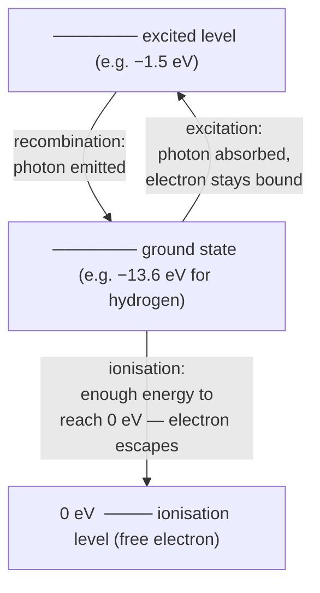

# Ionisation

## Core Idea

Ionisation is the process of removing one or more electrons from an atom (or adding electrons), leaving a charged ion; it requires a definite minimum energy called the ionisation energy.

## Meaning

A bound electron sits in a negative [[Energy-Levels|energy level]]. To remove it completely from the atom it must be supplied with enough energy to raise it to the zero (free) level. The minimum energy needed to remove the most loosely bound electron from a neutral atom in its ground state is the ionisation energy, often quoted in electronvolts (eV).

Energy for ionisation can be delivered in several ways: by a sufficiently energetic photon (photo-ionisation, the limiting case of the [[Photoelectric-Effect]] for an atom), by a fast-moving charged particle colliding with the atom (collisional ionisation), or by intense heating. Radiation that can ionise atoms — alpha, beta, gamma, X-rays and far-UV — is called ionising radiation and is biologically damaging because it disrupts molecules in living cells.

Once ionised, the atom is a positive ion and the freed electron may travel independently or be captured elsewhere. The reverse process, an ion recapturing an electron and dropping into a level, releases a photon (recombination).

## Everyday Intuition

A smoke detector uses a tiny radioactive source to ionise air so a current flows; smoke disrupts this current and triggers the alarm. Lightning ionises a channel of air, making it conduct.

## GCSE Foundation

- [[Atomic-Structure]]
- [[Static-Electricity]]
- [[Radioactivity]]

## Why It Matters

Ionisation underlies radiation detectors, the hazards of ionising radiation, gas discharge lamps, and the behaviour of plasmas and the ionosphere.

## Related Quantities

- [[Ionisation-Energy]]
- [[Photon-Energy]]
- [[Charge]]

## Related Laws or Results

- [[Conservation-of-Energy]]
- [[Photoelectric-Equation]]

## Related Models

- [[Photon-Model]]
- [[Bohr-Model]]

## Representations

- Energy-level diagram showing transition to the zero level.

## Experiments or Observations

- Ionisation chamber or Geiger–Müller tube detecting ionising radiation.

## Applications

- Smoke detectors and radiation dosimetry.
- Fluorescent and discharge lighting.

## Frontier Links

- Plasma physics and astrophysical ionisation connect to the [[Particle-Physics-Map]].

## Common Mistakes

- Confusing ionisation (electron fully removed) with excitation (electron raised but still bound).
- Thinking any photon can ionise an atom regardless of energy.
- Forgetting ionisation energy refers to the ground-state, most weakly bound electron.

## Visuals

### Energy-level diagram: ionisation vs excitation

*Figure: Ionisation requires raising the electron from its current level all the way to the zero (free) level. Excitation only raises it to an intermediate level; the electron remains bound. Ionisation energy = energy needed to reach 0 eV from the ground state.*
*Source: Authored for this vault (CC0). No external copyright.*

## Source Trace

- Source: OpenStax College Physics; The Physics Classroom; IOPSpark; Physics LibreTexts — paraphrased, no copied text.
- OCR alignment: [[OCR-Physics-A-H556-Specification]]
