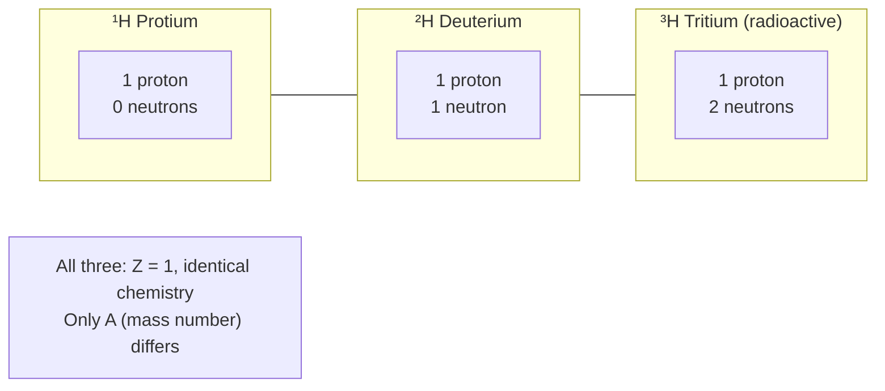

# Isotopes

## Core Idea

Isotopes are atoms of the same element that have the same number of protons but different numbers of neutrons.

## Meaning

Because the proton number Z is the same, isotopes are chemically identical and occupy the same place in the periodic table. They differ in nucleon number A, hence in mass and often in nuclear stability. For example, carbon has stable ¹²C and ¹³C and radioactive ¹⁴C; hydrogen has ¹H, deuterium ²H, and tritium ³H.

Some isotopes are stable; others are radioactive (radioisotopes) and decay over time. The neutron-to-proton ratio largely determines stability: too many or too few neutrons makes a nucleus unstable, leading to [[Radioactive-Decay]].

## Everyday Intuition

Isotopes are like the same model of car fitted with different ballast weights — they drive (react chemically) the same way, but weigh differently and some "wear out" (decay) while others last.

## GCSE Foundation

- [[Atomic-Structure]]

## Why It Matters

Isotopes enable radioactive dating (e.g. ¹⁴C in [[Carbon-Dating]]), medical tracers and imaging, nuclear fuel (²³⁵U vs ²³⁸U), and stable-isotope analysis. Distinguishing isotopes also explains why measured relative atomic masses are non-integer averages of natural isotope abundances.

## Related Quantities

- [[Mass]]
- [[Half-Life]]

## Related Laws or Results

- [[Radioactive-Decay-Law]]

## Related Models

- [[The-Nuclear-Atom]]

## Representations

- Nuclide notation ᴬ_Z X; chart of nuclides (N vs Z stability band)

## Experiments or Observations

- Mass spectrometer separating isotopes by mass-to-charge ratio

## Applications

- [[Carbon-Dating]]
- [[Nuclear-Fission]]

## Frontier Links

- [[Particle-Physics-Map]]

## Common Mistakes

- Thinking isotopes have different proton numbers
- Assuming all isotopes of an element are radioactive
- Confusing isotope (same Z) with ion (different electron count)

## Visuals

### Hydrogen isotopes: same proton number, different neutron number

*Figure: The three hydrogen isotopes share one proton (same element, same chemistry) but carry 0, 1, or 2 neutrons. Tritium is unstable (radioactive) because its neutron-to-proton ratio is too high.*
*Source: Authored for this vault (CC0). No external copyright.*

### From Wikipedia

<!-- wiki-images: yes -->

#### NuclearReaction

![[_attachments/04_Concepts/Isotopes--wiki-nuclearreaction.svg]]
*Figure: from Wikipedia article "Isotope".*
*Source: Wikimedia Commons — [NuclearReaction.svg](https://commons.wikimedia.org/wiki/File:NuclearReaction.svg). Retrieved 2026-05-20.*

#### Atomic number depiction

![[_attachments/04_Concepts/Isotopes--wiki-atomic-number-depiction.svg]]
*Figure: from Wikipedia article "Isotope".*
*Source: Wikimedia Commons — [Atomic number depiction.svg](https://commons.wikimedia.org/wiki/File:Atomic_number_depiction.svg). Retrieved 2026-05-20.*

#### Discovery of neon isotopes

![[_attachments/04_Concepts/Isotopes--wiki-discovery-of-neon-isotopes.jpg]]
*Figure: from Wikipedia article "Isotope".*
*Source: Wikimedia Commons — [Discovery of neon isotopes.JPG](https://commons.wikimedia.org/wiki/File:Discovery_of_neon_isotopes.JPG). Retrieved 2026-05-20.*

## Source Trace

- Source: OpenStax College Physics; HyperPhysics; CERN educational material — no copied text
- OCR alignment: [[OCR-Physics-A-H556-Specification]]
