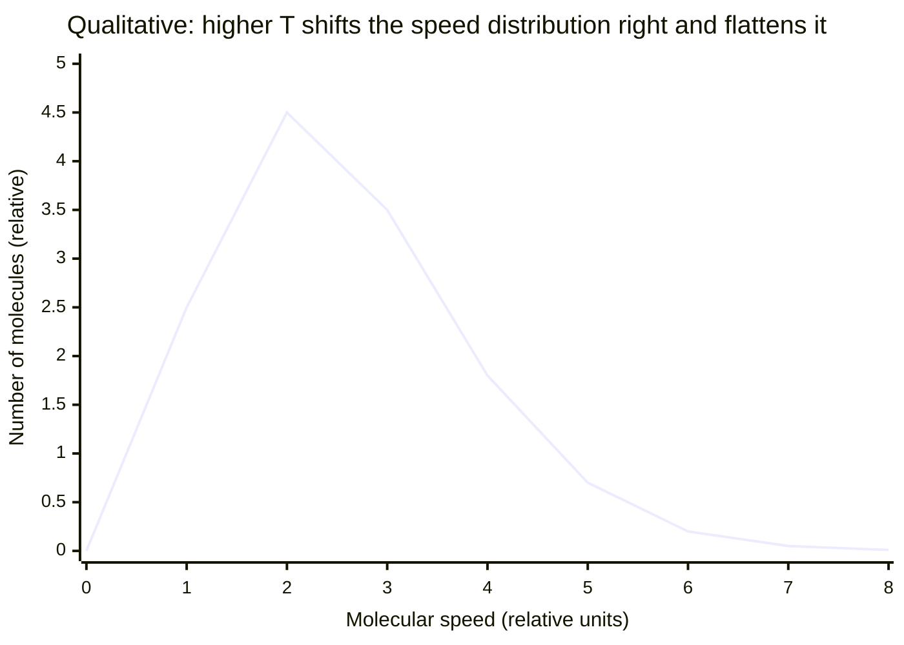

# Kinetic Theory of Gases

## Core Idea

Kinetic theory explains the macroscopic behaviour of a gas (its pressure and temperature) as the statistical result of many tiny molecules in rapid random motion colliding with the container walls.

## Meaning

The model rests on a set of simplifying assumptions for an ideal gas:

- a large number of identical molecules in continuous random motion;
- molecular volume is negligible compared with the container volume;
- collisions with walls and each other are perfectly elastic;
- the time of a collision is negligible compared with the time between collisions;
- no intermolecular forces except during collisions.

Applying Newtonian mechanics to one molecule of mass $m$ bouncing elastically off a wall, then averaging over all $N$ molecules in volume $V$, gives the kinetic theory equation:

$$ pV = \tfrac{1}{3} N m \overline{c^{2}} $$

where $p$ is pressure (Pa), $V$ is volume (m³), $N$ is the number of molecules, $m$ is the mass of one molecule (kg) and $\overline{c^{2}}$ is the **mean square speed** (m² s⁻²). The square root $\sqrt{\overline{c^{2}}}$ is the **root-mean-square (r.m.s.) speed**.

Comparing this with the empirical [[Ideal-Gas-Equation]] $pV = NkT$ links the microscopic and macroscopic pictures:

$$ \tfrac{1}{2} m \overline{c^{2}} = \tfrac{3}{2} k T $$

So the **mean translational kinetic energy of one molecule is $\frac{3}{2}kT$**, depending only on thermodynamic [[Temperature]], with $k$ the [[Boltzmann-Constant]] (J K⁻¹).

## Everyday Intuition

[[Pressure]] in a tyre is the cumulative drumming of countless molecular impacts on the inner wall; warming the gas makes molecules hit faster and harder, raising the pressure.

## GCSE Foundation

- GCSE particle model and gas pressure
- [[Pressure]]

## Why It Matters

It provides the molecular interpretation of [[Temperature]] and [[Internal-Energy]], and turns the empirical gas laws into a derived result rather than just an observation.

## Related Quantities

- [[Pressure]]
- [[Temperature]]
- [[Boltzmann-Constant]]

## Related Laws or Results

- [[Ideal-Gas-Equation]]
- [[Conservation-of-Energy]]

## Related Models

- [[Ideal-Gas-Model]]

## Representations

- Maxwell–Boltzmann speed distribution curve (qualitative shift with temperature)

## Experiments or Observations

- Brownian motion as direct evidence of random molecular motion

## Applications

- [[Applying-the-Ideal-Gas-Equation]]

## Frontier Links

- Statistical mechanics and the equipartition theorem (beyond A-Level)

## Common Mistakes

- [[Confusing-Heat-and-Temperature]]
- Treating r.m.s. speed as equal to the mean speed

## Visuals

### Maxwell–Boltzmann speed distribution shifts with temperature

*Figure: Qualitative Maxwell–Boltzmann distribution at lower temperature T₁. At higher T₂ the peak shifts right (higher most probable speed), the curve flattens, and the high-speed tail grows. Mean KE per molecule $= \tfrac{3}{2} kT$.*
*Source: Authored for this vault (CC0). No external copyright.*

### From Wikipedia

<!-- wiki-images: yes -->

#### Translational motion

![[_attachments/04_Concepts/Kinetic-Theory-of-Gases--wiki-translational-motion.gif]]
*Figure: from Wikipedia article "Kinetic theory of gases".*
*Source: Wikimedia Commons — [Translational_motion.gif](https://commons.wikimedia.org/wiki/File:Translational_motion.gif). Retrieved 2026-05-20.*

#### Catherine II visiting Mikhail Lomonosov by Ivan Feodorov 1884

![[_attachments/04_Concepts/Kinetic-Theory-of-Gases--wiki-catherine-ii-visiting-mikhail-lomonosov-.jpg]]
*Figure: from Wikipedia article "Kinetic theory of gases".*
*Source: Wikimedia Commons — [Catherine II visiting Mikhail Lomonosov by Ivan Feodorov 1884.jpg](https://commons.wikimedia.org/wiki/File:Catherine_II_visiting_Mikhail_Lomonosov_by_Ivan_Feodorov_1884.jpg). Retrieved 2026-05-20.*

#### HYDRODYNAMICA, Danielis Bernoulli

![[_attachments/04_Concepts/Kinetic-Theory-of-Gases--wiki-hydrodynamica-danielis-bernoulli.png]]
*Figure: from Wikipedia article "Kinetic theory of gases".*
*Source: Wikimedia Commons — [HYDRODYNAMICA, Danielis Bernoulli.png](https://commons.wikimedia.org/wiki/File:HYDRODYNAMICA,_Danielis_Bernoulli.png). Retrieved 2026-05-20.*

## Source Trace

- Source: OpenStax College Physics; HyperPhysics; The Physics Classroom — paraphrased, no copied text
- Section/Page: OCR alignment: [[OCR-Physics-A-H556-Specification]] (Module 5.1.4)
