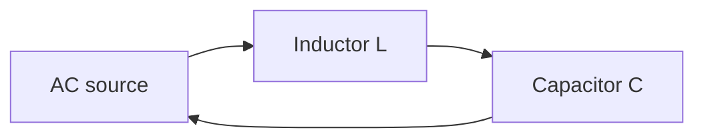

# LC Resonance Filter

## Core Idea

An inductor $L$ and a capacitor $C$ wired together form a circuit that "rings" at one preferred frequency. Driven at that frequency, the circuit responds strongly; driven away from it, the response drops. This is the basis of every tuned radio receiver.

## Meaning

A capacitor stores energy in an electric field; an inductor stores energy in a magnetic field. In an LC loop, energy sloshes between the two stores, just as energy sloshes between kinetic and potential in a mass on a spring. The natural **resonant frequency** is

$$f_{0} = \frac{1}{2\pi \sqrt{LC}}$$

Symbols and units:

- $f_{0}$: resonant frequency (Hz)
- $L$: inductance (H, henry)
- $C$: capacitance (F, farad)

Conditions: this formula assumes an ideal LC loop with no resistance. Real circuits include some [[Resistance]] $R$, which damps the oscillation.

**Filter behaviour.** When an LC circuit is driven by a signal containing many frequencies, it picks out frequencies near $f_{0}$ and attenuates the rest. Depending on the wiring (series vs parallel), it acts as a **band-pass** filter (lets one band through) or a **band-stop** filter (blocks one band).

**Quality factor $Q$ (qualitative).** $Q$ measures how sharply the filter selects $f_{0}$.

- High $Q$: narrow, tall response peak — very selective tuning.
- Low $Q$: broad, low peak — accepts a wider band but with less rejection of nearby frequencies.

Practically, $Q$ rises when resistive losses fall.

## Everyday Intuition

A child on a swing has one natural frequency. Push at that rate and the swing builds up; push at any other rate and energy gets wasted. An LC circuit is the electrical version, and tuning a radio dial physically changes $C$ (or sometimes $L$) to move $f_{0}$ onto the station you want.

## GCSE Foundation

- [[Alternating-Current]]
- [[Capacitance]]

## Why It Matters

LC filters select radio stations, define the carrier frequencies of [[Communication-Systems]], reject interference, and tune oscillators in instruments and clocks. Every wireless link uses a tuned LC circuit somewhere.

## Related Quantities

- [[Capacitance]]
- [[Resistance]]

## Related Laws or Results

- $f_{0} = 1/(2\pi\sqrt{LC})$

## Related Models

- [[Simple-Harmonic-Oscillator]] — mechanical analogue of the LC loop.
- [[Ideal-Operational-Amplifier]] — active filters combine op-amps with $RC$ networks for similar selectivity at lower frequencies.

## Representations

- [[Circuit-Diagram]] — series and parallel LC variants.
- Frequency-response plot: output amplitude vs frequency, with a peak at $f_{0}$.

## Experiments or Observations

- Drive an LC circuit with a signal generator and sweep frequency; plot output amplitude to locate $f_{0}$.
- Vary $C$ and verify that $f_{0}$ changes as $1/\sqrt{C}$.

## Applications

- [[Communication-Systems]] — radio tuning, AM/FM selection.
- [[Signal-Processing]]

## Frontier Links

- [[Resonance]]

## Common Mistakes

- Mixing up units of $L$ (H) and $C$ (F) in the formula — both must be in SI.
- Forgetting the $2\pi$: $\omega_{0} = 1/\sqrt{LC}$ is the angular frequency, while $f_{0}$ includes the $2\pi$ factor.
- Assuming an LC circuit oscillates forever — real circuits damp out because of resistance.
- Confusing high $Q$ (narrow, sharp) with high gain.

## Visuals

### Series LC resonant loop

*Figure: an ideal series LC loop resonates at f_0 = 1 / (2 pi sqrt(LC)).*
*Source: Authored for this vault (CC0). No external copyright.*

## Source Trace

- Source: [[AQA-Physics-7407-7408-Specification]] §3.13
- Public source: HyperPhysics; All About Circuits
- Section/Page: Electronics — LC resonance and tuned circuits
