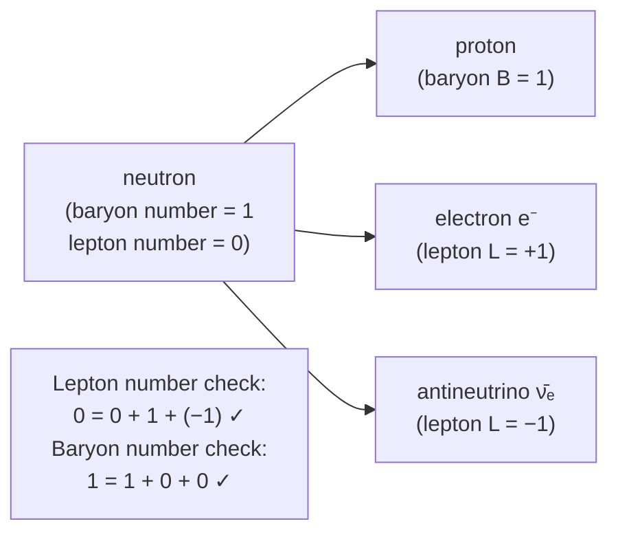

# Leptons

## Core Idea

Leptons are fundamental particles that do not feel the strong interaction; the electron and the neutrino are the leptons most relevant at A-Level.

## Meaning

There are six leptons in three generations: electron (e⁻), muon (μ⁻), tau (τ⁻), and their associated neutrinos (νₑ, ν_μ, ν_τ). Each has an [[Antiparticles|antilepton]] (e.g. the positron e⁺, and antineutrinos).

Key properties:

- The electron has charge −e and mass ≈ 9.11 × 10⁻³¹ kg.
- Neutrinos are electrically neutral, almost massless, and interact only via the weak interaction, so they pass through matter easily.
- **Lepton number** is conserved in all interactions. Each lepton has lepton number +1; each antilepton −1. This rule explains why beta-minus decay must emit an electron antineutrino: a neutron → proton + e⁻ + ν̄ₑ, keeping lepton number balanced (0 = 0 + 1 + (−1)).

Leptons are believed to be truly fundamental — no internal quark structure.

## Everyday Intuition

The electron is the lepton you meet daily — it carries electric current and forms chemical bonds. The neutrino is the "ghost" lepton: trillions stream through your body each second almost unnoticed.

## GCSE Foundation

- [[Atomic-Structure]]

## Why It Matters

Lepton-number conservation is a core tool for checking whether a proposed nuclear or particle reaction is allowed, especially in beta decay.

## Related Quantities

- [[Mass]]
- [[Energy-Quantity|Energy]]

## Related Laws or Results

- [[Radioactive-Decay-Law]]

## Related Models

- [[The-Standard-Model]]

## Representations

- Beta-decay equations with neutrino/antineutrino terms

## Experiments or Observations

- Beta-decay energy spectra (evidence for the neutrino)

## Applications

- [[Carbon-Dating]]

## Frontier Links

- [[Particle-Physics-Map]]
- [[CERN-Science]]

## Common Mistakes

- Forgetting the antineutrino in beta-minus decay
- Treating neutrinos as charged
- Mixing lepton number with baryon number when balancing equations

## Visuals

### Beta-minus decay: lepton number conservation

*Figure: In β⁻ decay a neutron converts to a proton and an electron. An electron antineutrino is also emitted to conserve lepton number: the initial lepton number is 0, and the electron (+1) is balanced by the antineutrino (−1).*
*Source: Authored for this vault (CC0). No external copyright.*

## Source Trace

- Source: OpenStax College Physics; HyperPhysics; CERN educational material — no copied text
- OCR alignment: [[OCR-Physics-A-H556-Specification]]
