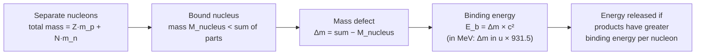

# Mass Defect

## Core Idea

The mass defect is the difference between the total mass of the separate nucleons and the actual (smaller) mass of the bound nucleus.

## Meaning

For a nucleus with Z protons and N = A − Z neutrons:

Δm = (Z m_p + N m_n) − M_nucleus

where m_p ≈ 1.0073 u, m_n ≈ 1.0087 u, and M_nucleus is the measured nuclear mass. Δm is always positive for a bound nucleus, because some mass is "converted" into the energy that holds the nucleus together. This is the basis of [[Binding-Energy]]:

E_b = Δm c²

Masses are usually given in unified atomic mass units, u = 1.66 × 10⁻²⁷ kg, with the convenient conversion 1 u ↔ 931.5 MeV of energy.

The same idea applies to any nuclear reaction: if the products have less total mass than the reactants, the lost mass appears as released energy (Q-value).

## Everyday Intuition

When nucleons "snap together" into a bound nucleus, the system loses a little mass — like a tiny down-payment of mass-energy paid to stay bound.

## GCSE Foundation

- [[Atomic-Structure]]

## Why It Matters

Mass defect is the quantity you compute first when finding binding energy or the energy released by [[Nuclear-Fission]] and [[Nuclear-Fusion]].

## Related Quantities

- [[Mass]]
- [[Energy-Quantity|Energy]]

## Related Laws or Results

- [[Mass-Energy-Equivalence]]

## Related Models

- [[The-Nuclear-Atom]]

## Representations

- Mass-balance table (reactant masses vs product masses)

## Experiments or Observations

- Precise mass spectrometry of nuclei and reaction products

## Applications

- [[Nuclear-Fission]]
- [[Nuclear-Fusion]]

## Frontier Links

- [[Particle-Physics-Map]]

## Common Mistakes

- Subtracting in the wrong order (getting a negative Δm)
- Using atomic instead of nuclear masses without accounting for electrons consistently
- Forgetting the u → MeV (931.5) conversion

## Visuals

### Mass defect → binding energy chain

*Figure: When nucleons bind, the system loses mass (Δm > 0). This mass defect directly gives the binding energy via E = mc². Nuclear reactions release energy when the products have higher total binding energy than the reactants.*
*Source: Authored for this vault (CC0). No external copyright.*

## Source Trace

- Source: OpenStax College Physics; HyperPhysics; CERN educational material — no copied text
- OCR alignment: [[OCR-Physics-A-H556-Specification]]
