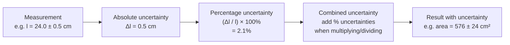

# Measurement Uncertainty

## Core Idea

Every measurement carries some doubt. The **uncertainty** is the interval around a measured value within which the true value can reasonably be expected to lie.

## Meaning

A result is never just a number — it is a number *plus a range*. Writing a length as $l = 24.0 \pm 0.5 \text{ cm}$ says the best estimate is 24.0 cm and the true value almost certainly falls between 23.5 cm and 24.5 cm. The ± 0.5 cm is the **absolute uncertainty**.

At A-Level, uncertainty is **estimated from the characteristics of the equipment**, not derived from the statistical spread of repeats. It reflects both [[Systematic-and-Random-Errors|systematic and random errors]] but is reported as a single sensible interval rather than a formal standard deviation.

## Everyday Intuition

If you weigh yourself on bathroom scales that read to the nearest kilogram, you cannot honestly claim to know your mass to the gram. The scale's coarseness *is* the uncertainty.

## GCSE Foundation

- [[Resolution-Accuracy-and-Precision]]
- [[Physical-Quantities-MOC]]

## Why It Matters

Uncertainty decides how many [[Significant-Figures-in-Measurements|significant figures]] a result deserves, whether two results actually disagree, and how confident a conclusion can be. It propagates through calculations via [[Combining-Uncertainties]] and is expressed proportionally as a [[Calculating-Percentage-Uncertainty|percentage uncertainty]].

## Related Quantities

- [[Acceleration]]

## Related Laws or Results

- _None directly._

## Related Models

- _None directly._

## Representations

- [[Results-Table]]
- [[Line-of-Best-Fit-Graph]]

## Experiments or Observations

- Underpins every required practical (PAG1–PAG12) — see [[Practical-Skills-MOC]].

## Applications

- _None directly._

## Frontier Links

- _Out of scope at A-Level._

## Common Mistakes

- Treating a measured value as exact.
- Confusing uncertainty with [[Systematic-and-Random-Errors|error]] — error is a deviation from the true value; uncertainty is the *range* of doubt.

## Visuals

### How uncertainty propagates from measurement to result

*Figure: Uncertainty flows from an individual measurement through percentage form into a combined uncertainty for the final calculated result. The number of significant figures in the result should match the uncertainty.*
*Source: Authored for this vault (CC0). No external copyright.*

### From Wikipedia

<!-- wiki-images: yes -->

#### Blank Fork

![[_attachments/04_Concepts/Measurement-Uncertainty--wiki-blank-fork.png]]
*Figure: from Wikipedia article "Uncertainty".*
*Source: Wikimedia Commons — [Blank_Fork.png](https://commons.wikimedia.org/wiki/File:Blank_Fork.png). Retrieved 2026-05-20.*

#### Blank Fork

![[_attachments/04_Concepts/Measurement-Uncertainty--wiki-blank-fork.png]]
*Figure: from Wikipedia article "Uncertainty".*
*Source: Wikimedia Commons — [Blank Fork.png](https://commons.wikimedia.org/wiki/File:Blank_Fork.png). Retrieved 2026-05-20.*

#### Uncertainty

![[_attachments/04_Concepts/Measurement-Uncertainty--wiki-uncertainty.svg]]
*Figure: from Wikipedia article "Uncertainty".*
*Source: Wikimedia Commons — [Uncertainty.svg](https://commons.wikimedia.org/wiki/File:Uncertainty.svg). Retrieved 2026-05-20.*

## Source Trace

- Source: [[OCR-Physics-Practical-Skills-Handbook]]
- Section/Page: Appendix 3 — *Uncertainties* (p31)
