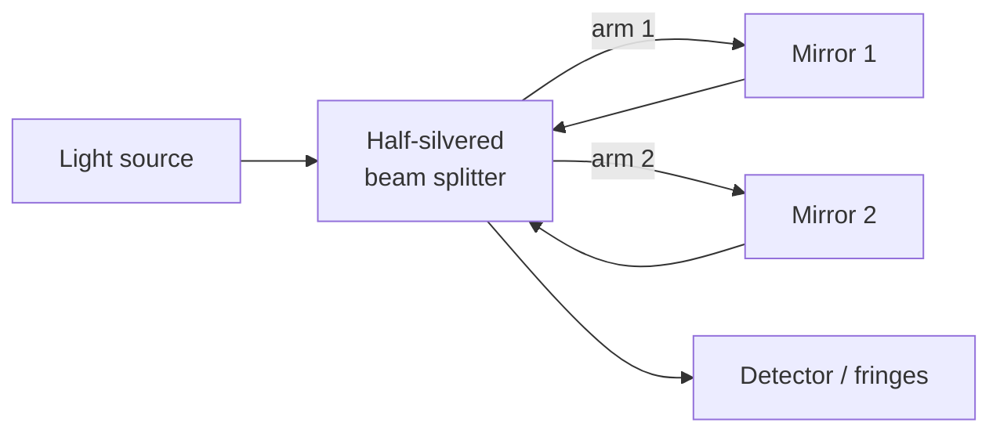

# Michelson-Morley Experiment

## Core Idea

A precision interferometer experiment (1887) that tried to detect the Earth's motion through a hypothetical "luminiferous aether" and found nothing — a null result that helped overturn classical ideas about absolute space.

## Meaning

Nineteenth-century physicists assumed light waves needed a medium to travel through, called the **aether**. If the Earth moved through this aether at speed $v$, then light travelling parallel to the Earth's motion should appear to travel at a different speed than light travelling perpendicular to it.

Michelson and Morley split a single light beam into two perpendicular arms of equal length using a half-silvered mirror, reflected each beam off a mirror, then recombined them to form an **interference pattern**. If one arm was aligned with the supposed aether wind, that beam would take a slightly longer round-trip time than the perpendicular beam. Rotating the apparatus by 90° should then shift the interference fringes by a predictable amount.

The expected fringe shift was about 0.4 fringes. The observed shift was less than 0.01 fringes — effectively zero, within experimental uncertainty.

## Everyday Intuition

Swimming across a river versus along it takes different times because the current helps or hinders you. If light were carried by a "river of aether", the same asymmetry should show up. It didn't.

## GCSE Foundation

- [[Waves]]
- [[Interference]]
- [[Speed of Light]]

## Why It Matters

The null result meant one of three things must be true:

1. The Earth somehow drags the aether with it (later ruled out by stellar aberration).
2. Objects physically shrink along the direction of motion (Lorentz–FitzGerald contraction — an ad hoc fix).
3. **There is no aether, and the speed of light is the same in every inertial frame.**

Einstein took option 3 seriously, leading directly to [[Special-Relativity]].

## Related Quantities

- [[Wavelength]]
- [[Frequency]]

## Related Laws or Results

- [[Maxwell-Speed-of-Light]]
- [[Special-Relativity]]

## Related Models

- Aether model (historical, refuted)
- Inertial frame

## Representations

- Interferometer ray diagram
- Fringe pattern

## Experiments or Observations

- Michelson interferometer
- Modern laser-based repeats consistent with null result to extraordinary precision

## Applications

- LIGO gravitational-wave detector (a giant Michelson interferometer)
- Precision metrology

## Frontier Links

- [[Relativity-Map]]

## Common Mistakes

- Saying "Michelson-Morley proved relativity" — it disproved the aether; relativity came later as an interpretation.
- Thinking they detected a tiny aether wind — the result was consistent with zero.
- Confusing the experiment with a measurement of $c$; the speed of light was already known.

## Visuals

### Michelson interferometer schematic

*Figure: Light is split into two perpendicular arms and recombined; any speed difference between the arms would shift the fringe pattern when the apparatus is rotated.*
*Source: Authored for this vault (CC0). No external copyright.*

## Source Trace

- Source: [[AQA-Physics-7407-7408-Specification]] §3.12.3
- Section/Page: Turning Points in Physics — Special Relativity (HyperPhysics; OpenStax University Physics)
