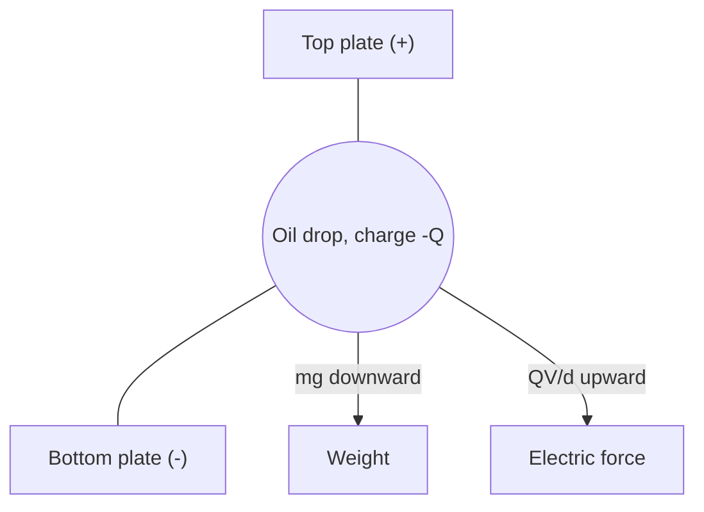

# Millikan Oil Drop Experiment

## Core Idea

Millikan (1909) measured the electric charge on tiny oil drops and found it always came in integer multiples of the same small quantity e ≈ 1.60 × 10⁻¹⁹ C. Electric charge is therefore **quantised**, with e the elementary charge.

## Meaning

A fine spray of oil droplets falls into the gap between two horizontal parallel plates separated by distance d. The drops pick up small static charges from friction. With no voltage on the plates, an individual drop falls and quickly reaches a terminal speed v₁ determined by its weight balancing viscous drag (Stokes' law):

$$6\pi\eta r v_{1} = m g$$

- η = viscosity of air (Pa s)
- r = drop radius (m)
- v₁ = terminal speed while falling (m s⁻¹)
- m = drop mass (kg)
- g = gravitational field strength (m s⁻² or N kg⁻¹)

Measuring v₁ (timing the drop across a known distance with a microscope) gives r, and since the density of the oil is known, the mass m = (4/3)πr³ρ follows.

A potential difference V is then applied so the upper plate is positive. For a negatively charged drop the resulting uniform [[Electric-Field]] E = V/d exerts an upward force QE = QV/d. If V is tuned so the drop hangs **stationary** (the classic "balanced drop" case):

$$\dfrac{Q V}{d} = m g \quad\Longrightarrow\quad Q = \dfrac{m g d}{V}$$

- Q = drop's net charge (C)
- V = pd across plates (V)
- d = plate separation (m)

Repeating this for hundreds of drops, every measured Q came out as Q = n e with n a small integer (1, 2, 3, …) and a common smallest value e. Combined with Thomson's [[Specific-Charge]] e/m for the electron, Millikan's e fixed the electron's mass at ≈ 9.11 × 10⁻³¹ kg.

## Everyday Intuition

You can pour out coffee in any volume, but you can only pay for it in whole pennies. Charge behaves like the pennies — there is a smallest "coin" and every real charge is an integer number of them.

## GCSE Foundation

- [[Static-Electricity]]
- [[Terminal-Velocity]]

## Why It Matters

The experiment did two things at once: it gave the first accurate value of the elementary charge **e**, and it showed that charge is **quantised**, not continuous. This was decisive evidence that the electron is a real particle of definite charge, and it underpins all later atomic and particle physics.

## Related Quantities

- [[Electric-Field]]
- [[Uniform-Electric-Field]]
- [[Specific-Charge]]
- [[Terminal-Velocity]]

## Related Laws or Results

- [[Coulombs-Law]]

## Related Models

- Stokes' law model of a small sphere falling slowly through a viscous fluid.

## Representations

- Cross-section of the apparatus: atomiser, two horizontal plates with a small hole, microscope, illumination beam.

## Experiments or Observations

- [[Cathode-Rays]]
- [[Thermionic-Emission]]

## Applications

- Reference value of e used in defining [[The-Electronvolt]] and in every photoelectric calculation ([[Photoelectric-Equation]]).

## Frontier Links

- [[Quantum-Mechanics-Map]] — fractional charges (quarks) are confined inside hadrons, so free charges still come in multiples of e.

## Common Mistakes

- Using Q = mg/E with E = V (forgetting to divide by plate separation d).
- Mixing up the falling phase (used to find r and m) with the balanced phase (used to find Q).
- Treating each measured Q as the elementary charge; only the **smallest common divisor** of many Q values is e.
- Ignoring the buoyancy of air or assuming the drop is in vacuum.

## Visuals

### Forces on a balanced oil drop

*Figure: When QV/d = mg the drop hangs motionless between the plates.*
*Source: Authored for this vault (CC0). No external copyright.*

### From Wikimedia

<!-- wiki-images: yes -->

#### Scheme of Millikan's apparatus
![[_attachments/04_Concepts/Millikan-Oil-Drop-Experiment--wiki-apparatus-scheme.jpg]]
*Figure: Millikan's own diagram of the apparatus — atomiser, the two parallel plates with their pd, the viewing microscope, and the illumination used to watch individual oil drops.*
*Source: Wikimedia Commons — [Scheme of Millikan's oil-drop apparatus.jpg](https://commons.wikimedia.org/wiki/File:Scheme_of_Millikan%E2%80%99s_oil-drop_apparatus.jpg) — Public domain — Robert Andrews Millikan. Retrieved 2026-06-27.*

## Source Trace

- Source: [[AQA-Physics-7407-7408-Specification]] §3.12.1
- Public reference: HyperPhysics; OpenStax College Physics
