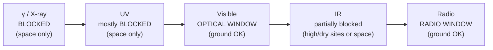

# Non-Optical Telescopes

## Core Idea

A **non-optical telescope** collects electromagnetic radiation **outside the visible band** — radio, infrared (IR), ultraviolet (UV), or X-ray — and forms an image of the sky in that wavelength range. Like an optical telescope it has a **collecting element**, a **detector**, and a way to **point and focus**, but the design depends strongly on what the atmosphere lets through and on what mirror/lens material works at that wavelength.

## Meaning

Astronomical sources radiate across the whole [[Electromagnetic-Spectrum]], not just visible light. To see hot young stars we need UV; cold dust and exoplanets, IR; pulsars and cold hydrogen clouds, radio; black-hole accretion disks, X-rays. Each band requires its own kind of telescope.

## Everyday Intuition

A satellite TV dish is essentially a small radio telescope: a parabolic reflector concentrates radio waves onto a feed. A thermal-imaging camera is an IR detector. The same family of ideas, scaled up and pointed at the sky, becomes radio astronomy or IR astronomy.

## GCSE Foundation

- [[Electromagnetic-Spectrum]] — radio, IR, visible, UV, X-ray, γ.
- GCSE wave behaviour: reflection, refraction, [[Diffraction]].

## Why It Matters

Different objects "shine" in different bands. Without non-optical telescopes we would miss the cosmic microwave background, most of the interstellar medium, exoplanet atmospheres, neutron stars, and active galactic nuclei. They expand astronomy from a narrow visible window to the full spectrum.

## Similarities to Optical Telescopes

- All collect EM radiation and bring it to a focus.
- All have **collecting power** $\propto D^2$ (dish or mirror diameter).
- All are diffraction-limited: minimum resolvable angle $\theta \approx \lambda/D$ (see [[Rayleigh-Criterion]] and [[Resolving-Power]]).
- All need pointing, tracking, and a detector.

## Differences from Optical Telescopes

### Radio telescopes

- Use a **large metal parabolic dish** (e.g. ~100 m). Wavelengths are long (mm to m), so surface accuracy is easy — wire mesh suffices for long-λ work.
- Because $\theta \approx \lambda/D$ and $\lambda$ is huge, dishes must be **enormous** to match optical resolution. Often combined as **interferometer arrays** (effective $D$ = array baseline).
- Detector: radio receiver + amplifier.
- Can operate **through clouds and in daylight**; the atmosphere is transparent to many radio wavelengths.

### IR telescopes

- Often look identical to optical reflectors (mirrors work across both bands).
- Must be **cooled** to reduce thermal emission from the telescope itself.
- Water vapour absorbs IR strongly — usually placed on high dry mountains, in aircraft (SOFIA), or in space (Spitzer, JWST).

### UV telescopes

- Mirrors with **special coatings** (UV is absorbed by ordinary glass).
- The ozone layer blocks most UV, so they **must be in space** (e.g. Hubble's UV instruments).

### X-ray telescopes

- X-rays pass straight through ordinary mirrors at normal incidence, so they use **grazing-incidence "nested" mirrors** that reflect X-rays at very shallow angles.
- The atmosphere is opaque to X-rays, so they **must be in space** (Chandra, XMM-Newton).

## Atmospheric Windows

The atmosphere is transparent in only two main "windows": the **optical window** (visible + a sliver of near-IR/UV) and the **radio window** (mm to ~30 m). Telescopes for the other bands must be flown above the atmosphere on aircraft, balloons, or satellites.

## Related Quantities

- $D$ — aperture diameter (m).
- $\lambda$ — observing wavelength (m).
- $\theta$ — minimum resolvable angle (rad). See [[Radian]].

## Related Laws or Results

- [[Rayleigh-Criterion]] — sets resolution from $\lambda$ and $D$.

## Related Models

- [[Astronomical-Telescope]] — refractor.
- [[Reflecting-Telescope]] — optical Cassegrain analogue for radio dishes.

## Representations

- [[Ray-Diagram]] for grazing-incidence X-ray mirrors and parabolic radio dishes.

## Applications

- Radio: 21 cm hydrogen line, pulsars, cosmic microwave background.
- IR: protoplanetary disks, exoplanet atmospheres, redshifted early galaxies.
- UV: hot young stars, the interstellar medium.
- X-ray: neutron-star binaries, AGN, hot intracluster gas.

## Frontier Links

- [[Cosmology-Map]] — the CMB (microwave) and high-z surveys (IR) are central to modern cosmology.

## Common Mistakes

- Saying radio telescopes have "poor resolution" because they are crude — actually their dishes are huge; the resolution is poor because **$\lambda$ is huge** ($\theta \propto \lambda/D$).
- Forgetting that **collecting power** scales as $D^2$, not $D$.
- Claiming X-ray telescopes use ordinary mirrors — they need **grazing-incidence** optics.
- Assuming all non-optical telescopes must be in space — radio telescopes generally do not.

## Visuals

### Atmospheric transparency vs wavelength (schematic)

*Figure: Schematic of which EM bands reach the ground. Non-optical telescopes are positioned to exploit (radio) or escape (UV, X-ray) atmospheric absorption.*
*Source: Authored for this vault (CC0). No external copyright.*

### From Wikimedia

<!-- wiki-images: yes -->

#### A single-dish radio telescope
![[_attachments/04_Concepts/Non-Optical-Telescopes--wiki-radio-dish.jpg]]
*Figure: A large steerable parabolic radio dish. Long radio wavelengths force the dish to be enormous to achieve useful resolution ($\theta \approx \lambda/D$), but it can observe through cloud and in daylight.*
*Source: Wikimedia Commons — [Radio telescope The Dish.jpg](https://commons.wikimedia.org/wiki/File:Radio_telescope_The_Dish.jpg) — CC BY 2.0 — Steve Jurvetson. Retrieved 2026-06-27.*

## Source Trace

- Source: [[AQA-Physics-7407-7408-Specification]] §3.9.1.3 (Single-dish radio telescopes; comparison with optical; IR, UV and X-ray telescopes)
- Public source: HyperPhysics ("Telescopes"); OpenStax College Physics, Ch. 26.
- Section/Page: Spec p. (Astrophysics option).
