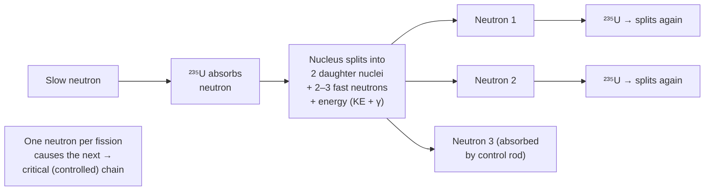

# Nuclear Fission

## Core Idea

Nuclear fission is the splitting of a large, heavy nucleus into two smaller nuclei (plus a few neutrons), releasing a large amount of energy because the products are more tightly bound.

## Meaning

A heavy nucleus such as uranium-235 can be made unstable by absorbing a slow (thermal) neutron. The resulting nucleus splits into two medium-sized daughter nuclei, releases two or three fast neutrons, and emits energy. The energy comes from the increase in binding energy per nucleon: the products lie nearer the peak of the binding-energy curve, so mass is lost and converted to energy according to $E = mc^2$ (mass–energy equivalence). Most of this energy appears as kinetic energy of the fragments.

The released neutrons can trigger further fissions in nearby nuclei, producing a chain reaction. In a nuclear reactor this chain is controlled — control rods absorb surplus neutrons and a moderator slows neutrons so they can be captured — keeping exactly one neutron from each fission causing the next (a steady, critical reaction). An uncontrolled, rapidly multiplying chain is the principle of a fission weapon.

Nucleon and charge numbers are conserved, so fission equations can be balanced even though many product combinations are possible.

## Everyday Intuition

It is like a tightly packed stack collapsing and flinging pieces out, with each falling piece knocking over more stacks — a controlled version steadily releases energy to heat water and drive turbines in a power station.

## GCSE Foundation

- [[Atomic-Structure]]
- [[Radioactivity]]
- [[Energy-Transfer]]

## Why It Matters

Fission provides nuclear electricity, raises questions of waste and safety, and demonstrates mass–energy equivalence and binding energy — central OCR H556 nuclear content.

## Related Quantities

- [[Binding-Energy]]
- [[Mass-Defect]]

## Related Laws or Results

- [[Mass-Energy-Equivalence]]
- [[Conservation-of-Energy]]

## Related Models

- [[Nuclear-Model]]

## Representations

- Binding-energy-per-nucleon curve.
- Fission reaction equations.

## Experiments or Observations

- Demonstrated via reactor data; binding-energy curve analysis (not a school bench experiment).

## Applications

- Nuclear power stations.
- Production of medical radioisotopes.

## Frontier Links

- Connects to the [[Particle-Physics-Map]] and reactor/fusion research.

## Common Mistakes

- Confusing fission (heavy nucleus splits) with [[Nuclear-Fusion]] (light nuclei join).
- Forgetting energy comes from increased binding energy, not "destroying" matter arbitrarily.
- Thinking any neutron speed works equally well to induce fission.

## Visuals

### Nuclear fission chain reaction

*Figure: Each fission releases 2–3 neutrons. In a controlled reactor, on average one neutron from each fission triggers the next, maintaining a critical chain reaction. Control rods absorb surplus neutrons.*
*Source: Authored for this vault (CC0). No external copyright.*

## Source Trace

- Source: OpenStax College Physics; The Physics Classroom; IOPSpark; Physics LibreTexts — paraphrased, no copied text.
- OCR alignment: [[OCR-Physics-A-H556-Specification]]
