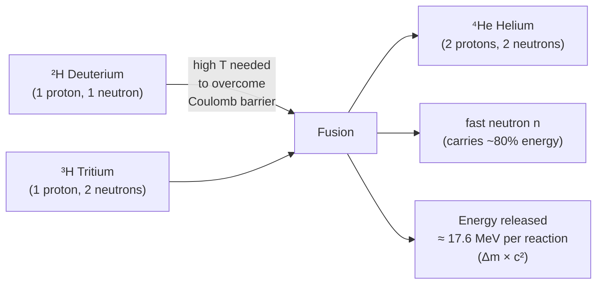

# Nuclear Fusion

## Core Idea

Nuclear fusion is the joining of two light nuclei to form a heavier nucleus, releasing energy because the product is more tightly bound than the original nuclei.

## Meaning

When two light nuclei (for example isotopes of hydrogen, deuterium and tritium) are brought close enough together they can fuse into a heavier nucleus such as helium, releasing energy. As with fission, the energy comes from a gain in binding energy per nucleon and an associated loss of mass, governed by $E = mc^2$. Fusion of light nuclei releases even more energy per nucleon than fission, because the binding-energy curve rises very steeply at the light end.

The great difficulty is getting the nuclei close enough. Both are positively charged, so they strongly repel (the Coulomb barrier). Overcoming this requires extremely high temperatures (millions of kelvin) so the nuclei move fast enough, and high density so collisions are frequent. These conditions exist naturally in the cores of stars: fusion of hydrogen into helium is the energy source of the Sun and the reason stars shine.

On Earth, achieving controlled, sustained, net-energy-positive fusion is a major engineering challenge being pursued in experimental reactors, because it promises abundant fuel and far less long-lived radioactive waste than fission.

## Everyday Intuition

The warmth of sunlight is the end product of fusion in the Sun's core. Fusion is like forcing two strong magnets together north-to-north — it takes great effort to push them close, but once joined the system settles into a much lower-energy state and releases energy.

## GCSE Foundation

- [[Atomic-Structure]]
- [[Energy-Transfer]]
- [[Radioactivity]]

## Why It Matters

Fusion powers stars and the chemical evolution of the universe, and is a leading candidate for future clean energy; it illustrates binding energy and mass–energy equivalence.

## Related Quantities

- [[Binding-Energy]]
- [[Mass-Defect]]

## Related Laws or Results

- [[Mass-Energy-Equivalence]]
- [[Conservation-of-Energy]]

## Related Models

- [[Nuclear-Model]]

## Representations

- Binding-energy-per-nucleon curve.
- Fusion reaction equations.

## Experiments or Observations

- Observed via stellar spectra and reactor research (not a school bench experiment).

## Applications

- Stellar energy production.
- Experimental fusion reactors for future power.

## Frontier Links

- Central to the [[Particle-Physics-Map]] and astrophysics/cosmology.

## Common Mistakes

- Confusing fusion (light nuclei join) with [[Nuclear-Fission]] (heavy nucleus splits).
- Underestimating why high temperature is needed (overcoming Coulomb repulsion).
- Thinking fusion produces large amounts of long-lived radioactive waste like fission.

## Visuals

### D–T fusion reaction

*Figure: Deuterium and tritium fuse to give helium-4 and a fast neutron. Energy is released because the helium nucleus is more tightly bound than the two hydrogen isotopes — the products lie higher on the binding-energy-per-nucleon curve.*
*Source: Authored for this vault (CC0). No external copyright.*

## Source Trace

- Source: OpenStax College Physics; The Physics Classroom; IOPSpark; Physics LibreTexts — paraphrased, no copied text.
- OCR alignment: [[OCR-Physics-A-H556-Specification]]
