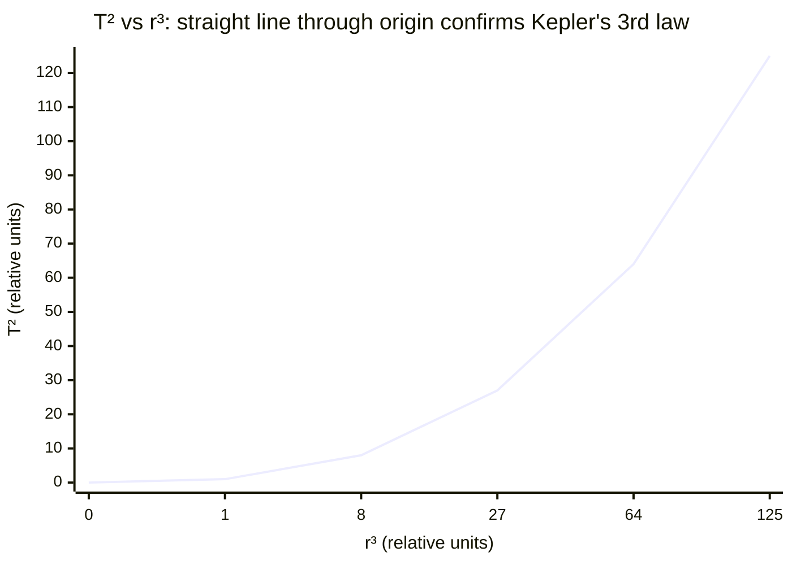

# Orbital Motion

## Core Idea

A body in orbit is in continuous free fall: gravity supplies exactly the
centripetal force needed to keep it moving in a (near-)circular path around a
much larger mass.

## Meaning

For a satellite of mass m in a circular orbit of radius r around a body of
mass M, the gravitational force from [[Newtons-Law-of-Gravitation]] provides
the [[Centripetal-Force]]:

G M m / r² = m v² / r

Cancelling m gives the orbital speed:

v = √(G M / r)

A more massive central body or a smaller orbit means a faster orbit. Using
v = 2πr / T leads directly to [[Keplers-Third-Law]]:

T² = (4π² / G M) r³

So the orbital period depends only on r and M, not on the satellite's mass.

The total energy of the orbit is the sum of kinetic energy and
[[Gravitational-Potential-Energy]]:

E = ½ m v² − G M m / r = − G M m / (2r)

The negative total energy shows the body is gravitationally bound; lower
(smaller r) orbits are faster but have *more negative* total energy.

## Everyday Intuition

Imagine throwing a ball horizontally faster and faster from a tall tower.
Eventually it falls "around" the curve of the Earth and never lands — that is
an orbit.

## GCSE Foundation

- [[Weight]]
- [[Mass]]
- [[Circular-Motion]]

GCSE treats gravity as keeping the Moon "going round". A-Level quantifies it
with the centripetal condition and Kepler's third law.

## Why It Matters

Orbital motion governs satellites, the Moon, planets and space missions, and
is a standard A-Level derivation linking gravitation and circular motion.

## Related Quantities

- [[Gravitational-Field-Strength]]
- [[Gravitational-Potential-Energy]]
- [[Mass]]

## Related Laws or Results

- [[Newtons-Law-of-Gravitation]]
- [[Keplers-Third-Law]]
- [[Conservation-of-Energy]]

## Related Models

- [[Circular-Motion]]
- [[Centripetal-Force]]

## Representations

- Free-body diagram: single inward gravitational force
- T² against r³ straight-line graph through the origin

## Experiments or Observations

- Astronomical timing of planetary and moon periods
- Tracking satellite orbits to determine planetary mass

## Applications

- [[Satellites-and-Geostationary-Orbits]]

## Frontier Links

- [[Cosmology-Map]]

## Common Mistakes

- Forgetting the satellite mass cancels (period independent of m)
- Using a uniform-field g instead of GM/r² for high orbits
- Confusing orbital speed with escape velocity (escape = √2 × orbital)

## Visuals

### Kepler's third law: T² proportional to r³

*Figure: A graph of T² against r³ for circular orbits is a straight line through the origin with gradient 4π²/GM. The slope depends only on the central mass M, not on the satellite's mass — this allows M to be determined from orbital data.*
*Source: Authored for this vault (CC0). No external copyright.*

## Source Trace

- Source: OpenStax College Physics; HyperPhysics; NASA educational material — no copied text
- OCR alignment: [[OCR-Physics-A-H556-Specification]]
- Section/Page: OCR M5.4 Gravitational fields
