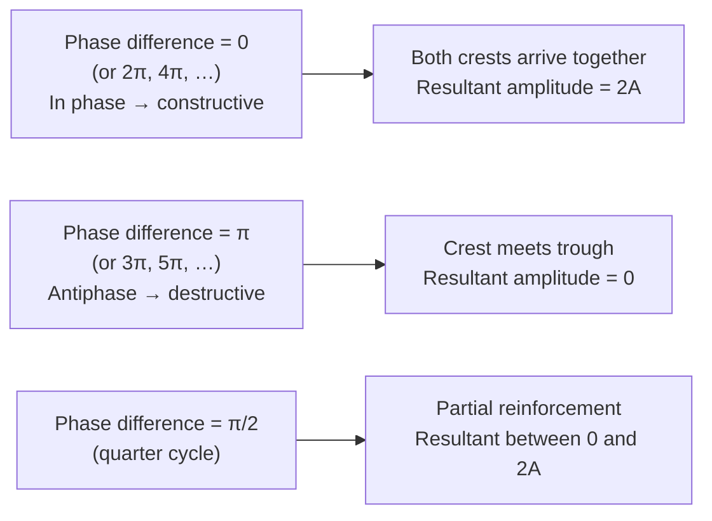

# Phase Difference

## Core Idea

Phase difference describes how far one oscillation leads or lags another, measured as an angle. Together with [[Path-Difference]] it determines the result of [[Superposition]].

## Meaning

Phase is the fraction of a complete cycle an oscillation has reached. The phase difference between two points (or two waves) is the difference in their phase, normally given in radians, where one full cycle is $2\pi$ radians (or $360^\circ$). Two waves are:

- in phase when phase difference $= 0, 2\pi, 4\pi, \dots$ (constructive)
- in antiphase when phase difference $= \pi, 3\pi, \dots$ (destructive)

The link to [[Path-Difference]] is $\Delta\phi = \dfrac{2\pi}{\lambda}\,\Delta x$, where $\Delta x$ is path difference and $\lambda$ the [[Wavelength]].

## Everyday Intuition

Two children on swings released a moment apart stay "out of step"; the time gap as a fraction of one swing is their phase difference.

## GCSE Foundation

- [[Frequency]]

## Why It Matters

Phase difference defines coherence (needed for stable [[Interference]]), describes standing waves (nodes are points kept in antiphase) and a.c. circuit behaviour. It is essential to predicting whether waves reinforce or cancel.

## Related Quantities

- [[Frequency]]
- [[Wavelength]]

## Related Laws or Results

- [[Diffraction-Grating-Equation]]

## Related Models

- Sinusoidal oscillation model.

## Representations

- Two displacement-time graphs offset along the time axis by a fraction of a period.

## Experiments or Observations

- [[Investigating-Diffraction-with-a-Grating]]

## Applications

- [[Medical-Imaging]]

## Frontier Links

- Phase coherence in lasers and quantum states; orientation only.

## Common Mistakes

- Quoting phase difference as a length rather than an angle.
- Forgetting to convert between radians and degrees consistently.

## Visuals

### Phase relationship: in phase vs antiphase

*Figure: The result of superposition depends entirely on the phase difference. In phase (Δφ = 0, 2π, …) gives constructive interference; antiphase (Δφ = π, 3π, …) gives destructive. Phase difference links to path difference via Δφ = (2π/λ)Δx.*
*Source: Authored for this vault (CC0). No external copyright.*

### From Wikipedia

<!-- wiki-images: yes -->

#### Oscillating sine wave

![[_attachments/04_Concepts/Phase-Difference--wiki-oscillating-sine-wave.gif]]
*Figure: from Wikipedia article "Phase (waves)".*
*Source: Wikimedia Commons — [Oscillating_sine_wave.gif](https://commons.wikimedia.org/wiki/File:Oscillating_sine_wave.gif). Retrieved 2026-05-20.*

#### Oscillating sine wave

![[_attachments/04_Concepts/Phase-Difference--wiki-oscillating-sine-wave.gif]]
*Figure: from Wikipedia article "Phase (waves)".*
*Source: Wikimedia Commons — [Oscillating sine wave.gif](https://commons.wikimedia.org/wiki/File:Oscillating_sine_wave.gif). Retrieved 2026-05-20.*

#### Out of phase AE

![[_attachments/04_Concepts/Phase-Difference--wiki-out-of-phase-ae.gif]]
*Figure: from Wikipedia article "Phase (waves)".*
*Source: Wikimedia Commons — [Out of phase AE.gif](https://commons.wikimedia.org/wiki/File:Out_of_phase_AE.gif). Retrieved 2026-05-20.*

## Source Trace

- Source: OpenStax College Physics; HyperPhysics; IOPSpark
- OCR alignment: [[OCR-Physics-A-H556-Specification]]
