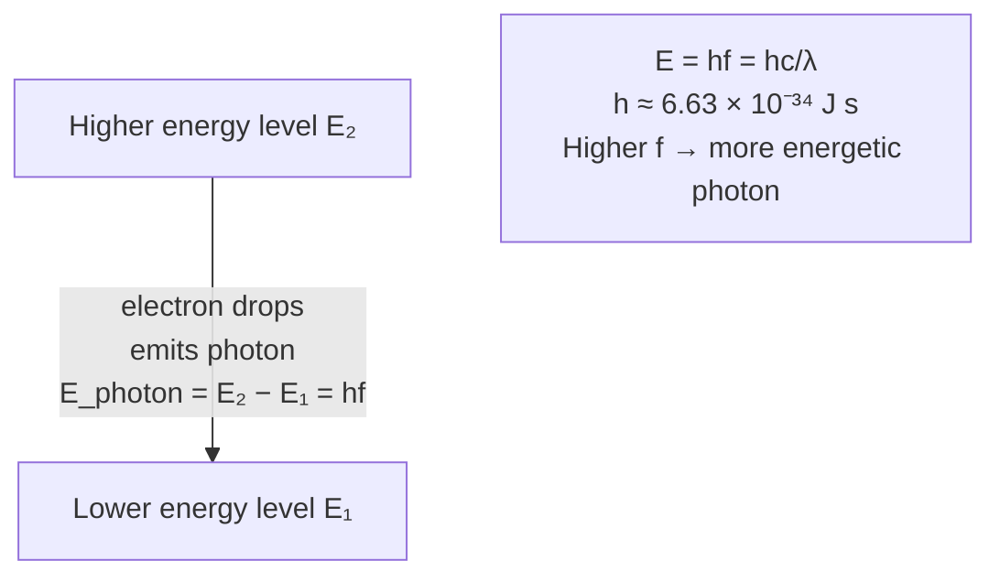

# Photon Energy

## Core Idea

A photon is a discrete packet (quantum) of electromagnetic energy. Its energy depends only on the wave's [[Frequency]], not on its [[Intensity]].

## Meaning

Electromagnetic radiation is emitted and absorbed in indivisible packets. The energy of one photon is:

$$E = hf = \frac{hc}{\lambda}$$

where $h$ is the Planck constant ($\approx 6.63 \times 10^{-34}\ \text{J s}$), $f$ is [[Frequency]], $c$ the speed of light, and $\lambda$ the [[Wavelength]]. Higher-frequency radiation has more energetic photons; increasing intensity at fixed frequency means more photons per second, not more energetic ones.

## Everyday Intuition

Light arrives in "grains" like raindrops: a brighter source delivers more drops per second, but each drop's size is fixed by its colour.

## GCSE Foundation

- [[Frequency]]
- [[Wavelength]]

## Why It Matters

The photon concept explains why only sufficiently high-frequency light causes the [[Photoelectric-Effect]], underlies emission and absorption between [[Energy-Levels]], and lets photon flux relate beam power to a photon count. It is the cornerstone of wave-particle duality.

## Related Quantities

- [[Frequency]]
- [[Wavelength]]
- [[Intensity]]

## Related Laws or Results

- [[Photoelectric-Equation]]

## Related Models

- Quantum (photon) model of light.

## Representations

- Energy-level diagram showing a photon emitted as an electron drops between [[Energy-Levels]].

## Experiments or Observations

- [[Measuring-the-Planck-Constant]]

## Applications

- [[PET-Scanning]]
- [[X-ray-Imaging]]

## Frontier Links

- Single-photon sources and quantum information; orientation only.

## Common Mistakes

- Thinking brighter light means more energetic photons (it means more photons).
- Mixing units: using $\lambda$ in nm without converting to metres in $E = hc/\lambda$.

## Visuals

### Energy-level transition with photon emission

*Figure: When an electron falls from level E₂ to E₁ it emits a photon with exactly the energy difference. This fixes the photon's frequency f = (E₂ − E₁)/h and hence its colour. A brighter source means more photons per second, not more energetic ones.*
*Source: Authored for this vault (CC0). No external copyright.*

### From Wikipedia

<!-- wiki-images: yes -->

#### Bohr-atom-PAR

![[_attachments/04_Concepts/Photon-Energy--wiki-bohr-atom-par.svg]]
*Figure: from Wikipedia article "Photon".*
*Source: Wikimedia Commons — [Bohr-atom-PAR.svg](https://commons.wikimedia.org/wiki/File:Bohr-atom-PAR.svg). Retrieved 2026-05-20.*

#### Bohr atom model

![[_attachments/04_Concepts/Photon-Energy--wiki-bohr-atom-model.svg]]
*Figure: from Wikipedia article "Photon".*
*Source: Wikimedia Commons — [Bohr atom model.svg](https://commons.wikimedia.org/wiki/File:Bohr_atom_model.svg). Retrieved 2026-05-20.*

#### Electron-scattering

![[_attachments/04_Concepts/Photon-Energy--wiki-electron-scattering.svg]]
*Figure: from Wikipedia article "Photon".*
*Source: Wikimedia Commons — [Electron-scattering.svg](https://commons.wikimedia.org/wiki/File:Electron-scattering.svg). Retrieved 2026-05-20.*

## Source Trace

- Source: OpenStax College Physics; HyperPhysics; IOPSpark
- OCR alignment: [[OCR-Physics-A-H556-Specification]]
