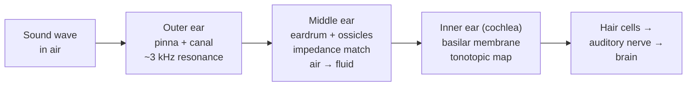

# Physics of the Ear

## Core Idea

The human ear is a three-stage mechanical-to-electrical transducer: it collects sound waves in air, matches their impedance to fluid, and then converts the resulting vibrations into nerve impulses encoded by frequency and intensity.

## Meaning

**Outer ear.** The pinna funnels pressure waves into the auditory canal, a roughly tubular resonator about 25 mm long. Its open-pipe quarter-wavelength resonance lies near 3 kHz, which boosts the ear's response in exactly the band where human speech carries most of its information.

**Middle ear.** The eardrum (tympanic membrane) converts the pressure wave into a mechanical vibration. Three tiny bones — malleus, incus, stapes — act as a lever and the stapes presses on the oval window of the cochlea. Crucially this stage is an **impedance-matching transformer**: the eardrum has roughly 17 times the area of the oval window and the ossicles add a further 1.3× lever advantage. Without this match, almost all the airborne sound energy would reflect at the fluid-filled cochlea (acoustic impedance of water is ~3500× that of air); with it, transmission rises from ~0.1% to ~50–60%.

**Inner ear.** The cochlea is a fluid-filled coiled tube. Pressure waves travel along the basilar membrane, whose mechanical properties vary along its length: it is narrow and stiff at the base (high frequencies, ~20 kHz) and wide and floppy at the apex (low frequencies, ~20 Hz). A given frequency creates a peak displacement at a specific position — this is **tonotopic place coding**. Hair cells sitting on that peak release neurotransmitter and fire the auditory nerve.

**Frequency response.** A healthy young ear responds to roughly 20 Hz – 20 kHz, with maximum sensitivity around 2–5 kHz. The upper limit drops with age (presbycusis) — by 60, the typical limit is closer to 8–12 kHz.

**Equal-loudness curves (Fletcher–Munson / ISO 226).** These are contours on a [[Frequency]] – [[Sound-Intensity-Level]] graph along which all pure tones sound equally loud. They show that the ear is much less sensitive at 50 Hz than at 3 kHz: a 50 Hz tone must be roughly 30 dB more intense to sound as loud as a 3 kHz tone of 40 dB. The contours flatten at high loudness, which is why bass sounds "fuller" when you turn the volume up.

**Logarithmic perception.** A doubling of perceived loudness corresponds roughly to a tenfold increase in physical [[Intensity]]. This is why [[Sound-Intensity-Level]] is measured in decibels — a logarithmic scale matches perception far better than a linear one. The same logarithmic compression appears in the eye's response to brightness.

## Everyday Intuition

Cup a hand behind your ear and high-frequency speech becomes clearer — you have extended the outer-ear funnel. Open your mouth during a loud bang and the pressure equalises across the eardrum, protecting the middle ear (Eustachian-tube reflex). After a loud concert, a temporary threshold shift lifts your threshold of hearing by 10–20 dB for hours: the hair cells are exhausted.

## GCSE Foundation

- [[Wave-Refraction]] (and reflection at interfaces)
- [[Frequency]]
- [[Intensity]]

## Why It Matters

Audiology, hearing-aid design, and noise-exposure regulation are all built on the impedance-matching, tonotopic, and logarithmic-response physics described here. The same principles explain why ultrasound transducers use coupling gel (impedance match to skin — see [[Medical-Imaging]]).

## Related Quantities

- [[Sound-Intensity-Level]]
- [[Intensity]]
- [[Frequency]]

## Related Laws or Results

- Acoustic impedance and transmission at boundaries

## Related Models

- Open-pipe resonator (outer ear)
- Lever transformer (ossicles)
- Place-coded resonator (cochlea)

## Representations

- Equal-loudness contour graph (frequency vs intensity level)

## Experiments or Observations

- Audiogram: threshold of hearing measured at standard frequencies
- Tuning-fork Rinne / Weber tests for conductive vs sensorineural loss

## Applications

- Hearing aids and cochlear implants
- Noise-exposure limits (e.g. 85 dBA workplace action level)

## Frontier Links

- Bone-conduction headsets
- Auditory brainstem implants

## Common Mistakes

- Treating loudness as proportional to intensity (it is roughly logarithmic).
- Forgetting impedance matching when explaining why hearing in air is even possible.
- Confusing frequency response of the ear with that of a hi-fi system — they have very different shapes.

## Visuals

### Three-stage ear schematic

*Figure: each stage solves a distinct physical problem — collection, impedance match, and frequency-resolved transduction.*
*Source: Authored for this vault (CC0). No external copyright.*

## Source Trace

- Source: [[AQA-Physics-7407-7408-Specification]] §3.10.2
- Public source: HyperPhysics (The Human Ear); OpenStax College Physics — Hearing
- Section/Page: Optional unit 3.10.2 — physics of hearing
