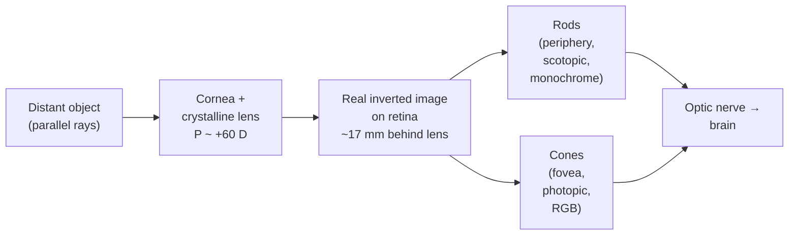

# Physics of the Eye

## Core Idea

The human eye is a compact refracting optical system that forms a real, inverted image on the light-sensitive retina, and then behaves like a biological photodetector with two distinct sensor populations.

## Meaning

Light entering the eye is refracted mainly at the **cornea** (the largest single refraction, where $n$ jumps from ~1.00 in air to ~1.38) and then fine-tuned by the **crystalline lens**. Together they act as a single converging system whose total power is roughly $+60\,\text{D}$ for a relaxed adult eye.

The retina sits at a fixed distance behind the lens (~17 mm in a model "reduced eye"). To keep the image sharp as the object distance $u$ changes, the eye varies the focal length $f$ of the lens by changing its curvature — a process called **accommodation**. The ciliary muscle relaxes for distant objects (thin lens, long $f$) and contracts for near objects (fat lens, short $f$). The closest distance at which a sharp image is still possible is the **near point** (~25 cm in a typical adult); the furthest is the **far point** (effectively infinity for an unaided emmetropic eye).

Once the image is on the retina, two cell types convert photons to nerve signals:

- **Rods** — about $1.2 \times 10^8$ per eye, spread across the periphery. Highly sensitive (respond to a handful of photons), but monochrome and slow. They dominate at low [[Intensity]] (scotopic vision) and give peripheral and night vision.
- **Cones** — about $6 \times 10^6$ per eye, packed densest at the central fovea. Three sub-types peak in the red, green, and blue parts of the [[Electromagnetic-Spectrum]]; together they encode colour. Cones need higher light levels (photopic vision) but support sharp detail and fast response.

**Spectral response.** Photopic sensitivity peaks near 555 nm (green-yellow); scotopic sensitivity peaks near 507 nm and falls to zero for wavelengths longer than ~700 nm — this is why deep red light barely affects dark adaptation.

**Spatial resolution.** Foveal cone spacing (~2 µm) sets the limit: the eye can resolve about 1 arc-minute (~$3 \times 10^{-4}\,\text{rad}$). Off-axis, rod-dominated vision is much coarser but vastly more light-sensitive.

## Everyday Intuition

Look at a printed word; now move it slowly towards your nose. At some point the letters blur — you have crossed the near point and the lens cannot bulge any further. In dim light at a star party, you see fainter stars by looking slightly *beside* them, using rod-rich peripheral retina rather than the cone-rich fovea.

## GCSE Foundation

- [[Ray-Model-of-Light]]
- [[Wave-Refraction]]
- [[Electromagnetic-Spectrum]]

## Why It Matters

The eye is the natural reference point for medical optics. Every correction (spectacles, contacts, intra-ocular implants, laser reshaping) is designed by treating the eye as a thin-lens system obeying the [[Lens-Equation]]. Understanding rod/cone behaviour also explains why pulse oximeters, X-ray viewing rooms, and operating-theatre lighting are designed the way they are.

## Related Quantities

- [[Lens-Power]]
- [[Intensity]]
- [[Refractive-Index]]

## Related Laws or Results

- [[Lens-Equation]]
- [[Snell-Law]]

## Related Models

- Reduced eye (single thin lens, $f \approx 17\,\text{mm}$ behind cornea)

## Representations

- [[Ray-Diagram]]

## Experiments or Observations

- Measuring near point with a ruler and printed text
- Dark adaptation timing (rods take ~20 min to reach full sensitivity)

## Applications

- [[Defects-of-Vision]]
- Reading glasses, contact lenses, intra-ocular lens implants
- [[Medical-Imaging]] viewing-station lighting design

## Frontier Links

- Retinal implants and visual prostheses
- Adaptive-optics ophthalmoscopy

## Common Mistakes

- Calling the lens the "main" refracting element — most refraction happens at the cornea.
- Confusing accommodation (changing $f$) with pupil contraction (changing aperture and depth of field).
- Treating rods and cones as interchangeable; they have very different sensitivities and responses.

## Visuals

### Reduced-eye ray diagram

*Figure: optical stage forms the image on the retina; the retina then splits the signal into rod and cone channels.*
*Source: Authored for this vault (CC0). No external copyright.*

## Source Trace

- Source: [[AQA-Physics-7407-7408-Specification]] §3.10.1
- Public source: HyperPhysics (The Human Eye); OpenStax College Physics — Physics of the Eye
- Section/Page: Optional unit 3.10.1 — physics of vision
