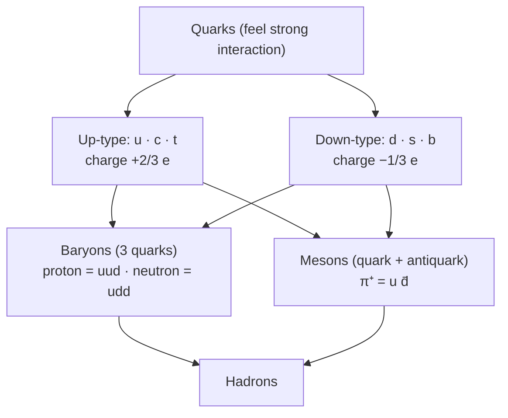

# Quarks

## Core Idea

Quarks are fundamental particles that feel the strong interaction and combine in groups to form protons, neutrons, and other hadrons.

## Meaning

There are six quark "flavours": up (u), down (d), charm (c), strange (s), top (t), bottom (b). For A-Level, up, down, and strange are the priority. Quarks carry **fractional charge**:

- up-type (u, c, t): charge +2/3 e
- down-type (d, s, b): charge −1/3 e

Each quark has a corresponding [[Antiparticles|antiquark]] with opposite charge. Quarks bind via the strong interaction into:

- **Baryons** — 3 quarks: proton = uud (charge +1e), neutron = udd (charge 0).
- **Mesons** — quark + antiquark, e.g. π⁺ = u d̄.

Quarks are never observed in isolation (quark confinement); they are inferred from deep inelastic scattering and from the patterns of observed particles. Quark flavour is conserved in strong and electromagnetic interactions but can change in the weak interaction — for example, in beta-minus decay a down quark changes to an up quark, converting a neutron into a proton.

## Everyday Intuition

Quarks are like LEGO bricks that only ever come stuck together in groups of three (baryons) or in pairs (mesons) — you never find a single loose brick.

## GCSE Foundation

- [[Atomic-Structure]]

## Why It Matters

Quark composition explains the charge and identity of nucleons and predicts allowed decays through charge and baryon-number conservation.

## Related Quantities

- [[Mass]]
- [[Energy]]

## Related Laws or Results

- [[Conservation-of-Momentum]]

## Related Models

- [[The-Standard-Model]]

## Representations

- Quark-content notation (proton uud, neutron udd)

## Experiments or Observations

- Deep inelastic electron–nucleon scattering

## Applications

- [[Particle-Physics-Map]]

## Frontier Links

- [[Particle-Physics-Map]]
- [[CERN-Science]]

## Common Mistakes

- Assigning integer charge to quarks
- Thinking a single quark can exist freely
- Forgetting beta decay involves a quark flavour change (d → u)

## Visuals

### Quark classification: flavour → hadron

*Figure: At A-Level, u, d, and s quarks are priority. Baryons are three-quark composites; mesons are quark–antiquark pairs. Quarks never appear in isolation (confinement).*
*Source: Authored for this vault (CC0). No external copyright.*

## Source Trace

- Source: OpenStax College Physics; HyperPhysics; CERN educational material — no copied text
- OCR alignment: [[OCR-Physics-A-H556-Specification]]
