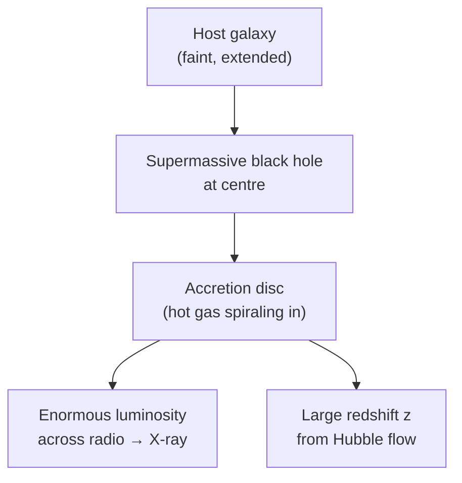

# Quasars

## Core Idea

A **quasar** ("quasi-stellar radio source") is the extraordinarily bright, compact core of a very distant galaxy. Quasars are among the most luminous and most distant objects ever observed.

## Meaning

A typical quasar shows three striking features:

1. **Star-like (point-source) appearance** in optical images, despite being far brighter than entire galaxies.
2. **Very large [[Redshift]]** — measured `z` values can exceed 7, placing quasars billions of light years away.
3. **Strong, often variable, radio (and X-ray) emission** in many cases, hence "quasi-stellar *radio* source".

The accepted model: a **supermassive black hole** of `10⁶ – 10¹⁰` solar masses sits at the centre of a host galaxy. Gas falling toward it forms a hot accretion disc that radiates enormous power as gravitational potential energy is converted to heat and light. This is an **active galactic nucleus (AGN)**.

Their huge redshifts let us combine [[Hubbles-Law]] (`v = H₀ d`) with the [[Doppler-Effect]] for light (`Δλ / λ ≈ v / c` for `v ≪ c`, full relativistic form for `v ≈ c`) to estimate distances. Because their light was emitted billions of years ago, quasars also act as probes of the **early universe**.

## Everyday Intuition

If you imagine a single street lamp outshining an entire city — that's the rough ratio of a quasar's compact core to the host galaxy that surrounds it.

## GCSE Foundation

- [[Electromagnetic-Spectrum]]
- [[Energy-Transfer]]
- [[Gravitational-Field-Strength]]

## Why It Matters

- Quasars are the **most distant measurable objects** routinely usable for cosmology.
- They provide direct evidence that supermassive black holes existed within the first billion years after the [[Big-Bang-Theory]].
- They illuminate the intergalactic medium along their line of sight (absorption-line spectroscopy).

## Related Quantities

- [[Apparent-Magnitude]]
- [[Absolute-Magnitude]]
- [[Luminosity]]
- [[Wavelength]]

## Related Laws or Results

- [[Hubbles-Law]]
- [[Magnitude-Distance-Equation]]

## Related Models

- Active galactic nucleus / accretion-disc model.
- [[Supernovae-Neutron-Stars-and-Black-Holes]] — supermassive black hole engine.

## Representations

- Redshifted optical and radio spectra.
- Hubble diagram (`d` or `m` vs `z`).

## Experiments or Observations

- Optical and radio surveys (e.g. SDSS, VLA).
- Spectroscopic redshift measurement of emission lines.

## Applications

- Probing the early universe and reionisation.
- Mapping intergalactic gas via absorption features (Lyman-alpha forest).

## Frontier Links

- Cosmology-Map — quasars at high redshift.
- Relativity-Map — supermassive black holes, relativistic jets.

## Common Mistakes

- Calling a quasar a "star" — they are galactic nuclei, not stellar objects.
- Confusing redshift `z` with velocity directly: for small `z`, `v ≈ cz`, but at high `z` the full relativistic Doppler formula is required.
- Thinking quasars are "everywhere now" — they are mostly seen at high redshift, i.e. in the distant past.

## Visuals

### Quasar engine schematic

*Figure: A supermassive black hole and its accretion disc power the quasar's huge luminosity.*
*Source: Authored for this vault (CC0). No external copyright.*

### From Wikimedia

<!-- wiki-images: yes -->

#### Quasar 3C 273
![[_attachments/04_Concepts/Quasars--wiki-3c273.jpg]]
*Figure: 3C 273, the first quasar identified — a star-like point source far outshining its host galaxy, powered by a supermassive black hole billions of light years away.*
*Source: Wikimedia Commons — [Quasar 3C 273 (opo0303c).jpg](https://commons.wikimedia.org/wiki/File:Quasar_3C_273_(opo0303c).jpg) — Public domain — NASA/ESA and J. Bahcall (IAS). Retrieved 2026-06-27.*

## Source Trace

- Source: [[AQA-Physics-7407-7408-Specification]] §3.9.3
- Section/Page: Quasars — characteristics, large redshifts, distance scale.
- Public reference: HyperPhysics "Quasars"; NASA / Hubble Heritage; OpenStax Astronomy Ch. 27.
