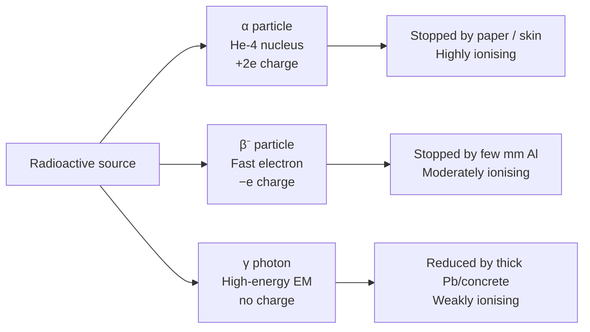

# Radioactivity

## Core Idea

Radioactivity is the property of unstable atomic nuclei spontaneously emitting ionising radiation (alpha, beta or gamma) as they transform towards more stable configurations.

## Meaning

A nucleus with an unfavourable balance of protons and neutrons is unstable. Without any external trigger it will, at an unpredictable moment, emit radiation and become more stable. "Radioactivity" names the overall phenomenon and the activity of a source; the individual transformation events are [[Radioactive-Decay]].

The three classic emissions are:

- **Alpha (α):** a helium nucleus (2 p, 2 n) — highly [[Ionisation|ionising]], very low penetration (stopped by paper/skin).
- **Beta-minus (β⁻):** a fast electron from a neutron → proton conversion, plus an antineutrino — moderately ionising, stopped by a few mm of aluminium.
- **Gamma (γ):** a high-energy [[Photon-Energy|photon]] released as the nucleus sheds excess energy — weakly ionising, only reduced by thick lead/concrete.

Two statistical properties define it: decay is **random** (the moment for any one nucleus cannot be predicted) and **spontaneous** (unaffected by temperature, pressure or chemical state). Over a large sample this randomness averages out to predictable exponential behaviour — the [[Activity]] is proportional to the number of undecayed nuclei — characterised by the [[Decay-Constant]] and [[Half-Life]] and described by the [[Radioactive-Decay-Law]].

## Everyday Intuition

It is like a huge bag of popcorn in a pan: you cannot say which kernel pops next, but the pops per second follow a steady, predictable pattern. Background radioactivity is always around us — rocks, food, cosmic rays — at low, normally harmless levels.

## GCSE Foundation

- [[Atomic-Structure]]
- [[Radioactive-Decay]]

## Why It Matters

Radioactivity underlies radiometric dating, medical imaging and radiotherapy, nuclear power ([[Nuclear-Fission]]), smoke detectors, and the energy of stars ([[Nuclear-Fusion]]). Understanding its random, spontaneous nature is essential for handling radiation safely.

## Related Quantities

- [[Activity]]
- [[Decay-Constant]]
- [[Half-Life]]

## Related Laws or Results

- [[Radioactive-Decay-Law]]
- [[Conservation-of-Energy]]

## Related Models

- [[Nuclear-Model]]

## Representations

- Decay equations balancing nucleon and proton numbers.
- Activity–time exponential decay curve.

## Experiments or Observations

- Detecting and distinguishing α, β, γ by absorption (paper / aluminium / lead) using an [[Ionisation|ionisation detector]].
- Measuring count rate and correcting for background radiation.

## Applications

- Radiometric dating, medical tracers and radiotherapy.
- [[Nuclear-Fission]] reactors; smoke detectors.

## Frontier Links

- The weak interaction behind beta decay and the wider unstable-particle zoo are mapped in [[Particle-Physics-Map]].

## Common Mistakes

- Thinking decay can be sped up or slowed by heat, pressure or chemistry.
- Treating decay as predictable for a single nucleus (only the bulk is predictable).
- Forgetting to subtract background radiation from a measured count rate.

## Visuals

### Alpha, beta, gamma: ionising power vs penetration

*Figure: Three emission types compared by charge, ionising power, and penetrating ability. Ionising power and penetration are inversely related across α, β, γ.*
*Source: Authored for this vault (CC0). No external copyright.*

### From Wikipedia

<!-- wiki-images: yes -->

#### NuclearReaction

![[_attachments/04_Concepts/Radioactivity--wiki-nuclearreaction.svg]]
*Figure: from Wikipedia article "Radioactive decay".*
*Source: Wikimedia Commons — [NuclearReaction.svg](https://commons.wikimedia.org/wiki/File:NuclearReaction.svg). Retrieved 2026-05-20.*

#### Alfa beta gamma radiation

![[_attachments/04_Concepts/Radioactivity--wiki-alfa-beta-gamma-radiation.svg]]
*Figure: from Wikipedia article "Radioactive decay".*
*Source: Wikimedia Commons — [Alfa beta gamma radiation.svg](https://commons.wikimedia.org/wiki/File:Alfa_beta_gamma_radiation.svg). Retrieved 2026-05-20.*

#### Crookes tube xray experiment

![[_attachments/04_Concepts/Radioactivity--wiki-crookes-tube-xray-experiment.jpg]]
*Figure: from Wikipedia article "Radioactive decay".*
*Source: Wikimedia Commons — [Crookes tube xray experiment.jpg](https://commons.wikimedia.org/wiki/File:Crookes_tube_xray_experiment.jpg). Retrieved 2026-05-20.*

## Source Trace

- Source: OpenStax College Physics; The Physics Classroom; IOPSpark; Physics LibreTexts — paraphrased, no copied text.
- OCR alignment: [[OCR-Physics-A-H556-Specification]]
