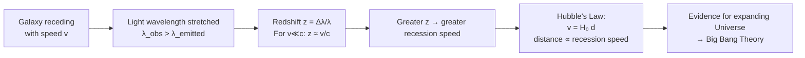

# Redshift

## Core Idea

Redshift is the lengthening of the observed [[Wavelength]] of light from a
source that is receding. Distant galaxies are systematically redshifted,
which is key evidence that the Universe is expanding.

## Meaning

Redshift $z$ is defined from the [[Doppler-Effect]] for light as the fractional
increase in wavelength:

$$z = \frac{\Delta\lambda}{\lambda} = \frac{\lambda_\text{observed} - \lambda_\text{emitted}}{\lambda_\text{emitted}}$$

For recession speeds $v$ much less than $c$:

$$z \approx \frac{v}{c} \quad \Longrightarrow \quad v \approx c z$$

Symbols: $\lambda_\text{emitted}$ = laboratory wavelength of a spectral line (m),
$\lambda_\text{observed}$ = measured wavelength (m), $v$ = recession speed (m s⁻¹),
$c = 3.00 \times 10^8 \text{ m s}^{-1}$. Redshift is dimensionless. A negative value (blueshift)
indicates approach.

Observed redshift is found by identifying a known absorption/emission line
pattern in a galaxy's spectrum and measuring how far it is displaced towards
longer (redder) wavelengths. Combined with distance, redshift gives the
recession-speed–distance relation expressed by [[Hubbles-Law]]. On
cosmological scales the shift is better understood as the stretching of light
by the expansion of space itself rather than ordinary motion through space.

## Everyday Intuition

Like the lowered pitch of a receding siren, light from a receding galaxy is
shifted towards the low-frequency (red) end of the spectrum.

## GCSE Foundation

- [[Wavelength]]
- [[Frequency]]

GCSE links galactic red-shift to an expanding Universe qualitatively.
A-Level adds $z = \Delta\lambda/\lambda$ and $z \approx v/c$.

## Why It Matters

The systematic redshift of galaxies, increasing with distance, is the central
observational evidence for [[Hubbles-Law]] and the [[Big-Bang-Theory]].

## Related Quantities

- [[Wavelength]]
- [[Frequency]]

## Related Laws or Results

- [[Hubbles-Law]]

## Related Models

- [[Big-Bang-Theory]]

## Representations

- Spectral line spectra displaced toward longer wavelengths
- Recession-speed vs distance straight-line graph

## Experiments or Observations

- Galaxy spectra showing shifted absorption lines
- Cosmic microwave background as a highly redshifted relic

## Applications

- Measuring recession speeds and cosmic distances
- [[Doppler-Effect]] in astrophysics

## Frontier Links

- [[Cosmology-Map]]

## Common Mistakes

- Thinking redshift means light "turns red" rather than wavelength increases
- Using $z \approx v/c$ at very large $z$ where it breaks down
- Confusing cosmological redshift with ordinary motion through space

## Visuals

### Redshift: spectral line displacement and cosmological chain

*Figure: Chain from a receding source through the redshift definition to the cosmological evidence. Blueshift (z < 0) indicates approach and is seen in nearby galaxies.*
*Source: Authored for this vault (CC0). No external copyright.*

### From Wikipedia

<!-- wiki-images: yes -->

#### Redshift

![[_attachments/04_Concepts/Redshift--wiki-redshift.svg]]
*Figure: from Wikipedia article "Redshift".*
*Source: Wikimedia Commons — [Redshift.svg](https://commons.wikimedia.org/wiki/File:Redshift.svg). Retrieved 2026-05-20.*

#### 2dfgrs

![[_attachments/04_Concepts/Redshift--wiki-2dfgrs.png]]
*Figure: from Wikipedia article "Redshift".*
*Source: Wikimedia Commons — [2dfgrs.png](https://commons.wikimedia.org/wiki/File:2dfgrs.png). Retrieved 2026-05-20.*

#### Comoving distance and lookback time (Planck 2018)

![[_attachments/04_Concepts/Redshift--wiki-comoving-distance-and-lookback-time-plan.png]]
*Figure: from Wikipedia article "Redshift".*
*Source: Wikimedia Commons — [Comoving distance and lookback time (Planck 2018).png](https://commons.wikimedia.org/wiki/File:Comoving_distance_and_lookback_time_(Planck_2018).png). Retrieved 2026-05-20.*

## Source Trace

- Source: OpenStax College Physics; HyperPhysics; NASA educational material — no copied text
- OCR alignment: [[OCR-Physics-A-H556-Specification]]
- Section/Page: OCR M5.5 Astrophysics and cosmology
