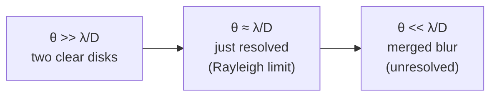

# Resolving Power

## Core Idea

The **resolving power** of a telescope is its ability to **distinguish two close objects** (e.g. a double star) as separate sources rather than a single blur. It is set ultimately by **diffraction** at the aperture, so a bigger aperture or a shorter wavelength gives finer resolution.

## Meaning

When light from a point source passes through a circular aperture of diameter $D$, [[Diffraction]] spreads it into an **Airy pattern** with angular width $\sim \lambda/D$ (radians, see [[Radian]]). Two point sources whose angular separation is much smaller than this overlap and look like one. The **minimum resolvable angle** $\theta_{\min}$ is the smallest separation at which they can still be told apart. The standard criterion for $\theta_{\min}$ is the [[Rayleigh-Criterion]]:

$$
\theta_{\min} \;\approx\; \frac{\lambda}{D}
$$

with $\theta_{\min}$ in radians.

## Everyday Intuition

Two car headlights far away look like one dot. As they approach, you eventually see two. The angle at which you can just separate them is your eye's resolving power — limited by the diameter of the pupil and the wavelength of visible light.

## GCSE Foundation

- [[Diffraction]] — waves spread when they pass through an aperture.
- [[Electromagnetic-Spectrum]] — different telescopes use different $\lambda$.

## Why It Matters

Resolving power decides whether a telescope can:
- split a binary star,
- resolve features on a planet,
- separate a galaxy from a nearby star,
- map detail in a nebula.

It is one of the two "powers" of any telescope, alongside **collecting power**.

## Collecting Power

The amount of light a telescope captures per second is proportional to the **area** of its aperture:

$$
\text{collecting power} \;\propto\; D^2
$$

- $D$ — aperture diameter (m).

Doubling $D$ gives **four times** as much light. Larger collecting power means fainter objects become visible and exposure times shorten.

So for any telescope, increasing $D$ improves **both** powers — finer detail **and** brighter images.

## Detectors: Eye vs CCD

The detector at the focal plane matters as much as the optics.

| Property | Human eye | Charge-coupled device (CCD) |
|---|---|---|
| **Quantum efficiency** (fraction of photons detected) | ~1–5% | typically 70–90% |
| **Integration time** | Cannot store light — refreshes ~10 times per second | Can integrate for minutes or hours, accumulating very faint signals |
| **Spectral range** | Visible only | Visible plus near-IR / UV depending on coating |
| **Linearity** | Non-linear (logarithmic response) | Linear with intensity — can be measured quantitatively |
| **Resolution per pixel** | Limited by rods/cones (~1 arcmin) | Limited by pixel size; can be matched to telescope diffraction limit |
| **Convenience** | Instant view | Needs cooling, electronics, software |

For modern astronomy CCDs (and CMOS) dominate because their **high quantum efficiency** plus the ability to **integrate** faint light over long exposures makes objects accessible that the eye could never see, even through the same telescope.

## Related Quantities

- $D$ — aperture diameter (m).
- $\lambda$ — observing wavelength (m).
- $\theta_{\min}$ — minimum resolvable angle (rad). See [[Radian]].

## Related Laws or Results

- [[Rayleigh-Criterion]] — quantitative form of resolving power.

## Related Models

- [[Astronomical-Telescope]]
- [[Reflecting-Telescope]]

## Representations

- [[Ray-Diagram]]
- Airy pattern intensity sketch (two overlapping disks).

## Experiments or Observations

- Two LEDs on a board viewed from increasing distance until they merge.
- Imaging a known double star and comparing to $\theta_{\min} = \lambda/D$.

## Applications

- Choosing telescope size for a target.
- [[Non-Optical-Telescopes]] — explains why radio telescopes need such huge dishes.
- Adaptive optics (corrects atmosphere so the telescope reaches its diffraction-limited $\theta_{\min}$).

## Frontier Links

- [[Cosmology-Map]] — resolving distant galaxies relies directly on this limit.

## Common Mistakes

- Confusing **resolving power** (ability to separate sources) with **magnification** (size of image). A telescope can have huge magnification and still not resolve detail — diffraction sets the floor.
- Using $\theta_{\min} = \lambda/D$ in **degrees**. The formula is in **radians**.
- Saying collecting power scales linearly with $D$. It scales as $D^2$.
- Saying CCDs are "better than eyes because they magnify more". The advantage is **quantum efficiency** and **integration**, not magnification.

## Visuals

### Two stars at the diffraction limit

*Figure: As two point sources move closer in angle, their Airy disks merge. The crossover near $\theta \approx \lambda/D$ is the resolving-power limit of the telescope.*
*Source: Authored for this vault (CC0). No external copyright.*

### From Wikimedia

<!-- wiki-images: yes -->

#### Airy diffraction pattern of a point source
![[_attachments/04_Concepts/Resolving-Power--wiki-airy-disk.png]]
*Figure: The Airy pattern — the bright central disk plus faint rings — produced when light from a point source passes through a circular aperture. Its angular size $\sim\lambda/D$ sets the resolving power.*
*Source: Wikimedia Commons — [Airy disk D65.png](https://commons.wikimedia.org/wiki/File:Airy_disk_D65.png) — CC0 — SiriusB. Retrieved 2026-06-27.*

## Source Trace

- Source: [[AQA-Physics-7407-7408-Specification]] §3.9.1 (Telescopes — resolving and collecting powers; eye and CCD as detectors)
- Public source: HyperPhysics ("Rayleigh Criterion; Resolving Power"); OpenStax College Physics, Ch. 27 (Wave Optics).
- Section/Page: Spec p. (Astrophysics option).
