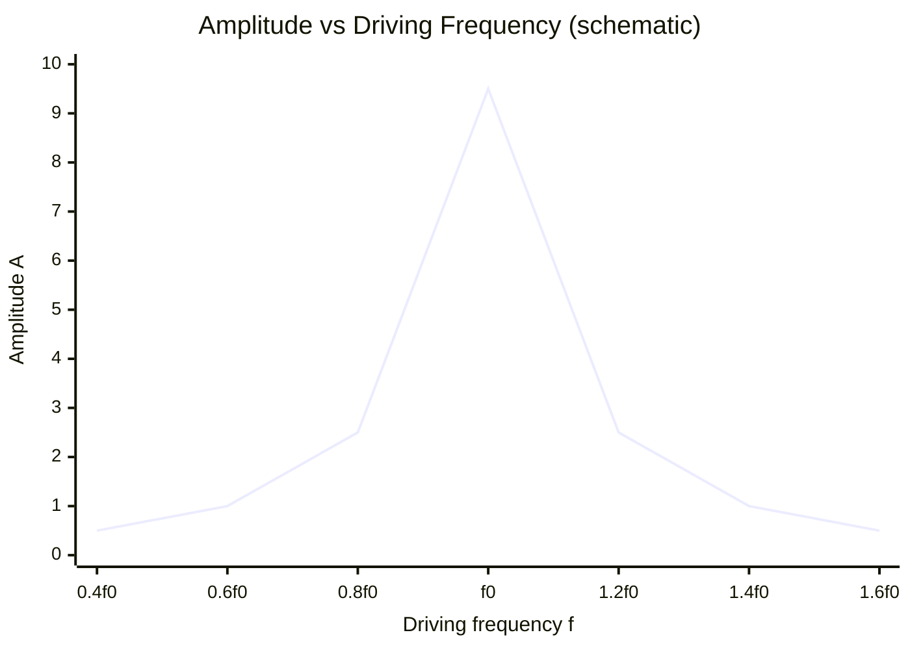

# Resonance

## Core Idea

Resonance occurs when a system is driven at its natural frequency, causing the amplitude of oscillation to grow to a large maximum because energy is transferred most efficiently from the driver.

## Meaning

Every oscillator has a natural frequency f₀ at which it oscillates freely. When an external periodic driving force is applied (see [[Free-and-Forced-Oscillations]]), the steady-state [[Amplitude]] depends on how close the driving frequency is to f₀. At resonance (driving frequency ≈ f₀) the driver does maximum positive work each cycle and the amplitude peaks. The sharpness and height of the peak depend on [[Damping]]: light damping gives a tall, narrow peak near f₀; heavy damping gives a low, broad peak shifted slightly below f₀. At resonance the driving force is (near) 90° out of phase with displacement, in phase with velocity, maximising power input.

## Everyday Intuition

Pushing a swing in time with its natural rhythm makes it go higher and higher; a wine glass shattering at the right sung pitch; tuning a radio to a station's frequency.

## GCSE Foundation

- [[Conservation-of-Energy]]
- [[Force]]

## Why It Matters

Resonance is exploited (musical instruments, MRI, radio tuning, microwave heating) and avoided (bridges, buildings, machinery) — the Tacoma Narrows and Millennium Bridge are classic cautionary cases.

## Related Quantities

- [[Frequency]]
- [[Amplitude]]
- [[Period]]

## Related Laws or Results

- [[Simple-Harmonic-Motion-Equation]]
- [[Conservation-of-Energy]]

## Related Models

- [[Simple-Harmonic-Oscillator]]

## Representations

- [[Velocity-Time-Graph]]

## Experiments or Observations

- [[Investigating-Simple-Harmonic-Motion]]

## Applications

- [[Banked-Tracks-and-Centrifuges]]

## Frontier Links

- [[Quantum-Mechanics-Map]]

## Common Mistakes

- [[Confusing-Angular-and-Linear-Quantities]]

## Visuals

### Resonance: amplitude response vs driving frequency

*Figure: Schematic resonance curve — amplitude peaks sharply when driving frequency equals the natural frequency f₀. Heavier damping lowers and broadens the peak.*
*Source: Authored for this vault (CC0). No external copyright.*

### From Wikipedia

<!-- wiki-images: yes -->

#### Resonance

![[_attachments/04_Concepts/Resonance--wiki-resonance.png]]
*Figure: from Wikipedia article "Resonance".*
*Source: Wikimedia Commons — [Resonance.PNG](https://commons.wikimedia.org/wiki/File:Resonance.PNG). Retrieved 2026-05-20.*

#### Animación1

![[_attachments/04_Concepts/Resonance--wiki-animacion1.gif]]
*Figure: from Wikipedia article "Resonance".*
*Source: Wikimedia Commons — [Animación1.gif](https://commons.wikimedia.org/wiki/File:Animación1.gif). Retrieved 2026-05-20.*

#### HWB-NMR - 900MHz - 21.2 Tesla

![[_attachments/04_Concepts/Resonance--wiki-hwb-nmr-900mhz-212-tesla.jpg]]
*Figure: from Wikipedia article "Resonance".*
*Source: Wikimedia Commons — [HWB-NMR - 900MHz - 21.2 Tesla.jpg](https://commons.wikimedia.org/wiki/File:HWB-NMR_-_900MHz_-_21.2_Tesla.jpg). Retrieved 2026-05-20.*

## Source Trace

- Source: OpenStax College Physics; HyperPhysics; The Physics Classroom — no copied text
- Section/Page: OCR alignment: [[OCR-Physics-A-H556-Specification]] (M5.3 Oscillations)
